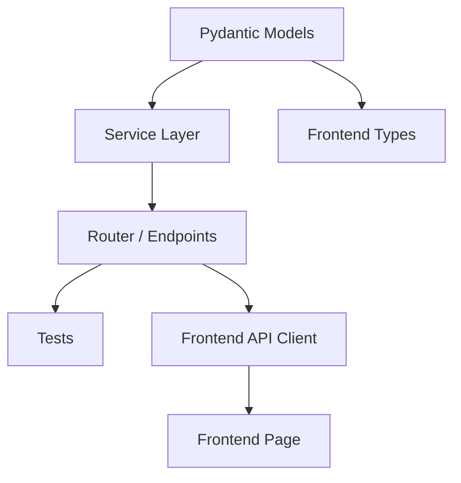

# Plan: [Feature Name]

> **Spec Reference**: `specs/NNN-feature-name/spec.md`
> **Branch**: `verb/phase-name`
> **Spec**: NNN of MMM in phase
> **Date**: YYYY-MM-DD
> **Status**: Draft

---

## 1. Technical Approach

_High-level description of the implementation strategy. What patterns are we
using? What are the key architectural decisions?_

## 2. Dependencies on Prior Specs

_List files, modules, or APIs created by earlier specs in this phase that this
plan depends on. This is critical for correct execution ordering._

| Prior Spec | What It Provides | What This Spec Uses |
|------------|-----------------|---------------------|
| `specs/NNN-feature-name/` | [module/file/API] | [how it's consumed] |
| Or: None | — | — |

## 3. Files to Create

_List every new file that needs to be created, with a brief description of its
purpose._

| File Path | Purpose |
|-----------|---------|
| `backend/app/routers/example.py` | Router for ... endpoints |
| `backend/app/models/example.py` | Pydantic models for ... |
| `backend/app/services/example.py` | Business logic for ... |
| `backend/tests/test_example.py` | Tests for ... |
| `frontend/app/example/page.tsx` | Page component for ... |
| `frontend/components/example.tsx` | Reusable component for ... |
| `frontend/lib/api/example.ts` | API client functions for ... |

## 4. Files to Modify

_List every existing file that needs changes, with a description of what changes
are needed._

| File Path | Changes |
|-----------|---------|
| `backend/app/main.py` | Register new router |
| ... | ... |

## 5. Dependencies & Order

_Which components depend on which? This determines the build order._

## 6. Detailed Implementation Notes

_File-by-file breakdown of what needs to happen. Be specific about function
names, model shapes, and logic._

### 6.1 — Backend: Models (`backend/app/models/example.py`)

_Describe each Pydantic model, its fields, and validation rules._

### 6.2 — Backend: Service (`backend/app/services/example.py`)

_Describe the business logic functions, their inputs, outputs, and side
effects._

### 6.3 — Backend: Router (`backend/app/routers/example.py`)

_Describe each endpoint: method, path, request body, response, auth
requirements, and tags._

### 6.4 — Backend: Tests (`backend/tests/test_example.py`)

_List the test cases to write. Each test should cover one specific behavior._

### 6.5 — Frontend: Types (`frontend/types/example.ts`)

_TypeScript types that mirror the backend models._

### 6.6 — Frontend: API Client (`frontend/lib/api/example.ts`)

_Fetch wrapper functions for each endpoint._

### 6.7 — Frontend: Page (`frontend/app/example/page.tsx`)

_Component structure, state management, data fetching with TanStack Query._

## 7. Testing Strategy

_What tests to write and what to mock._

### Backend Tests (Pytest)
- Test case 1: ...
- Test case 2: ...

### Frontend Tests (Vitest)
- Test case 1: ...
- Test case 2: ...

### Manual Verification
- Step 1: ...
- Step 2: ...

## 8. Constitution Compliance Checklist

_Verify this plan follows all relevant constitution rules._

- [ ] All business logic in FastAPI, not Next.js (§4.1)
- [ ] Using argon2 for password hashing, not Supabase Auth (§4.2)
- [ ] JWT in httpOnly cookie (§4.2)
- [ ] All endpoints prefixed with `/api/v1/` (§4.3)
- [ ] Pydantic models with field descriptions (§4.3)
- [ ] Standard error envelope for all errors (§4.4)
- [ ] Naming conventions followed (§7)
- [ ] Tests written for all endpoints (§14)
- [ ] Conventional Commits used (§13)

## 9. Risks & Mitigations

_What could go wrong during implementation?_

| Risk | Mitigation |
|------|-----------|
| ... | ... |
