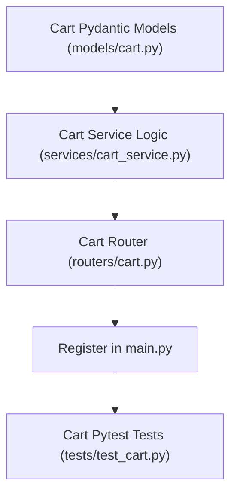

# Plan: Cart Backend — Add Item Endpoint

> **Spec Reference**: `specs/001-cart-backend-add-item/spec.md`
> **Branch**: `feat/cart`
> **Spec**: 001 of 004 in phase
> **Date**: 2026-09-05
> **Status**: Draft
>
> **CRITICAL CONTENT RULE**: DO NOT write implementation code or logic blocks in this document.
> Everything must be written in **pure text** (natural language, tables, bullet points). Only mock code
> shapes (e.g. JSON schemas or minimal type/interface signatures) are allowed, but **mock logic is
> strictly prohibited** (no function bodies, control flow, loops, or algorithms). Custom enums
> MUST be explained in pure text.

---

## 1. Technical Approach

The implementation builds a robust, layered architecture inside the FastAPI backend following existing conventions (`models/`, `services/`, `routers/`, `dependencies/`):

1. **Schema Layer**: Define Pydantic models for cart item creation input (`CartItemCreate`) and response (`CartItemResponse`) in `backend/app/models/cart.py`. All fields include descriptive metadata and examples for OpenAPI generation.
2. **Database & Service Layer**: Create `backend/app/services/cart_service.py` to encapsulate all database queries and transactions using the Supabase client:
   - Querying or creating the buyer's cart row in `carts`.
   - Checking existence and available stock in `seller_products`.
   - Checking whether a cart item already exists in `cart_items` for that cart.
   - Verifying prospective quantity against current inventory stock.
   - Performing insert or update in `cart_items`.
3. **Routing Layer**: Create `backend/app/routers/cart.py` exposing `POST /api/v1/cart/items`. The route injects the authenticated buyer via `get_current_user`, validates the user's role (rejecting non-buyers with 403), invokes the cart service, and returns standard response structures.
4. **App Integration**: Register `cart_router` with prefix `/api/v1/cart` in `backend/app/main.py`.
5. **Testing**: Write comprehensive pytest test suites in `backend/tests/test_cart.py` verifying all success flows, inventory boundaries, unauthorized access, non-buyer roles, and error payloads.

## 2. Dependencies on Prior Specs

| Prior Spec | What It Provides | What This Spec Uses |
|------------|-----------------|---------------------|
| Phase 2 Authentication | `get_current_user` dependency, `AuthenticatedUser` model | Authenticating user and extracting buyer UUID and role |
| Phase 3 Products | `seller_products` and `products` table access patterns | Verifying seller product offers and checking stock quantities |

## 3. Files to Create

| File Path | Purpose |
|-----------|---------|
| `backend/app/models/cart.py` | Pydantic models for cart requests, responses, and error definitions |
| `backend/app/services/cart_service.py` | Cart business logic, stock verification, and Supabase database interactions |
| `backend/app/routers/cart.py` | FastAPI router containing the `POST /api/v1/cart/items` endpoint |
| `backend/tests/test_cart.py` | Pytest tests for adding items to the cart and handling edge cases |

## 4. Files to Modify

| File Path | Changes |
|-----------|---------|
| `backend/app/main.py` | Include and mount the new `cart_router` with `/api/v1/cart` prefix and `Cart` OpenAPI tag |

## 5. Dependencies & Order

## 6. Detailed Implementation Notes

### 6.1 — Backend Models (`backend/app/models/cart.py`)

- **CartItemCreate**:
  - `seller_product_id`: UUID of the merchant's offer from `seller_products`. Required.
  - `quantity`: Integer number of items to add. Default is 1. Constrained to minimum value of 1.
- **CartItemResponse**:
  - `id`: Integer primary key of the created/updated `cart_items` row.
  - `cart_id`: Integer foreign key linking to the buyer's cart in `carts`.
  - `seller_product_id`: UUID of the seller product.
  - `quantity`: Integer representing the final quantity in the cart.
  - `created_at`: String or datetime representing record timestamp.

### 6.2 — Backend Service (`backend/app/services/cart_service.py`)

- **get_or_create_user_cart**:
  - Parameters: Supabase client, user ID (UUID).
  - Queries `carts` table for row with `user_id`.
  - If found, returns the cart row dictionary.
  - If not found, executes insert into `carts` with `user_id` and returns the newly inserted row dictionary.
- **add_item_to_cart**:
  - Parameters: Supabase client, user ID (UUID), `seller_product_id` (UUID), `quantity` (integer).
  - Queries `seller_products` by `id`. If row does not exist, raises an HTTP 404 exception with code `SELLER_PRODUCT_NOT_FOUND`.
  - Extracts current available stock. If stock is less than 1, raises an HTTP 400 exception with code `INSUFFICIENT_STOCK`.
  - Calls `get_or_create_user_cart` to retrieve the target `cart_id`.
  - Queries `cart_items` for existing row matching `cart_id` and `seller_product_id`.
  - If existing row is found:
    - Calculates prospective quantity as existing quantity plus requested quantity.
    - If prospective quantity exceeds available stock, raises an HTTP 400 exception with code `INSUFFICIENT_STOCK` detailing available stock and existing quantity.
    - Updates row in `cart_items` with the new quantity.
    - Returns updated item dictionary.
  - If no existing row is found:
    - If requested quantity exceeds available stock, raises an HTTP 400 exception with code `INSUFFICIENT_STOCK`.
    - Inserts new row into `cart_items` with `cart_id`, `seller_product_id`, and `quantity`.
    - Returns newly inserted item dictionary.

### 6.3 — Backend Router (`backend/app/routers/cart.py`)

- Instantiate `APIRouter` with prefix `/cart` and tags `["Cart"]`.
- Define endpoint `POST /items`:
  - Decorator: `@router.post("/items", response_model=CartItemResponse, status_code=status.HTTP_200_OK, summary="Add item to cart")`.
  - Dependencies: `current_user: AuthenticatedUser = Depends(get_current_user)`, `supabase_client: Client = Depends(get_supabase_client)`.
  - Verify `current_user.user_role == "buyer"`. If not, raise HTTP 403 with code `FORBIDDEN_ROLE` and message stating only buyers may add items to cart.
  - Call service function `add_item_to_cart`.
  - Return `CartItemResponse`.
  - Document possible error responses (`400`, `401`, `403`, `404`, `422`) using standard error envelope model.

### 6.4 — App Registration (`backend/app/main.py`)

- Import `cart` from `app.routers`.
- Call `app.include_router(cart.router, prefix="/api/v1")`.

### 6.5 — Backend Tests (`backend/tests/test_cart.py`)

- Test 1: Successful addition of a new item to an empty cart creates cart and returns HTTP 200/201.
- Test 2: Adding an item that already exists in the cart increments its quantity correctly.
- Test 3: Adding quantity that exceeds available stock fails with HTTP 400 and code `INSUFFICIENT_STOCK`.
- Test 4: Adding item when prospective cumulative quantity exceeds stock fails with HTTP 400 `INSUFFICIENT_STOCK`.
- Test 5: Adding a non-existent `seller_product_id` returns HTTP 404 with code `SELLER_PRODUCT_NOT_FOUND`.
- Test 6: Unauthenticated request returns HTTP 401 with code `MISSING_TOKEN` or `INVALID_TOKEN`.
- Test 7: Authenticated request from a merchant returns HTTP 403 with code `FORBIDDEN_ROLE`.
- Test 8: Request with negative or zero quantity returns HTTP 422 validation error.

## 7. Testing Strategy

### Backend Tests (Pytest)
- Use standard FastAPI `TestClient`.
- Mock or configure Supabase database client dependencies to simulate `users`, `carts`, `cart_items`, and `seller_products` tables.
- Verify exact status codes and standard error envelopes in all failure paths.

### Manual Verification
- Start FastAPI with `uv run uvicorn app.main:app --reload`.
- Visit `/docs` and verify the `POST /api/v1/cart/items` endpoint under the `Cart` tag.
- Send test requests with a buyer bearer token to verify cart creation and stock limits.

## 8. Constitution Compliance Checklist

- [ ] All business logic in FastAPI, not Next.js (§4.1)
- [ ] Uses existing `carts`, `cart_items`, and `seller_products` schema (§5)
- [ ] No Supabase Auth used; uses `get_current_user` dependency (§4.2)
- [ ] All endpoints prefixed with `/api/v1/` (§4.3)
- [ ] OpenAPI documentation with summaries, descriptions, tags, and Pydantic models (§4.3)
- [ ] Standard error envelope for all errors (§4.4)
- [ ] Naming conventions followed (§7)
- [ ] Tests written for all endpoints (§14)
- [ ] Conventional Commits used (§13)

## 9. Risks & Mitigations

| Risk | Mitigation |
|------|-----------|
| Concurrent additions creating duplicate carts for the same user | Query existing cart first; if race condition occurs, catch unique constraint and re-fetch existing cart |
| Stale stock cache | Query live `seller_products` row directly on each add request |
| Negative or fractional quantity payloads | Strict Pydantic integer validator `gt=0` |
