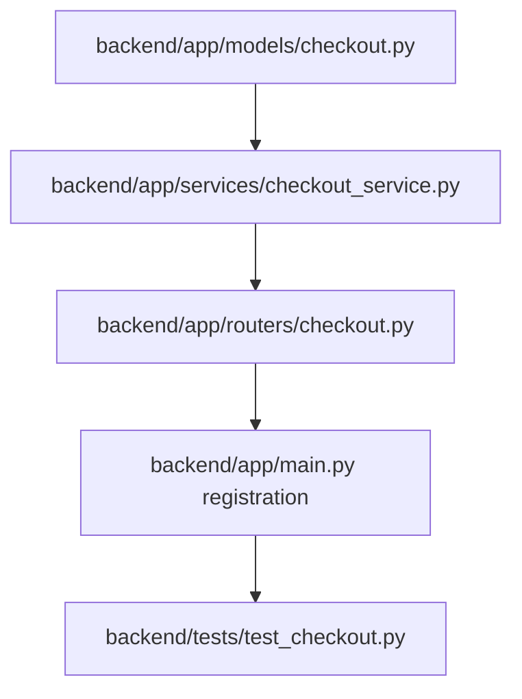

# Plan: Checkout Endpoint

> **Spec Reference**: `specs/001-checkout-endpoint/spec.md`
> **Branch**: `feat/checkout-and-orders`
> **Spec**: 001 of 004 in phase
> **Date**: 2026-09-05
> **Status**: Draft
>
> **CRITICAL CONTENT RULE**: DO NOT write implementation code or logic blocks in this document.
> Everything must be written in **pure text** (natural language, tables, bullet points). Only mock code
> shapes (e.g. JSON schemas or minimal type/interface signatures) are allowed, but **mock logic is
> strictly prohibited** (no function bodies, control flow, loops, or algorithms). Custom enums
> MUST be explained in pure text.

---

## 1. Technical Approach

The checkout endpoint implementation provides transactional-style validation and order creation within FastAPI.
- A new checkout router `backend/app/routers/checkout.py` handles the `POST /api/v1/checkout` route.
- A dedicated service layer `backend/app/services/checkout_service.py` encapsulates business logic: fetching the user's cart, verifying stock across all cart items against `seller_products`, inserting rows into `user_orders` with delivery status set to `pending`, decrementing stock counts in `seller_products`, optionally updating `users.address`, and removing the cart items.
- Pydantic models in `backend/app/models/checkout.py` validate request bodies (address non-empty check) and structure OpenAPI responses with field-level descriptions.
- FastAPI dependency injection (`get_current_user` and `get_supabase_client`) provides authenticated user state and database access.

## 2. Dependencies on Prior Specs

| Prior Spec | What It Provides | What This Spec Uses |
|------------|-----------------|---------------------|
| None (Phase 4 completed) | Cart models and tables (`carts`, `cart_items`, `seller_products`) | Reading active cart items and verifying seller offers |
| Phase 2 completed | Auth dependencies and `users` table | Authenticating the buyer and updating the user's saved profile address |

## 3. Files to Create

| File Path | Purpose |
|-----------|---------|
| `backend/app/models/checkout.py` | Pydantic request and response models for the checkout flow |
| `backend/app/services/checkout_service.py` | Business logic for cart verification, stock decrement, order insertion, and cart clearing |
| `backend/app/routers/checkout.py` | FastAPI route definition for `POST /api/v1/checkout` |
| `backend/tests/test_checkout.py` | Pytest unit and integration tests covering all checkout scenarios |

## 4. Files to Modify

| File Path | Changes |
|-----------|---------|
| `backend/app/main.py` | Register the new `checkout.router` under the FastAPI application |

## 5. Dependencies & Order

## 6. Detailed Implementation Notes

### 6.1 — Backend: Models (`backend/app/models/checkout.py`)

- **CheckoutRequest**:
  - `address`: string, required, must be at least 5 characters long and contain non-whitespace text. Field description explains this is the physical delivery destination.
  - `save_address`: boolean, optional, default is false. Field description explains that if set to true, updates the user's profile address in the database.
- **OrderItemSummary**:
  - `id`: integer, unique identifier of the created order record.
  - `product_id`: UUID, identifier of the purchased product.
  - `product_name`: string, title of the purchased product.
  - `seller_id`: UUID, identifier of the seller merchant.
  - `seller_name`: string, display name of the seller.
  - `bought_price`: float, unit price at the time of purchase.
  - `quantity`: integer, number of units ordered.
  - `subtotal`: float, product of unit price and quantity.
  - `delivery_types`: string, initial status set to `pending`. The `delivery_types` enum accepts values: `pending`, `confirmed`, `shipped`, `delivered`, `cancelled`, or `returned`.
  - `address`: string, delivery address for this order.
  - `created_at`: datetime or ISO string, timestamp when the order was placed.
- **CheckoutResponse**:
  - `order_ids`: list of integers, primary keys of the generated orders.
  - `orders`: list of `OrderItemSummary` objects.
  - `total_items`: integer, sum of quantities across all orders.
  - `total_price`: float, grand total monetary cost.
  - `message`: string, user-friendly confirmation message.

### 6.2 — Backend: Service (`backend/app/services/checkout_service.py`)

- **process_checkout**:
  - Accepts Supabase client instance, user ID (UUID), user role (string), and `CheckoutRequest` payload.
  - Authorization check: Verifies `user_role` equals `buyer`. If not, raises HTTP 403 Forbidden with `FORBIDDEN` code.
  - Fetch active cart: Query `carts` table for `user_id`. If not found, raise HTTP 400 Bad Request with `EMPTY_CART`.
  - Fetch cart items with joins: Query `cart_items` for the cart id, fetching item details including `seller_product_id`, `quantity`, and joined seller product data (`price`, `stock`, `product_id`, `seller_id`), product name, and seller display name.
  - Validate non-empty: If zero items found, raise HTTP 400 Bad Request with `EMPTY_CART`.
  - Stock validation step: For each item, compare current `seller_products.stock` with requested `cart_items.quantity`. If current stock is less than requested quantity, raise HTTP 400 Bad Request with `INSUFFICIENT_STOCK` and detail naming the affected product.
  - Order creation step: Prepare list of order dictionaries for `user_orders` table:
    - `product_id`: UUID from seller product.
    - `bought_price`: Price from seller product.
    - `buyer_id`: Buyer user ID.
    - `delivery_types`: Literal string `pending`.
    - `address`: Submitted address string.
    - `seller_id`: Seller user ID.
    - `quantity`: Ordered quantity.
    - Insert records into `user_orders`.
  - Inventory decrement step: For each seller product offer, update `seller_products` by setting `stock = stock - quantity`.
  - Profile update step: If `save_address` is true, update `users` table where `id == user_id`, setting `address = payload.address`.
  - Cart cleanup step: Delete all rows from `cart_items` where `cart_id == cart.id`.
  - Response formatting step: Construct and return `CheckoutResponse` containing created order IDs, items list, total items, and grand total.

### 6.3 — Backend: Router (`backend/app/routers/checkout.py`)

- Route path: `POST /api/v1/checkout`.
- Tags: `["Checkout"]`.
- Summary: "Process buyer checkout".
- Dependencies: `get_current_user` (returns `AuthenticatedUser`) and `get_supabase_client` (returns Supabase client).
- Response model: `CheckoutResponse`.
- Error responses documented: HTTP 400 (`EMPTY_CART`, `INSUFFICIENT_STOCK`), HTTP 401 (`UNAUTHORIZED`), HTTP 403 (`FORBIDDEN`), HTTP 422 (`VALIDATION_ERROR`).

### 6.4 — Backend: Tests (`backend/tests/test_checkout.py`)

- Test 1: Successful checkout for buyer with multiple cart items (verifies orders inserted, stock decremented, cart cleared, 200 returned).
- Test 2: Checkout fails with HTTP 400 `EMPTY_CART` when cart has 0 items.
- Test 3: Checkout fails with HTTP 400 `EMPTY_CART` when user has no cart record.
- Test 4: Checkout fails with HTTP 400 `INSUFFICIENT_STOCK` when requested quantity exceeds available stock (verifies no orders created and cart untouched).
- Test 5: Checkout fails with HTTP 403 `FORBIDDEN` when authenticated user is a `merchant`.
- Test 6: Checkout fails with HTTP 403 `FORBIDDEN` when authenticated user is a `logistics` user.
- Test 7: Checkout rejects unauthenticated requests with HTTP 401.
- Test 8: Checkout successfully persists address to `users.address` when `save_address` is true.
- Test 9: Checkout does not overwrite `users.address` when `save_address` is false.
- Test 10: Checkout rejects blank or whitespace-only address with HTTP 422.

## 7. Testing Strategy

### Backend Tests (Pytest)
- Use FastAPI `TestClient` with dependency overrides for `get_supabase_client` and mock JWT buyer/merchant tokens.
- Mock Supabase table operations for `carts`, `cart_items`, `seller_products`, `user_orders`, and `users`.
- Assert exact error envelope structure: `{"error": {"code": "...", "message": "..."}}`.

### Manual Verification
- Log in as buyer in local environment with seeded products and cart items.
- Send POST request to `/api/v1/checkout` with address string and inspect returned order IDs.
- Verify in Supabase table that `cart_items` is empty, `user_orders` has rows with status `pending`, and `seller_products` stock is decremented.

## 8. Constitution Compliance Checklist

- [ ] All business logic in FastAPI, not Next.js (§4.1)
- [ ] No Supabase JS client used; all database calls in backend service (§4.1)
- [ ] JWT authentication via FastAPI dependency (§4.2)
- [ ] Route prefixed with `/api/v1/` (§4.3)
- [ ] OpenAPI documentation with summary, description, and response codes (§4.3)
- [ ] Pydantic models with field descriptions and examples (§4.3)
- [ ] Standard error envelope for all client and server errors (§4.4)
- [ ] Tables comply with predefined schema: `user_orders`, `seller_products`, `carts`, `cart_items` (§5)
- [ ] Custom enum `delivery_types` uses status value `pending` (§5)
- [ ] All naming conventions followed (`snake_case` files, `PascalCase` classes) (§7)
- [ ] Unit and integration tests written in Pytest (§14)

## 9. Risks & Mitigations

| Risk | Mitigation |
|------|-----------|
| Concurrent checkout requests causing negative stock | Strict pre-validation of current stock for every item before executing updates; fail fast if stock is insufficient |
| Partial order insertion if network drops mid-process | Validate and stage all records before writing; execute database updates sequentially and handle failures safely |
| Missing address formatting causing delivery ambiguities | Validate minimum length and non-whitespace string in Pydantic schema |
