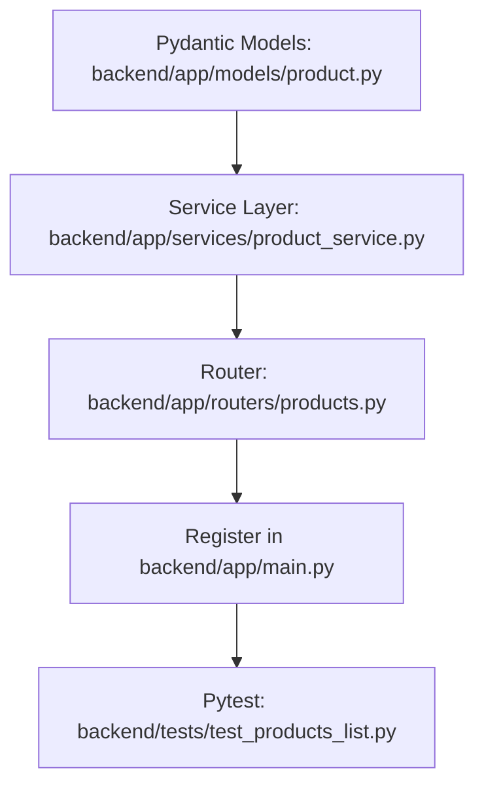

# Plan: List Products Endpoint

> **Spec Reference**: `specs/001-list-products-endpoint/spec.md`
> **Branch**: `feat/product-catalog`
> **Spec**: 001 of 005 in phase
> **Date**: 2026-09-05
> **Status**: Draft
>
> **CRITICAL CONTENT RULE**: DO NOT write implementation code or logic blocks in this document.
> Everything must be written in **pure text** (natural language, tables, bullet points). Only mock code
> shapes (e.g. JSON schemas or minimal type/interface signatures) are allowed, but **mock logic is
> strictly prohibited** (no function bodies, control flow, loops, or algorithms). Custom enums
> MUST be explained in pure text.

---

## 1. Technical Approach

The List Products endpoint (`GET /api/v1/products`) will be implemented within the FastAPI backend using standard layered architecture: Router -> Service -> Database client. 

1. **Request Validation**: FastAPI query parameters with Pydantic validation enforces that `limit` and `offset` are required integer query parameters with boundaries (`limit` between 1 and 100, `offset` >= 0). The search parameter `q` is optional string.
2. **Database Querying**: The service layer queries the Supabase `products` table. If `q` is present, ILIKE filtering is applied to either `name` or `description`. To optimize performance and prevent N+1 queries, all matching products in the paginated slice are collected, and their in-stock seller offers (`seller_products` with `stock > 0`) joined with `users` (seller display name) are retrieved.
3. **Cheapest Offer Calculation**: In Python service logic, each product's active offers are inspected to determine the offer with the minimum price. If multiple offers share the lowest price, the offer with the lowest estimated delivery days is chosen. Products without in-stock offers have `cheapest_offer` assigned as `None` / `null`.
4. **Response Serialization**: The response is validated and returned via Pydantic model `ProductsListResponse` matching the API contract.

## 2. Dependencies on Prior Specs

| Prior Spec | What It Provides | What This Spec Uses |
|------------|-----------------|---------------------|
| None | — | — |

## 3. Files to Create

| File Path | Purpose |
|-----------|---------|
| `backend/app/models/product.py` | Pydantic models for product items, cheapest offer, and paginated product list response |
| `backend/app/services/product_service.py` | Service functions to query products and compute cheapest in-stock seller offers |
| `backend/app/routers/products.py` | FastAPI route module exposing `GET /api/v1/products` with OpenAPI docs and validation |
| `backend/tests/test_products_list.py` | Pytest tests for pagination, filtering, offer resolution, and validation errors |

## 4. Files to Modify

| File Path | Changes |
|-----------|---------|
| `backend/app/main.py` | Include `products.router` into the FastAPI application instance |

## 5. Dependencies & Order

## 6. Detailed Implementation Notes

### 6.1 — Backend: Models (`backend/app/models/product.py`)

- **`CheapestOfferResponse` Model**:
  - `seller_product_id`: UUID string representing the offer identifier.
  - `seller_id`: UUID string representing the seller identifier.
  - `seller_name`: String representing the display name of the seller.
  - `price`: Float representing the unit price.
  - `stock`: Integer representing available inventory (greater than zero).
  - `estimated_delivery_days`: Optional integer representing transit days.
- **`ProductListItemResponse` Model**:
  - `id`: UUID string representing the product ID.
  - `name`: String with the product title.
  - `description`: String with the detailed description.
  - `brand`: String with the manufacturer or brand name.
  - `image_url`: Optional string with the public image URL.
  - `cheapest_offer`: Optional `CheapestOfferResponse` object, null if out of stock.
- **`ProductsListResponse` Model**:
  - `items`: List of `ProductListItemResponse` items.
  - `total`: Integer count of all matching products.
  - `limit`: Integer matching the requested limit.
  - `offset`: Integer matching the requested offset.

### 6.2 — Backend: Service (`backend/app/services/product_service.py`)

- **`list_products` Function**:
  - **Inputs**: `supabase` client dependency, `limit` (int), `offset` (int), `q` (optional string).
  - **Steps**:
    1. Initialize query against `products` table with count configuration.
    2. If `q` is provided and non-empty, apply or-filter for ILIKE matching on `name` or `description`.
    3. Apply ordering (by `created_at` descending) and range slicing using `offset` and `offset + limit - 1`.
    4. Execute count and product fetch.
    5. For returned product IDs, query `seller_products` where `product_id` is in the ID set and `stock > 0`, joining `users` to fetch `display_name`.
    6. For each product, group its seller offers and select the one with the lowest `price` (tie-breaking with `estimated_delivery_days`).
    7. Construct and return dictionary matching `ProductsListResponse`.

### 6.3 — Backend: Router (`backend/app/routers/products.py`)

- **Route Definition**:
  - Method: `GET`
  - Path: `/api/v1/products`
  - Tags: `["Products"]`
  - Summary: `List catalog products with cheapest offer`
  - Description: Complete markdown description detailing query parameters, filtering behavior, and cheapest offer resolution.
  - Parameters:
    - `limit`: `Query(..., ge=1, le=100, description="Maximum number of items to return")`
    - `offset`: `Query(..., ge=0, description="Number of items to skip for pagination")`
    - `q`: `Query(None, description="Case-insensitive substring search across name and description")`
  - Responses: `200` returning `ProductsListResponse`, `422` for parameter validation errors, `500` for unexpected errors.

### 6.4 — Backend: Tests (`backend/tests/test_products_list.py`)

- **Test Suite Fixtures**:
  - Mock Supabase client or seed data in database fixture representing multiple products, some with multiple offers, some with out-of-stock offers, and some with no offers.
- **Test Scenarios**:
  - `test_list_products_success`: Valid request with limit and offset returns 200 with matching items and total count.
  - `test_list_products_cheapest_offer_selection`: Verify product with multiple seller offers correctly selects lowest price offer.
  - `test_list_products_out_of_stock_null_offer`: Verify product where all offers have zero stock returns null `cheapest_offer`.
  - `test_list_products_search_by_name`: Verify `?q=` matches substring in product name.
  - `test_list_products_search_by_description`: Verify `?q=` matches substring in description.
  - `test_list_products_search_no_results`: Verify `?q=` with nonexistent term returns empty items list and total 0.
  - `test_list_products_missing_limit_offset`: Verify omitting limit or offset returns 422.
  - `test_list_products_invalid_bounds`: Verify limit=0 or offset=-1 returns 422.

## 7. Testing Strategy

### Backend Tests (Pytest)
- Execute `pytest backend/tests/test_products_list.py` to verify unit and integration logic.
- Assert correct status codes, JSON response shapes, offer selection logic, and pagination bounds.

### Manual Verification
> **Server Process Timeout Rule**: Any server process started for manual verification MUST include an automatic timeout that automatically terminates and kills the process after X seconds (e.g. 20 seconds max).
- Start backend server with an automated timeout (max 20 seconds): e.g. run uvicorn in background or with a 20-second timeout that automatically kills the process after 20 seconds.
- Send GET request via curl / test client to `/api/v1/products?limit=10&offset=0` and check output.
- Check Swagger UI at `http://localhost:8000/docs` to verify OpenAPI schema annotations and tag before the server process automatically terminates.

## 8. Constitution Compliance Checklist

- [ ] All business logic in FastAPI, not Next.js (§4.1)
- [ ] No Supabase JS client used; Python Supabase client via backend dependency (§4.1)
- [ ] All endpoints prefixed with `/api/v1/` (§4.3)
- [ ] Auto-generated OpenAPI docs with summary, description, tags, and Pydantic models (§4.3)
- [ ] Standard error envelope for errors (§4.4)
- [ ] Naming conventions followed (`products.py`, `product_service.py`) (§7)
- [ ] Substring ILIKE search used for query (§10)
- [ ] Tests written with Pytest (§14)
- [ ] Conventional Commits used (§13)

## 9. Risks & Mitigations

| Risk | Mitigation |
|------|-----------|
| N+1 query problem when fetching seller offers for each product | Batch query `seller_products` using `in_` filter on product IDs, then map in memory |
| Supabase ILIKE syntax with multiple columns | Use Supabase `or_` filter with `name.ilike.%q%,description.ilike.%q%` |
