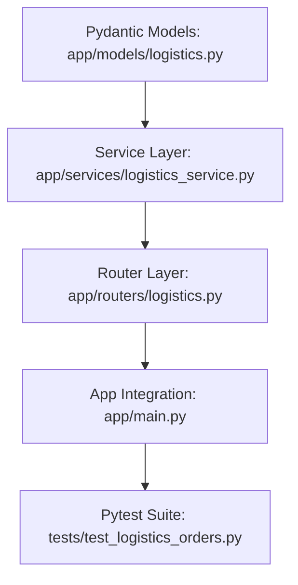

# Plan: Logistics View All Orders Endpoint

> **Spec Reference**: `specs/001-logistics-view-orders-endpoint/spec.md`
> **Branch**: `feat/logistics-dashboard`
> **Spec**: 001 of 003 in phase
> **Date**: 2026-09-06
> **Status**: Draft
>
> **CRITICAL CONTENT RULE**: DO NOT write implementation code or logic blocks in this document.
> Everything must be written in **pure text** (natural language, tables, bullet points). Only mock code
> shapes (e.g. JSON schemas or minimal type/interface signatures) are allowed, but **mock logic is
> strictly prohibited** (no function bodies, control flow, loops, or algorithms). Custom enums
> MUST be explained in pure text.

---

## 1. Technical Approach

The implementation will introduce a dedicated logistics module inside the FastAPI backend. This follows the architecture patterns established in the dashboard and order modules:

1. **Pydantic Schemas (`backend/app/models/logistics.py`)**: Define strict response models (`LogisticsOrderItemResponse` and `LogisticsOrderListResponse`) with comprehensive documentation fields and examples.
2. **Business Logic Service (`backend/app/services/logistics_service.py`)**: Implement `get_all_logistics_orders` which accepts the Supabase database client and optional status filter string. The service performs database queries with table joins to fetch associated product data (`name`, `brand`, `image_url`) and user display names for buyers and sellers, falling back to individual queries if foreign key relation joins encounter differences in Supabase postgrest schemas. It computes line subtotals and sorts orders newest first (`created_at` descending).
3. **Router Layer (`backend/app/routers/logistics.py`)**: Create a new APIRouter with prefix `/api/v1/logistics` and tag `Logistics`. Protect the route with the existing `get_current_user` dependency, and enforce that `current_user.user_role == "logistics"`. Validate that the optional status query belongs to the valid delivery types.
4. **App Integration (`backend/app/main.py`)**: Include the new logistics router in the main FastAPI application.
5. **Comprehensive Testing (`backend/tests/test_logistics_orders.py`)**: Write pytest test cases validating authentication guards, role restrictions, query parameter validation, successful data enrichment, and empty results handling.

## 2. Dependencies on Prior Specs

| Prior Spec | What It Provides | What This Spec Uses |
|------------|-----------------|---------------------|
| None | — | — |

## 3. Files to Create

| File Path | Purpose |
|-----------|---------|
| `backend/app/models/logistics.py` | Pydantic response models for logistics order items and collections |
| `backend/app/services/logistics_service.py` | Service functions querying and enriching order records for logistics staff |
| `backend/app/routers/logistics.py` | FastAPI APIRouter hosting the `/api/v1/logistics/orders` endpoint |
| `backend/tests/test_logistics_orders.py` | Pytest test suite covering all scenarios for the view orders endpoint |

## 4. Files to Modify

| File Path | Changes |
|-----------|---------|
| `backend/app/main.py` | Import and register the new logistics router on the FastAPI application |

## 5. Dependencies & Order

## 6. Detailed Implementation Notes

### 6.1 — Backend: Models (`backend/app/models/logistics.py`)

- **Model `LogisticsOrderItemResponse`**:
  - `id`: integer, unique identifier of the order row in `user_orders`.
  - `product_id`: UUID, identifier of the purchased product.
  - `product_name`: string, title of the product.
  - `product_brand`: string, brand of the product.
  - `product_image_url`: string or null, public image URL.
  - `seller_id`: UUID, identifier of the merchant seller.
  - `seller_name`: string, merchant display name.
  - `buyer_id`: UUID or null, identifier of the purchasing user.
  - `buyer_name`: string, buyer display name.
  - `address`: string, delivery destination address.
  - `bought_price`: float, unit price charged at purchase.
  - `quantity`: integer, number of units ordered.
  - `subtotal`: float, computed as bought price multiplied by quantity, rounded to 2 decimals.
  - `delivery_types`: string, delivery status. The `delivered_types` enum accepts: `pending`, `confirmed`, `shipped`, `delivered`, `cancelled`, or `returned`.
  - `created_at`: datetime or ISO string, timestamp when order was placed.

### 6.2 — Backend: Service (`backend/app/services/logistics_service.py`)

- **Function `get_all_logistics_orders`**:
  - Arguments: `supabase_client` (Client instance), `status_filter` (optional string).
  - Validates `status_filter` against allowed values: `pending`, `confirmed`, `shipped`, `delivered`, `cancelled`, `returned`. If invalid, raises HTTPException 400 with code `INVALID_STATUS`.
  - Executes a select query on `user_orders` ordered by `created_at` descending.
  - If `status_filter` is present, adds an equality filter for `delivery_types`.
  - Enriches records with product name, brand, image URL from `products` table, seller name from `users` table via `seller_id`, and buyer name from `users` table via `buyer_id`.
  - Computes `subtotal` for each line item.
  - Returns a list of `LogisticsOrderItemResponse` objects.

### 6.3 — Backend: Router (`backend/app/routers/logistics.py`)

- **Router Configuration**:
  - Prefix: `/api/v1/logistics`
  - Tags: `["Logistics"]`
- **Endpoint `GET /api/v1/logistics/orders`**:
  - Dependency injection: `current_user` from `get_current_user`, `supabase_client` from `get_supabase_client`.
  - Role Guard: Verify `current_user.user_role == "logistics"`. If not, raise HTTPException 403 with error envelope code `FORBIDDEN` and message "Only logistics personnel can view platform orders."
  - Query parameter: `status: str | None = Query(default=None, description="Filter orders by fulfillment status")`.
  - Calls `get_all_logistics_orders` and returns `list[LogisticsOrderItemResponse]`.
  - Documents status codes 200, 400, 401, 403, and 500 in the OpenAPI `responses` dictionary with detailed descriptions.

### 6.4 — Backend: Integration (`backend/app/main.py`)

- Import `logistics` from `app.routers`.
- Mount `app.include_router(logistics.router)`.

### 6.5 — Backend: Tests (`backend/tests/test_logistics_orders.py`)

- Use FastAPI `TestClient` with dependency overrides for database client and user authentication.
- Implement test cases covering:
  - Unauthenticated access returns 401 with `MISSING_TOKEN`.
  - User with role `buyer` receives 403 `FORBIDDEN`.
  - User with role `merchant` receives 403 `FORBIDDEN`.
  - User with role `logistics` successfully receives 200 and list of orders.
  - Status filter `?status=pending` returns only pending orders.
  - Invalid status query `?status=unknown_status` returns 400 `INVALID_STATUS`.
  - Empty database returns 200 with empty list.

## 7. Testing Strategy

### Backend Tests (Pytest)
- Test unauthorized access without cookie or token header.
- Test forbidden access when user role is `buyer` or `merchant`.
- Test successful retrieval with mocked Supabase responses.
- Test query filtering logic with various status values.
- Test error response structure matches `{ "error": { "code": "...", "message": "..." } }`.

### Manual Verification
- Start backend server via `uv run uvicorn app.main:app --reload`.
- Inspect Swagger UI at `/docs` to confirm summary, description, query params, and error responses.
- Send authenticated request with logistics JWT to verify populated payload.

## 8. Constitution Compliance Checklist

- [ ] All business logic in FastAPI, not Next.js (§4.1)
- [ ] No Supabase Auth used; custom user tables & JWT (§4.2)
- [ ] All endpoints prefixed with `/api/v1/` (§4.3)
- [ ] OpenAPI documentation with summaries, descriptions, tags, and field-level metadata (§4.3)
- [ ] Standard error envelope for all error responses (§4.4)
- [ ] Naming conventions followed (snake_case in Python, kebab-case in URLs) (§7)
- [ ] Comprehensive pytest tests for the endpoint (§14)
- [ ] Conventional Commits used for all commits (§13)

## 9. Risks & Mitigations

| Risk | Mitigation |
|------|-----------|
| Database query fails if join syntax fails | Implement safe fallback individual record lookups for product and user names identical to order service |
| Deleted or anonymous buyers/sellers | Use graceful string defaults ("Unknown Buyer", "Unknown Merchant") rather than throwing unhandled null reference errors |
