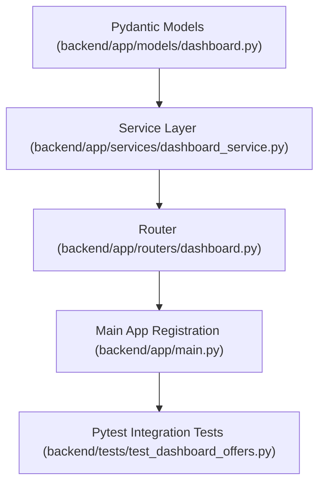

# Plan: Merchant List Offers Endpoint

> **Spec Reference**: `specs/001-merchant-list-offers-endpoint/spec.md`
> **Branch**: `feat/merchant-dashboard`
> **Spec**: 001 of 006 in phase
> **Date**: 2026-09-06
> **Status**: Draft
>
> **CRITICAL CONTENT RULE**: DO NOT write implementation code or logic blocks in this document.
> Everything must be written in **pure text** (natural language, tables, bullet points). Only mock code
> shapes (e.g. JSON schemas or minimal type/interface signatures) are allowed, but **mock logic is
> strictly prohibited** (no function bodies, control flow, loops, or algorithms). Custom enums
> MUST be explained in pure text.

---

## 1. Technical Approach

Implement a new dashboard API endpoint `GET /api/v1/dashboard/offers` under a new FastAPI router `dashboard.py`.
The endpoint leverages the existing `get_current_user` auth dependency and ensures that `current_user.user_role == "merchant"`.
The service layer (`dashboard_service.py`) queries the `seller_products` table via Supabase client, selecting all columns and joining with the `products` table on `product_id`. The returned data is mapped into a Pydantic response model list `list[MerchantOfferItemResponse]`.
The new router is registered into FastAPI application in `backend/app/main.py`. Comprehensive unit/integration tests with pytest will be added in `backend/tests/test_dashboard_offers.py`.

## 2. Dependencies on Prior Specs

| Prior Spec | What It Provides | What This Spec Uses |
|------------|-----------------|---------------------|
| None | — | — |

## 3. Files to Create

| File Path | Purpose |
|-----------|---------|
| `backend/app/models/dashboard.py` | Pydantic models for merchant dashboard requests and responses |
| `backend/app/services/dashboard_service.py` | Business logic for querying seller offers and joining product records |
| `backend/app/routers/dashboard.py` | FastAPI router for `/api/v1/dashboard` endpoints |
| `backend/tests/test_dashboard_offers.py` | Pytest tests for merchant list offers endpoint |

## 4. Files to Modify

| File Path | Changes |
|-----------|---------|
| `backend/app/main.py` | Include `dashboard.router` under `/api/v1/dashboard` prefix |

## 5. Dependencies & Order

## 6. Detailed Implementation Notes

> **REMINDER**: DO NOT write implementation code or logic blocks here! Everything must
> be written in pure text. Mock code shapes/signatures only; mock logic is strictly
> prohibited. Custom enums must be explained in pure text.

### 6.1 — Backend: Models (`backend/app/models/dashboard.py`)

- Define `MerchantOfferItemResponse`:
  - `id`: UUID, unique identifier of the seller product offer.
  - `product_id`: UUID, unique identifier of the catalog product.
  - `product_name`: string, title of the product.
  - `product_brand`: string, brand of the product.
  - `product_description`: string, detailed description.
  - `product_image_url`: string or null, public URL to the product image.
  - `price`: float, unit price set by the merchant.
  - `stock`: integer, available inventory count.
  - `estimated_delivery_days`: integer or null, estimated transit days.
  - `created_at`: datetime or ISO string or null, creation timestamp.
- Configure Pydantic model with `ConfigDict(from_attributes=True)` and detailed field descriptions.

### 6.2 — Backend: Service (`backend/app/services/dashboard_service.py`)

- Define `get_merchant_offers`:
  - Inputs: `seller_id` (UUID), `supabase_client` (Supabase Client).
  - Queries `seller_products` table where `seller_id` equals the input `seller_id`, selecting columns `id, product_id, seller_id, price, stock, estimated_delivery_days, created_at, products(id, name, brand, description, image_url)`.
  - Orders rows by `created_at` descending.
  - Maps database rows to instances of `MerchantOfferItemResponse`. For each row, flattens the joined `products` dictionary attributes into `product_name`, `product_brand`, `product_description`, and `product_image_url`.
  - Output: Returns a list of `MerchantOfferItemResponse` instances.

### 6.3 — Backend: Router (`backend/app/routers/dashboard.py`)

- Initialize `APIRouter` with `prefix="/api/v1/dashboard"` and `tags=["Dashboard"]`.
- Define endpoint `GET /offers`:
  - Summary: "Retrieve merchant product offers"
  - Description: "Returns all offers owned by the current merchant, joined with catalog product data."
  - Dependencies: `current_user: AuthenticatedUser = Depends(get_current_user)`, `supabase_client: Client = Depends(get_supabase_client)`.
  - Role check: Verify `current_user.user_role == "merchant"`. If not equal, raise `HTTPException(status_code=403)` with error envelope containing code `FORBIDDEN`.
  - Calls `get_merchant_offers` service function with `current_user.id` and `supabase_client`.
  - Returns `list[MerchantOfferItemResponse]`.
  - Documents status codes: 200 (Success), 401 (Unauthorized), 403 (Forbidden), 500 (Internal Server Error).

### 6.4 — Backend: App Registration (`backend/app/main.py`)

- Import `dashboard` router from `app.routers.dashboard`.
- Call `app.include_router(dashboard.router)`.

### 6.5 — Backend: Tests (`backend/tests/test_dashboard_offers.py`)

- Setup test client and mock authentication helpers for merchant, buyer, and unauthenticated requests.
- Test cases:
  1. Test successful retrieval with multiple offers: Verifies HTTP 200, correct array length, and properly flattened product fields.
  2. Test empty offers list: Merchant has zero offers; returns HTTP 200 with `[]`.
  3. Test role verification (buyer forbidden): Buyer token receives HTTP 403 with `FORBIDDEN` error code.
  4. Test unauthenticated request: Missing or invalid token receives HTTP 401.
  5. Test data isolation: Verifies that query explicitly filters by authenticated merchant ID.

## 7. Testing Strategy

### Backend Tests (Pytest)
- Execute `uv run pytest backend/tests/test_dashboard_offers.py -v`.
- Ensure all assertions pass without warnings.

### Manual Verification
- Start FastAPI dev server with `uv run uvicorn app.main:app --reload`.
- Visit OpenAPI documentation at `http://127.0.0.1:8000/docs` to inspect the `Dashboard` tag and `GET /api/v1/dashboard/offers` schema.
- Execute request using a merchant JWT bearer token or cookie and inspect the output JSON payload.

## 8. Constitution Compliance Checklist

- [ ] All business logic in FastAPI, not Next.js (§4.1)
- [ ] Role enforcement verifying merchant access (§2)
- [ ] Endpoint prefixed with `/api/v1/` (§4.3)
- [ ] OpenAPI documentation with summary, description, and Pydantic models with field descriptions (§4.3)
- [ ] Standard error envelope for all errors (§4.4)
- [ ] Naming conventions followed (§7)
- [ ] Tests written for all endpoints (§14)
- [ ] Conventional Commits used (§13)

## 9. Risks & Mitigations

| Risk | Mitigation |
|------|-----------|
| Joined product record could be null if database integrity is violated | Handle optional product dictionary safely when mapping to response model |
| Role check missed on new endpoints | Implement consistent role check at the top of the endpoint handler before invoking service logic |
