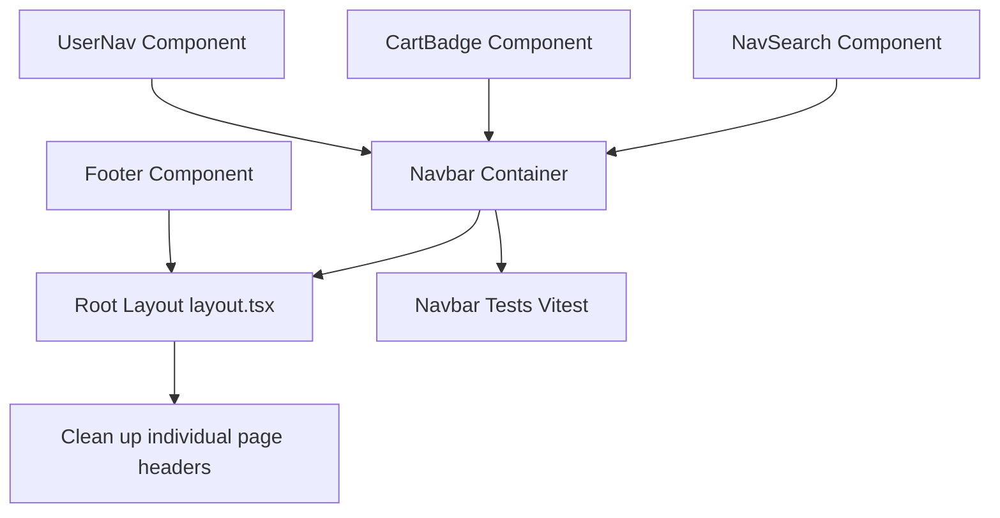

# Plan: Shared Layout and Navigation

> **Spec Reference**: `specs/001-shared-layout-and-navigation/spec.md`
> **Branch**: `feat/polish-and-integration`
> **Spec**: 001 of 006 in phase
> **Date**: 2026-09-07
> **Status**: Draft
>
> **CRITICAL CONTENT RULE**: DO NOT write implementation code or logic blocks in this document.
> Everything must be written in **pure text** (natural language, tables, bullet points). Only mock code
> shapes (e.g. JSON schemas or minimal type/interface signatures) are allowed, but **mock logic is
> strictly prohibited** (no function bodies, control flow, loops, or algorithms). Custom enums
> MUST be explained in pure text.

---

## 1. Technical Approach

The objective is to establish a unified visual frame and global navigation system across the entire application without duplicating code across individual pages.

1. **Root Layout Integration**: Place a new `Navbar` component and `Footer` component inside `frontend/app/layout.tsx`, wrapping `{children}` between them with a flex column container (`flex flex-col min-h-screen`) where `{children}` expands (`flex-1`).
2. **Modular Navbar Architecture**:
   - `Navbar`: Main container holding brand logo, links, search, cart, and user menu.
   - `NavSearch`: Encapsulates search form input state and submits via Next.js navigation router (`useRouter`) to `/products?q={query}`.
   - `CartBadge`: Consumes `useCart` (or cart query) to count total items. Displays badge only when quantity is greater than zero.
   - `UserNav`: Connects to `AuthContext` (`useAuth`). If unauthenticated, renders login and signup buttons. If authenticated, renders a dropdown menu showing user details and role-filtered links.
3. **Role-Based Navigation Filtering**:
   - Roles are checked against `user.user_role` (which accepts `buyer`, `merchant`, or `logistics`).
   - Merchants see a link to `/dashboard`.
   - Logistics staff see a link to `/logistics`.
   - Buyers see links to `/orders` and `/cart`.
4. **Footer Implementation**:
   - Semantic `<footer>` with structured columns for Brand/About, Platform Navigation, Educational Project Disclaimer, and Copyright.
5. **Page Cleanup**:
   - Inspect and clean up individual page components (`page.tsx`, `products/page.tsx`, etc.) to remove old inline headers and repetitive navigation markup.

## 2. Dependencies on Prior Specs

| Prior Spec | What It Provides | What This Spec Uses |
|------------|-----------------|---------------------|
| None | — | — |

## 3. Files to Create

| File Path | Purpose |
|-----------|---------|
| `frontend/components/layout/navbar.tsx` | Main responsive navigation bar container |
| `frontend/components/layout/nav-search.tsx` | Persistent navbar search input component |
| `frontend/components/layout/cart-badge.tsx` | Cart icon with dynamic numeric badge |
| `frontend/components/layout/user-nav.tsx` | Role-aware user profile dropdown and auth action links |
| `frontend/components/layout/footer.tsx` | Shared application footer component |
| `frontend/__tests__/navbar.test.tsx` | Vitest unit and integration tests for navigation components |

## 4. Files to Modify

| File Path | Changes |
|-----------|---------|
| `frontend/app/layout.tsx` | Embed `Navbar` and `Footer` around `{children}` |
| `frontend/app/page.tsx` | Remove inline header and use global layout navbar |
| `frontend/app/products/page.tsx` | Remove inline header/nav and redundant search bar |
| `frontend/app/products/[id]/page.tsx` | Remove inline header if present |
| `frontend/app/cart/page.tsx` | Remove redundant page header if present |
| `frontend/app/checkout/page.tsx` | Remove redundant page header if present |
| `frontend/app/orders/page.tsx` | Remove redundant page header if present |
| `frontend/app/dashboard/page.tsx` | Remove redundant page header if present |
| `frontend/app/logistics/page.tsx` | Remove redundant page header if present |

## 5. Dependencies & Order

## 6. Detailed Implementation Notes

### 6.1 — Frontend: `NavSearch` (`frontend/components/layout/nav-search.tsx`)

- Component: `NavSearch`
- State: Local string for query input, synced with URL search params when mounted on `/products`.
- Interaction: On form submit, trims the string, prevents default form behavior, and calls `router.push('/products?q=' + encodeURIComponent(query))`.
- Accessibility: Text input has `aria-label="Search products"` and placeholder `"Search products..."`. Submit button has `aria-label="Submit search"`.

### 6.2 — Frontend: `CartBadge` (`frontend/components/layout/cart-badge.tsx`)

- Component: `CartBadge`
- Data Source: Uses the `useCart` hook from `@/lib/hooks/use-cart` to read the current cart items.
- Calculation: Sums the `quantity` field across all cart items.
- Rendering: Renders an anchor tag wrapping a `ShoppingCart` Lucide icon pointing to `/cart`. If the total item count exceeds zero, displays an absolute-positioned badge pill in the upper-right corner with the count (capped at `99+` if greater than 99).
- Accessibility: Includes `aria-label="Shopping Cart with X items"`.

### 6.3 — Frontend: `UserNav` (`frontend/components/layout/user-nav.tsx`)

- Component: `UserNav`
- Data Source: Uses `useAuth` from `@/lib/context/auth-context`.
- Unauthenticated View:
  - Renders "Log In" secondary button linking to `/login`.
  - Renders "Sign Up" primary button linking to `/signup`.
- Authenticated View:
  - Uses shadcn/ui `DropdownMenu` primitive (or custom accessible popover).
  - Trigger button displays user avatar or initial with display name.
  - Dropdown header displays user email and a badge indicating their role (`Buyer`, `Merchant`, or `Logistics`).
  - Conditional menu items:
    - If role is `merchant`: Link to "Seller Dashboard" (`/dashboard`).
    - If role is `logistics`: Link to "Logistics Dashboard" (`/logistics`).
    - If role is `buyer`: Link to "Order History" (`/orders`) and "My Cart" (`/cart`).
  - Dropdown separator followed by a "Log Out" menu item which invokes `logout()` and redirects to `/`.
- Accessibility: Dropdown trigger has `aria-expanded` and `aria-haspopup="menu"`.

### 6.4 — Frontend: `Navbar` (`frontend/components/layout/navbar.tsx`)

- Component: `Navbar`
- Structure: Semantic `<header>` containing `<nav>` with `max-w-7xl mx-auto flex items-center justify-between h-16 px-4`.
- Left: Brand icon and title linking to `/`.
- Center: `NavSearch` centered in available space with max width.
- Right: Catalog navigation link, `CartBadge`, and `UserNav`.
- Styling: Sticky header (`sticky top-0 z-50 bg-background/95 backdrop-blur border-b border-border`).

### 6.5 — Frontend: `Footer` (`frontend/components/layout/footer.tsx`)

- Component: `Footer`
- Structure: Semantic `<footer>` with `border-t border-border bg-muted/40 py-8 mt-auto`.
- Content:
  - Brand section with short tagline.
  - Navigation section with links to Home, Catalog, Cart, and Auth.
  - Learning Notice: Highlighted educational project disclaimer stating no real transactions take place.
  - Copyright line: "Kalano Marketplace. Built for educational purposes."

### 6.6 — Frontend: `layout.tsx` Integration

- Wraps `{children}` between `<Navbar />` and `<Footer />`.
- Container layout: `
 <Navbar /> <main className="flex-1">{children}</main> <Footer /> 
`.

### 6.7 — Frontend: Page Cleanup

- Audit `frontend/app/page.tsx` to remove its bespoke `<header>` and duplicate search input.
- Audit `frontend/app/products/page.tsx` to ensure it integrates seamlessly with the persistent search bar in the navbar.
- Remove any orphan header markup from other route pages.

## 7. Testing Strategy

### Frontend Tests (Vitest)
- Test `Navbar` unauthenticated state:
  - Assert "Log In" and "Sign Up" links are rendered.
  - Assert brand logo links to `/`.
  - Assert Catalog link points to `/products`.
- Test `Navbar` authenticated state:
  - Mock buyer user: Assert "My Orders" link appears, assert cart badge shows correct count.
  - Mock merchant user: Assert "Seller Dashboard" link appears.
  - Mock logistics user: Assert "Logistics Dashboard" link appears.
- Test `NavSearch`:
  - Typing a query and submitting triggers router push to `/products?q=query`.
  - Submitting empty string does not trigger navigation.
- Test `UserNav` logout action:
  - Clicking logout calls the logout handler.

### Manual Verification
- Navigate to `/` as a guest; verify navbar and footer display.
- Type "shirt" in navbar search bar and hit Enter; verify URL changes to `/products?q=shirt` and results display.
- Log in as buyer; verify user menu shows buyer name, cart badge shows count, and `/orders` link works.
- Log in as merchant; verify user menu shows merchant badge and `/dashboard` link works.
- Log in as logistics; verify user menu shows logistics badge and `/logistics` link works.
- Click "Log Out"; verify session clears and UI resets to unauthenticated state.

## 8. Constitution Compliance Checklist

- [x] All business logic in FastAPI, not Next.js (§4.1)
- [x] Using argon2 for password hashing, not Supabase Auth (§4.2)
- [x] JWT in httpOnly cookie (§4.2)
- [x] All endpoints prefixed with `/api/v1/` (§4.3)
- [x] Standard error envelope for all errors (§4.4)
- [x] Naming conventions followed (`kebab-case` files, `PascalCase` components) (§7)
- [x] Semantic HTML and accessibility requirements followed (§12)
- [x] Tests written for new components (§14)
- [x] Conventional Commits used (§13)

## 9. Risks & Mitigations

| Risk | Mitigation |
|------|-----------|
| Hydration mismatch between server-rendered HTML and client auth session | Render placeholder state in `UserNav` until client-side hydration completes (`mounted` state check). |
| Search bar on `/products` conflicting with navbar search bar | Standardize on the persistent navbar search bar; keep catalog page focused on filters and results. |
| Page content hidden underneath sticky navbar | Ensure proper padding-top or standard document flow with sticky positioning. |
