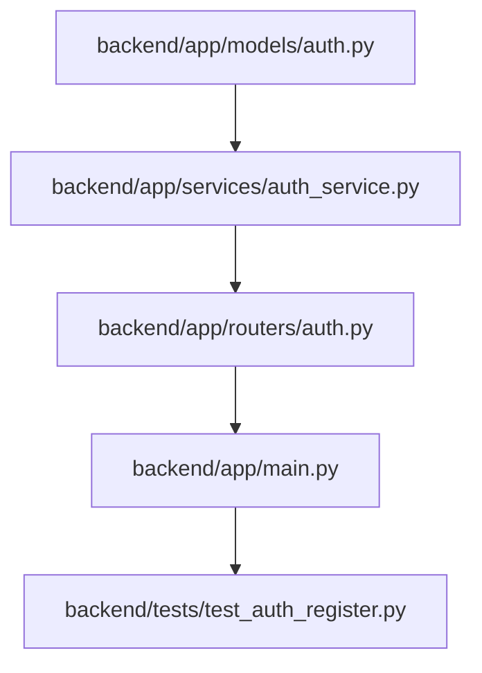

# Plan: User Registration Endpoint

> **Spec Reference**: `specs/001-user-registration-endpoint/spec.md`  
> **Branch**: `feat/authentication`  
> **Spec**: 001 of 006 in phase  
> **Date**: 2026-09-03  
> **Status**: Draft  

---

## 1. Technical Approach

The registration endpoint (`POST /api/v1/auth/register`) implements user account creation with strict layering and constitution compliance:

1. **Routing & Documentation Layer (`backend/app/routers/auth.py`)**:
   - Uses `APIRouter(prefix="/api/v1", tags=["Auth"])`.
   - Exposes `POST /auth/register` with complete OpenAPI metadata (`summary`, `description`, `response_model=UserResponse`, and response documentation for `409` and `422`).
   - Receives validated `UserRegisterRequest` payload and injects the Supabase client via `Depends(get_supabase_client)`.
   - Maps service-level domain exceptions (e.g. `DuplicateEmailError`) into HTTP 409 `JSONResponse` conforming to the platform-standard `ErrorResponse` envelope.

2. **Validation & Modeling Layer (`backend/app/models/auth.py`)**:
   - `ErrorDetail` and `ErrorResponse`: Standard reusable error envelope models (`{"error": {"code": "...", "message": "..."}}`).
   - `UserRegisterRequest`: Validates `email` (regex email validation pattern, trimmed and lowercased), `password` (min 8 chars), `display_name` (min 1, max 100 chars, trimmed), and `user_role` (constrained via `Literal["buyer", "merchant"]`).
   - `UserResponse`: Public user representation returning `id` (UUID), `created_at` (datetime), `email`, `display_name`, `user_role`, and `address` (optional string). The `password_hash` column is explicitly excluded.

3. **Business Logic & Security Layer (`backend/app/services/auth_service.py`)**:
   - Password hashing implemented via `argon2.PasswordHasher` from `argon2-cffi`.
   - Database interaction with the pre-existing `users` table via `client.table("users").insert({...}).execute()`.
   - Neither `id` nor `created_at` are generated or supplied by the application; Supabase handles both automatically via table defaults (`gen_random_uuid()` and `now()`).
   - Detection of PostgreSQL unique constraint violations (code `23505`) on the `email` column, raising a domain-specific `DuplicateEmailError`.

4. **Application Wiring (`backend/app/main.py`)**:
   - Mounts `auth.router` on the main FastAPI application.

---

## 2. Dependencies on Prior Specs

| Prior Spec | What It Provides | What This Spec Uses |
|---|---|---|
| None | — | First spec in Phase 2 |

---

## 3. Files to Create

| File Path | Purpose |
|---|---|
| `backend/app/models/auth.py` | Pydantic models for registration request, user response, and standard error envelope |
| `backend/app/services/auth_service.py` | Core authentication business logic: Argon2 hashing, database insertion, and conflict handling |
| `backend/app/routers/auth.py` | FastAPI APIRouter declaring `POST /auth/register` under `/api/v1` |
| `backend/tests/test_auth_register.py` | Pytest test suite covering success (201), duplicate email (409), and validation errors (422) |

---

## 4. Files to Modify

| File Path | Changes |
|---|---|
| `backend/app/main.py` | Import `auth` router and mount it via `app.include_router(auth.router)` |

---

## 5. Dependencies & Order



Execution sequence:
1. **Foundation**: Define Pydantic models (`ErrorDetail`, `ErrorResponse`, `UserRegisterRequest`, `UserResponse`) in `models/auth.py`.
2. **Service**: Implement `DuplicateEmailError`, `hash_password`, and `register_user` in `services/auth_service.py`.
3. **Router**: Create `routers/auth.py` and implement `POST /auth/register`.
4. **App Wiring**: Register `auth.router` in `main.py`.
5. **Testing**: Write comprehensive pytest cases in `tests/test_auth_register.py` and verify all tests pass.

---

## 6. Detailed Implementation Notes

### 6.1 — Backend: Models (`backend/app/models/auth.py`)

- **`ErrorDetail`**:
  - `code: str = Field(description="Machine-readable error code", examples=["DUPLICATE_EMAIL"])`
  - `message: str = Field(description="Human-readable description of error", examples=["A user with this email address already exists."])`
- **`ErrorResponse`**:
  - `error: ErrorDetail = Field(description="Standard error envelope")`
- **`UserRegisterRequest`**:
  - `email: str = Field(pattern=r"^[a-zA-Z0-9_.+-]+@[a-zA-Z0-9-]+\.[a-zA-Z0-9-.]+$", description="Unique user email address", examples=["user@example.com"])`
    - Validator normalizes email by stripping whitespace and converting to lowercase.
  - `password: str = Field(min_length=8, description="Plaintext password, minimum 8 characters", examples=["secret12345"])`
  - `display_name: str = Field(min_length=1, max_length=100, description="Public display name", examples=["Jane Doe"])`
    - Validator strips whitespace.
  - `user_role: Literal["buyer", "merchant"] = Field(description="User account role", examples=["buyer"])`
- **`UserResponse`**:
  - `id: UUID = Field(description="Unique user identifier", examples=["e4b01e3e-7a42-4f1b-8c29-33b6d080b091"])`
  - `created_at: datetime = Field(description="Account creation timestamp", examples=["2026-09-03T12:00:00Z"])`
  - `email: str = Field(description="User email address", examples=["user@example.com"])`
  - `display_name: str = Field(description="User public display name", examples=["Jane Doe"])`
  - `user_role: str = Field(description="User role", examples=["buyer"])`
  - `address: str | None = Field(default=None, description="User address, null upon registration", examples=[None])`
  - Config: `from_attributes = True`

### 6.2 — Backend: Service (`backend/app/services/auth_service.py`)

- **Domain Exception**:
  ```python
  class DuplicateEmailError(Exception):
      """Raised when attempting to register an email that already exists."""
      pass
  ```
- **Password Hashing**:
  ```python
  from argon2 import PasswordHasher

  ph = PasswordHasher()

  def hash_password(password: str) -> str:
      return ph.hash(password)
  ```
- **User Registration Function**:
  - Signature: `def register_user(payload: UserRegisterRequest, supabase_client: Client) -> UserResponse:`
  - Compute `password_hash = hash_password(payload.password)`.
  - Prepare dictionary matching `users` table schema:
    ```python
    # NOTE: Do NOT include 'id' or 'created_at'; Supabase generates both automatically
    user_data = {
        "email": payload.email,
        "password_hash": password_hash,
        "display_name": payload.display_name,
        "user_role": payload.user_role,
        "address": None,
    }
    ```
  - Execute Supabase insertion:
    ```python
    try:
        response = supabase_client.table("users").insert(user_data).execute()
        if not response.data:
            raise RuntimeError("Failed to insert user record into database.")
        created_record = response.data[0]
        return UserResponse(**created_record)
    except Exception as exc:
        error_str = str(exc)
        code = getattr(exc, "code", None)
        if code == "23505" or "23505" in error_str or "duplicate key" in error_str.lower():
            raise DuplicateEmailError("A user with this email address already exists.") from exc
        raise
    ```

### 6.3 — Backend: Router (`backend/app/routers/auth.py`)

- Instantiate router:
  ```python
  router = APIRouter(prefix="/api/v1", tags=["Auth"])
  ```
- Endpoint definition:
  ```python
  @router.post(
      "/auth/register",
      response_model=UserResponse,
      status_code=status.HTTP_201_CREATED,
      summary="Register a new user",
      description="Registers a new user account with either 'buyer' or 'merchant' role. "
                  "Hashes password with argon2, persists user in Supabase, and returns "
                  "the public user profile excluding sensitive password hash data.",
      responses={
          201: {
              "model": UserResponse,
              "description": "User successfully created.",
          },
          409: {
              "model": ErrorResponse,
              "description": "Email address already in use.",
          },
          422: {
              "description": "Validation error in request payload.",
          },
      },
  )
  def register(
      payload: UserRegisterRequest,
      supabase_client: Client = Depends(get_supabase_client),
  ) -> UserResponse | JSONResponse:
      try:
          return register_user(payload=payload, supabase_client=supabase_client)
      except DuplicateEmailError as exc:
          return JSONResponse(
              status_code=status.HTTP_409_CONFLICT,
              content=ErrorResponse(
                  error=ErrorDetail(
                      code="DUPLICATE_EMAIL",
                      message=str(exc),
                  )
              ).model_dump(),
          )
  ```

### 6.4 — Backend: Application Wiring (`backend/app/main.py`)

- Add `from app.routers import auth` alongside existing `from app.routers import health`.
- Include router: `app.include_router(auth.router)`.

### 6.5 — Backend: Tests (`backend/tests/test_auth_register.py`)

- Use `client` fixture from `backend/tests/conftest.py`.
- Mock `get_supabase_client` in `app.routers.auth` and `app.dependencies.database` using pytest `monkeypatch`.
- Test cases:
  1. `test_register_success`:
     - Provide valid payload (`buyer@example.com`, `password123`, `Jane Buyer`, `buyer`).
     - Mock Supabase `table("users").insert().execute()` returning mock data with UUID, timestamp, and fields.
     - Assert that the record passed to `insert(...)` does NOT contain `"id"` or `"created_at"` keys.
     - Assert `status_code == 201`.
     - Assert returned JSON contains `id`, `email`, `display_name`, `user_role`, `address == None`.
     - Assert `password_hash` is not in returned JSON.
  2. `test_register_duplicate_email`:
     - Mock Supabase `insert().execute()` raising an exception with message `"duplicate key value violates unique constraint users_email_key"` (code 23505).
     - Assert `status_code == 409`.
     - Assert response body is `{"error": {"code": "DUPLICATE_EMAIL", "message": "A user with this email address already exists."}}`.
  3. `test_register_missing_email`:
     - Omit `email` from payload.
     - Assert `status_code == 422`.
  4. `test_register_invalid_email_format`:
     - Provide `"not-an-email"`.
     - Assert `status_code == 422`.
  5. `test_register_short_password`:
     - Provide password `"short"` (< 8 chars).
     - Assert `status_code == 422`.
  6. `test_register_missing_password`:
     - Omit `password`.
     - Assert `status_code == 422`.
  7. `test_register_empty_display_name`:
     - Provide `display_name=""` or whitespace.
     - Assert `status_code == 422`.
  8. `test_register_invalid_role`:
     - Provide `user_role="logistics"` or `user_role="admin"`.
     - Assert `status_code == 422`.
  9. `test_register_merchant_role_success`:
     - Provide valid payload with `user_role="merchant"`.
     - Assert `status_code == 201` and `data["user_role"] == "merchant"`.

---

## 7. Testing Strategy

### Backend Tests (Pytest)

- Run via `uv run pytest backend/tests/test_auth_register.py -v`.
- All database operations are mocked via `monkeypatch` to ensure fast, deterministic, offline execution without requiring live Supabase credentials.
- Test argon2 hashing directly to ensure hashes generated can be verified with `PasswordHasher().verify(...)`.

### Manual Verification

1. Start the backend API under a strict timeout constraint (run as a background task with a maximum 30-second timeout, or terminate immediately after verification via `manage_task kill` to prevent the agent from waiting indefinitely): `uv run uvicorn app.main:app --port 8000`.
2. Open interactive OpenAPI docs at `http://localhost:8000/docs` (or fetch `http://localhost:8000/openapi.json`).
3. Locate `POST /api/v1/auth/register` under the `Auth` tag.
4. Verify summary, description, request body schema, and response schemas (201, 409, 422).
5. Submit a registration test request and observe responses.
6. Stop the server immediately after verification to return the agent to working state.

---

## 8. Constitution Compliance Checklist

- [x] All business logic in FastAPI, not Next.js (§4.1)
- [x] Using argon2 for password hashing, not Supabase Auth (§4.2)
- [x] JWT in httpOnly cookie (§4.2 — prepared for login in Spec 002)
- [x] All endpoints prefixed with `/api/v1/` (§4.3)
- [x] Pydantic models with field descriptions and examples (§4.3)
- [x] Standard error envelope for all errors (`{"error": {"code": "...", "message": "..."}}`) (§4.4)
- [x] Naming conventions followed (snake_case in Python, kebab-case in URLs) (§7)
- [x] Tests written for all endpoints and failure paths (§14)
- [x] Conventional Commits used for all changes (§13)

---

## 9. Risks & Mitigations

| Risk | Impact | Mitigation |
|---|---|---|
| Supabase `APIError` representation varies between SDK versions | Could cause duplicate email check to miss constraint violation | Service layer checks both `exc.code == "23505"` and substring presence of `"23505"` or `"duplicate key"` in string representation |
| Missing `email-validator` library in base Pydantic | Pydantic `EmailStr` would raise import error at startup | Use regex pattern validation `pattern=r"^[a-zA-Z0-9_.+-]+@[a-zA-Z0-9-]+\.[a-zA-Z0-9-.]+$"` within `Field()` and custom validator |
| Sensitive password hash leakage in responses | Critical security violation | `UserResponse` model strictly defines allowed fields; `password_hash` is never included in the response schema |
