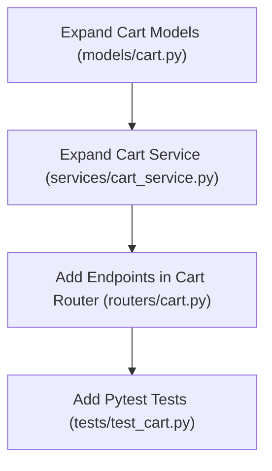

# Plan: Cart Backend — View & Modify Endpoints

> **Spec Reference**: `specs/002-cart-backend-view-modify/spec.md`
> **Branch**: `feat/cart`
> **Spec**: 002 of 004 in phase
> **Date**: 2026-09-05
> **Status**: Draft
>
> **CRITICAL CONTENT RULE**: DO NOT write implementation code or logic blocks in this document.
> Everything must be written in **pure text** (natural language, tables, bullet points). Only mock code
> shapes (e.g. JSON schemas or minimal type/interface signatures) are allowed, but **mock logic is
> strictly prohibited** (no function bodies, control flow, loops, or algorithms). Custom enums
> MUST be explained in pure text.

---

## 1. Technical Approach

This plan expands the backend modules created in Spec 001 (`models/cart.py`, `services/cart_service.py`, `routers/cart.py`, `tests/test_cart.py`):

1. **Schema Extension**: Add Pydantic schemas in `backend/app/models/cart.py`:
   - `CartItemDetail`: Enriched view of a cart item with product name, brand, image, seller name, unit price, stock, estimated delivery days, quantity, and computed subtotal.
   - `CartResponse`: Top-level cart schema containing cart ID, list of `CartItemDetail` items, `total_items`, and `total_price`.
   - `CartItemUpdate`: Request body schema for `PATCH` endpoint with constrained integer `quantity >= 1`.
   - `CartItemDeleteResponse`: Confirmation response schema for `DELETE`.
2. **Service Functions**: Add business logic functions in `backend/app/services/cart_service.py`:
   - `get_user_cart`: Look up user cart, query `cart_items` with joins to `seller_products`, `products`, and seller profile in `users`. Calculate line item subtotals and overall cart totals.
   - `update_cart_item_quantity`: Verify item belongs to user cart, check available inventory stock in `seller_products`, update quantity in `cart_items`, and return updated details.
   - `delete_cart_item`: Verify item belongs to user cart and delete row from `cart_items`.
3. **Router Endpoints**: Add route handlers in `backend/app/routers/cart.py`:
   - `GET /api/v1/cart`
   - `PATCH /api/v1/cart/items/{item_id}`
   - `DELETE /api/v1/cart/items/{item_id}`
4. **Pytest Coverage**: Expand `backend/tests/test_cart.py` to test cart fetching (empty and populated), updating quantities (success, insufficient stock, item not found, unauthorized), and deletion (success, item not found, unauthorized).

## 2. Dependencies on Prior Specs

| Prior Spec | What It Provides | What This Spec Uses |
|------------|-----------------|---------------------|
| `specs/001-cart-backend-add-item/` | `models/cart.py`, `services/cart_service.py`, `routers/cart.py` | Extends models, adds service methods, and adds routes to the cart router |

## 3. Files to Create

_None (all files were initialized in Spec 001)._

## 4. Files to Modify

| File Path | Changes |
|-----------|---------|
| `backend/app/models/cart.py` | Add `CartItemDetail`, `CartResponse`, `CartItemUpdate`, and delete response models |
| `backend/app/services/cart_service.py` | Add `get_user_cart`, `update_cart_item_quantity`, and `delete_cart_item` functions |
| `backend/app/routers/cart.py` | Add `GET /`, `PATCH /items/{item_id}`, and `DELETE /items/{item_id}` endpoints |
| `backend/tests/test_cart.py` | Add comprehensive pytest test cases for cart retrieval, patching, and deletion |

## 5. Dependencies & Order

## 6. Detailed Implementation Notes

### 6.1 — Backend Models (`backend/app/models/cart.py`)

- **CartItemDetail**:
  - `id`: Integer primary key of the cart item.
  - `seller_product_id`: UUID of the seller product offer.
  - `product_id`: UUID of the parent product.
  - `product_name`: String name of the product.
  - `product_brand`: String brand name of the product.
  - `product_image_url`: Optional string URL for product photo.
  - `seller_id`: UUID of the merchant.
  - `seller_name`: String display name of the merchant.
  - `unit_price`: Float price per unit.
  - `stock`: Integer available inventory.
  - `estimated_delivery_days`: Optional integer delivery estimate.
  - `quantity`: Integer quantity in cart.
  - `subtotal`: Float calculated as unit price multiplied by quantity.
  - `created_at`: Datetime or ISO string.
- **CartResponse**:
  - `id`: Optional integer cart primary key.
  - `user_id`: UUID of the owner.
  - `items`: List of `CartItemDetail` items.
  - `total_items`: Integer sum of all item quantities.
  - `total_price`: Float sum of all item subtotals.
- **CartItemUpdate**:
  - `quantity`: Integer strictly greater than 0 (`ge=1`).
- **CartItemDeleteResponse**:
  - `message`: String confirmation message.

### 6.2 — Backend Service (`backend/app/services/cart_service.py`)

- **get_user_cart**:
  - Query `carts` where `user_id == buyer_id`. If not found, return empty cart response with empty items, total items 0, and total price 0.0.
  - Query `cart_items` for this `cart_id`.
  - For each item, retrieve associated `seller_products` record (price, stock, estimated delivery days, product_id, seller_id).
  - Retrieve associated `products` record (name, brand, image_url).
  - Retrieve associated `users` record (seller display_name).
  - Construct `CartItemDetail` objects and calculate cumulative totals.
  - Return `CartResponse`.
- **update_cart_item_quantity**:
  - Retrieve `cart_items` row by `item_id`.
  - Check that the cart item belongs to a cart owned by the authenticated buyer. If not, raise HTTP 404 with code `CART_ITEM_NOT_FOUND`.
  - Fetch corresponding `seller_products` row to inspect live `stock`.
  - If requested `quantity > stock`, raise HTTP 400 with code `INSUFFICIENT_STOCK`.
  - Update `quantity` in `cart_items`.
  - Return updated cart item details.
- **delete_cart_item**:
  - Retrieve `cart_items` row by `item_id`.
  - Check that the cart item belongs to the authenticated buyer's cart. If not, raise HTTP 404 with code `CART_ITEM_NOT_FOUND`.
  - Delete row from `cart_items`.
  - Return confirmation message.

### 6.3 — Backend Router (`backend/app/routers/cart.py`)

- **`GET /api/v1/cart`**:
  - Guard with `get_current_user` and role check for `buyer`.
  - Call `get_user_cart` service function and return `CartResponse`.
- **`PATCH /api/v1/cart/items/{item_id}`**:
  - Path parameter: `item_id` (integer).
  - Body: `CartItemUpdate`.
  - Guard with `get_current_user` and role check for `buyer`.
  - Call `update_cart_item_quantity` service function and return updated response.
- **`DELETE /api/v1/cart/items/{item_id}`**:
  - Path parameter: `item_id` (integer).
  - Guard with `get_current_user` and role check for `buyer`.
  - Call `delete_cart_item` service function and return confirmation message.

### 6.4 — Pytest Tests (`backend/tests/test_cart.py`)

- Test 1: `GET /api/v1/cart` for a new buyer returns empty cart with 0 items and 0.0 total.
- Test 2: `GET /api/v1/cart` after adding items returns enriched details (product name, seller name, subtotals, total price).
- Test 3: `PATCH /api/v1/cart/items/{item_id}` updates quantity successfully.
- Test 4: `PATCH /api/v1/cart/items/{item_id}` with quantity exceeding stock returns HTTP 400 `INSUFFICIENT_STOCK`.
- Test 5: `PATCH /api/v1/cart/items/{item_id}` with quantity 0 returns HTTP 422.
- Test 6: `PATCH` on a non-existent item or an item belonging to another buyer returns HTTP 404 `CART_ITEM_NOT_FOUND`.
- Test 7: `DELETE /api/v1/cart/items/{item_id}` removes the item from the cart.
- Test 8: `DELETE` on a non-existent item returns HTTP 404 `CART_ITEM_NOT_FOUND`.
- Test 9: Non-buyer users calling any of these endpoints receive HTTP 403 `FORBIDDEN_ROLE`.
- Test 10: Unauthenticated requests receive HTTP 401.

## 7. Testing Strategy

### Backend Tests (Pytest)
- Run isolated pytest unit/integration tests using FastAPI `TestClient`.
- Mock or configure Supabase database responses for empty cart, multi-item cart, stock boundaries, and foreign key relations.

### Manual Verification
- Access `/docs` and test `GET /api/v1/cart`, `PATCH /api/v1/cart/items/{item_id}`, and `DELETE /api/v1/cart/items/{item_id}`.
- Verify status codes and error payloads in response tab.

## 8. Constitution Compliance Checklist

- [ ] All cart business logic and calculations in FastAPI (§4.1)
- [ ] Role enforcement ensuring buyer access only (§2, §8)
- [ ] Endpoints prefixed with `/api/v1/` (§4.3)
- [ ] OpenAPI documentation with summaries, descriptions, tags, and Pydantic schemas (§4.3)
- [ ] Standard error envelope for all error responses (§4.4)
- [ ] Predefined schema used (`carts`, `cart_items`, `seller_products`, `products`, `users`) (§5)
- [ ] Tests written for all endpoints (§14)
- [ ] Conventional Commits used (§13)

## 9. Risks & Mitigations

| Risk | Mitigation |
|------|-----------|
| Insecure Direct Object Reference (IDOR) on `{item_id}` | Always filter cart item queries by verifying ownership through the buyer's `cart_id` |
| Floating point rounding discrepancies in totals | Standardize rounding of prices, subtotals, and totals to two decimal places |
| Stale stock during PATCH | Query real-time inventory from `seller_products` inside `update_cart_item_quantity` |
