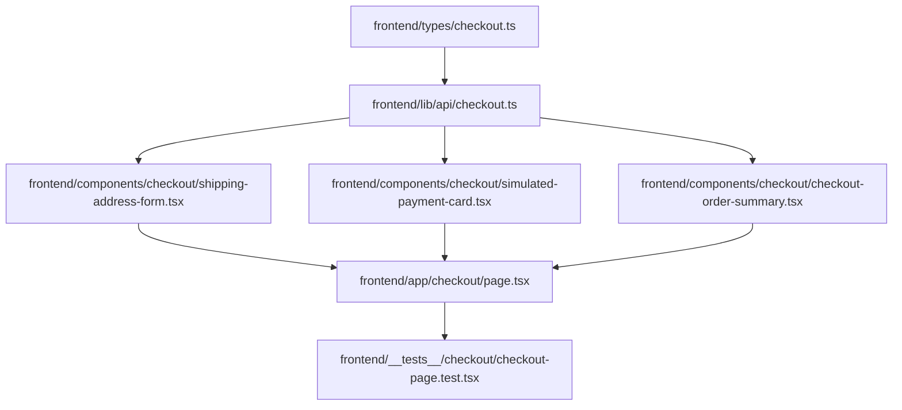

# Plan: Checkout Frontend Page

> **Spec Reference**: `specs/002-checkout-frontend-page/spec.md`
> **Branch**: `feat/checkout-and-orders`
> **Spec**: 002 of 004 in phase
> **Date**: 2026-09-05
> **Status**: Draft
>
> **CRITICAL CONTENT RULE**: DO NOT write implementation code or logic blocks in this document.
> Everything must be written in **pure text** (natural language, tables, bullet points). Only mock code
> shapes (e.g. JSON schemas or minimal type/interface signatures) are allowed, but **mock logic is
> strictly prohibited** (no function bodies, control flow, loops, or algorithms). Custom enums
> MUST be explained in pure text.

---

## 1. Technical Approach

The checkout frontend feature is implemented as a client component page in Next.js (`frontend/app/checkout/page.tsx`).
- It integrates with the checkout API endpoint (`POST /api/v1/checkout`) via a new API client function in `frontend/lib/api/checkout.ts`.
- TypeScript types matching the checkout payload and response are declared in `frontend/types/checkout.ts`.
- State management relies on TanStack Query: querying the cart via existing `useCart` hook, and using a mutation for submitting checkout.
- Upon mutation success, the cart query cache is invalidated to reflect the empty cart, user context is refreshed if address saving was selected, and Next.js router navigates to `/orders` with a success toast.
- Modular subcomponents in `frontend/components/checkout/` divide concerns:
  - `shipping-address-form.tsx` for the delivery address input and "save to profile" checkbox.
  - `simulated-payment-card.tsx` for displaying mock credit card information and educational disclaimer.
  - `checkout-order-summary.tsx` for rendering item breakdown, subtotal, and "Place Order" button.
  - `checkout-skeleton.tsx` for the loading state.

## 2. Dependencies on Prior Specs

| Prior Spec | What It Provides | What This Spec Uses |
|------------|-----------------|---------------------|
| `specs/001-checkout-endpoint/` | `POST /api/v1/checkout` endpoint | Consumed by the checkout API client function |
| Phase 4 (Cart) | `useCart` hook and `GET /api/v1/cart` | Provides cart items, counts, and prices |
| Phase 2 (Auth) | `AuthContext` and `useAuth` hook | Provides current user, `user.address`, and `refreshUser()` |

## 3. Files to Create

| File Path | Purpose |
|-----------|---------|
| `frontend/types/checkout.ts` | TypeScript types for checkout request, response, and order item summaries |
| `frontend/lib/api/checkout.ts` | API client function calling `POST /api/v1/checkout` with error parsing |
| `frontend/components/checkout/shipping-address-form.tsx` | Component for shipping address input and save checkbox |
| `frontend/components/checkout/simulated-payment-card.tsx` | Visual mockup of simulated payment method and disclaimer |
| `frontend/components/checkout/checkout-order-summary.tsx` | Order summary listing items, total, and submission button |
| `frontend/components/checkout/checkout-skeleton.tsx` | Skeleton placeholder for loading state |
| `frontend/app/checkout/page.tsx` | Checkout page coordinating form state, mutations, and redirect |
| `frontend/__tests__/checkout/checkout-page.test.tsx` | Vitest integration tests for the checkout page |

## 4. Files to Modify

| File Path | Changes |
|-----------|---------|
| None | Page and components are completely additive to existing codebase |

## 5. Dependencies & Order

## 6. Detailed Implementation Notes

### 6.1 — Frontend: Types (`frontend/types/checkout.ts`)

- **CheckoutPayload**:
  - `address`: string, required.
  - `save_address`: boolean, optional.
- **CheckoutOrderItem**:
  - `id`: number.
  - `product_id`: string.
  - `product_name`: string.
  - `seller_id`: string.
  - `seller_name`: string.
  - `bought_price`: number.
  - `quantity`: number.
  - `subtotal`: number.
  - `delivery_types`: string (representing enum values `pending`, `confirmed`, `shipped`, `delivered`, `cancelled`, or `returned`).
  - `address`: string.
  - `created_at`: string.
- **CheckoutResponse**:
  - `order_ids`: number array.
  - `orders`: array of `CheckoutOrderItem`.
  - `total_items`: number.
  - `total_price`: number.
  - `message`: string.

### 6.2 — Frontend: API Client (`frontend/lib/api/checkout.ts`)

- Function `processCheckout`:
  - Receives `CheckoutPayload`.
  - Performs `fetch` POST to `/api/v1/checkout` with `credentials: "include"`.
  - If response is not ok, parses error JSON envelope and throws standard `ApiError`.
  - Returns parsed `CheckoutResponse`.

### 6.3 — Frontend: Components (`frontend/components/checkout/`)

- **shipping-address-form.tsx**:
  - Props: `address` (string), `onAddressChange` (callback), `saveAddress` (boolean), `onSaveAddressChange` (callback), `error` (optional string), `disabled` (boolean).
  - Renders input/textarea for delivery address with label and required marker.
  - Displays checkbox for "Save this address to my profile for future orders".
  - Displays inline validation message if error is passed.
- **simulated-payment-card.tsx**:
  - Renders card with dummy Visa/Mastercard badge, masked card number `•••• •••• •••• 4242`, simulated expiry, and CVV placeholder.
  - Prominent alert box stating: "Educational Simulator: No actual payment will be taken. Orders are fulfilled in simulated logistics mode."
- **checkout-order-summary.tsx**:
  - Props: `cart` (`CartResponse`), `isSubmitting` (boolean), `onSubmit` (callback).
  - Renders list of cart item thumbnails, names, quantities, unit prices, and line subtotals.
  - Calculates and renders subtotal, shipping cost ($0.00 / Free), and grand total.
  - Renders primary button "Place Order" that displays loading spinner when `isSubmitting` is true.
- **checkout-skeleton.tsx**:
  - Renders animated pulsing skeletons for left form column and right summary column.

### 6.4 — Frontend: Page (`frontend/app/checkout/page.tsx`)

- Client component marked with `"use client"`.
- Reads `user` and `refreshUser` from `useAuth()`.
- Reads `cart`, `isLoading` from `useCart()`.
- Uses `useRouter` from `next/navigation`.
- Initializes local state for `address` (defaulting to `user.address` or empty string) and `saveAddress` (defaulting to true if `user.address` is empty, otherwise false).
- Validates that address is non-empty and at least 5 characters.
- Uses TanStack `useMutation` calling `processCheckout`:
  - `onSuccess`: Invalidate `["cart"]` query key, await `refreshUser()` if `saveAddress` is true, trigger toast success notification, and push route `/orders`.
  - `onError`: Parse error message and set form error state or toast error.
- Handles empty cart state: if `cart.items.length === 0`, render empty cart banner with link to `/products`.

### 6.5 — Frontend: Tests (`frontend/__tests__/checkout/checkout-page.test.tsx`)

- Test 1: Renders loading skeleton while cart is fetching.
- Test 2: Renders empty cart message and link to products when cart is empty.
- Test 3: Pre-populates shipping address from authenticated user profile.
- Test 4: Shows client-side validation error when clicking Place Order with an empty address.
- Test 5: Submits checkout mutation with address and save_address flag on valid submit.
- Test 6: Displays error toast/alert if backend returns an error (such as out-of-stock).
- Test 7: Redirects to `/orders` on successful checkout.

## 7. Testing Strategy

### Frontend Tests (Vitest)
- Render `CheckoutPage` wrapped in `QueryClientProvider` and mock `AuthContext`.
- Mock `@/lib/api/checkout` and `@/lib/api/cart`.
- Simulate user typing address, checking checkbox, and clicking "Place Order".
- Assert expected function calls, validation states, and router redirects.

### Manual Verification
- Add items to cart from catalog.
- Navigate to `/checkout`.
- Confirm saved address appears if logged in.
- Click "Place Order" and confirm redirection to `/orders`.

## 8. Constitution Compliance Checklist

- [ ] Thin client: no backend logic in Next.js; calls FastAPI endpoint (§4.1)
- [ ] No Supabase JS client in frontend (§4.1)
- [ ] Protected route checked by Next.js middleware (§4.2)
- [ ] Uses TanStack Query for state and invalidation (§3)
- [ ] Desktop-first responsive layout with TailwindCSS (§12)
- [ ] Semantic HTML and accessible form elements (§12)
- [ ] Tested with Vitest (§14)

## 9. Risks & Mitigations

| Risk | Mitigation |
|------|-----------|
| User rapidly clicks "Place Order" multiple times | Disable button immediately upon form submission and show loading spinner |
| Stale cart data if user changed cart in another tab | Re-fetch cart on mount and display clear error if stock changed during checkout |
| User address updated in profile without context refresh | Call `refreshUser()` in `onSuccess` if `save_address` was checked |
