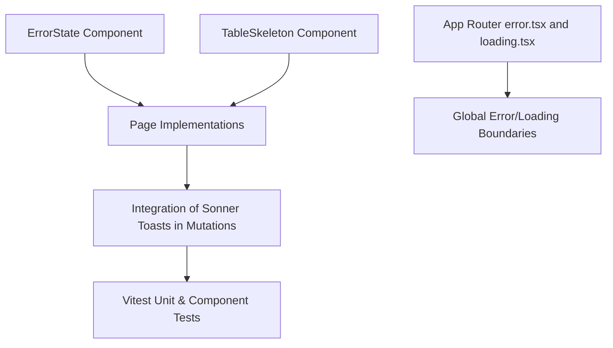

# Plan: Loading and Error States

> **Spec Reference**: `specs/002-loading-and-error-states/spec.md`
> **Branch**: `feat/polish-and-integration`
> **Spec**: 002 of 006 in phase
> **Date**: 2026-09-07
> **Status**: Draft
>
> **CRITICAL CONTENT RULE**: DO NOT write implementation code or logic blocks in this document.
> Everything must be written in **pure text** (natural language, tables, bullet points). Only mock code
> shapes (e.g. JSON schemas or minimal type/interface signatures) are allowed, but **mock logic is
> strictly prohibited** (no function bodies, control flow, loops, or algorithms). Custom enums
> MUST be explained in pure text.

---

## 1. Technical Approach

This plan establishes unified feedback loops for data loading, errors, and mutations across the application.

1. **Reusable Feedback Components**:
   - `ErrorState`: Generic error presentation component accepting `title`, `message`, `onRetry`, and optional `actionLabel`. Renders an alert box with retry button.
   - `TableSkeleton`: Configurable placeholder for table rows and columns.
   - `CardSkeleton`: Placeholder matching the geometry of `ProductCard`.
2. **Next.js App Router Special Files**:
   - `app/loading.tsx`: Root-level streaming fallback during page transitions.
   - `app/error.tsx`: Root-level client error boundary catching unexpected client-side rendering exceptions.
   - `app/not-found.tsx`: Clean 404 page when routes or resources are missing.
3. **Toast Notifications with Sonner**:
   - Import `toast` from `sonner`.
   - Update mutations in hooks and page components (`use-cart`, `use-checkout`, dashboard actions, logistics updates, auth submissions) to invoke `toast.success()` on resolution and `toast.error()` on rejection.
   - Parse error messages from the standard backend error envelope (`error.message` or `response.data.error.message`).

## 2. Dependencies on Prior Specs

| Prior Spec | What It Provides | What This Spec Uses |
|------------|-----------------|---------------------|
| `specs/001-shared-layout-and-navigation/` | Unified root layout and global navbar | Toast notifications and page boundaries display inside the global layout frame |

## 3. Files to Create

| File Path | Purpose |
|-----------|---------|
| `frontend/components/ui/error-state.tsx` | Reusable error presentation component with retry button |
| `frontend/components/ui/table-skeleton.tsx` | Reusable skeleton component for data tables |
| `frontend/app/loading.tsx` | Next.js root loading boundary |
| `frontend/app/error.tsx` | Next.js root client error boundary |
| `frontend/app/not-found.tsx` | 404 not found page component |
| `frontend/__tests__/error-state.test.tsx` | Vitest tests for ErrorState and loading indicators |

## 4. Files to Modify

| File Path | Changes |
|-----------|---------|
| `frontend/app/cart/page.tsx` | Wire toast notifications on quantity updates, deletion, and error states |
| `frontend/app/checkout/page.tsx` | Wire toast notifications on order placement and checkout errors |
| `frontend/app/products/[id]/page.tsx` | Wire toast on add to cart, integrate `ErrorState` on product load failure |
| `frontend/app/dashboard/page.tsx` | Wire toast on offer updates, product creation, and ready-for-pickup actions |
| `frontend/app/logistics/page.tsx` | Wire toast on order status updates and end delivery action |
| `frontend/app/login/page.tsx` | Wire toast on login errors and welcome notification |
| `frontend/app/signup/page.tsx` | Wire toast on registration success/failure |

## 5. Dependencies & Order

## 6. Detailed Implementation Notes

### 6.1 — Frontend: `ErrorState` (`frontend/components/ui/error-state.tsx`)

- Component: `ErrorState`
- Props:
  - `title`: Optional custom heading (defaults to "Something went wrong").
  - `message`: Detailed explanation or error description (defaults to "An error occurred while loading data.").
  - `onRetry`: Optional callback function to re-attempt the action or query.
  - `retryLabel`: Optional text for the button (defaults to "Try Again").
- Structure: Centered flexbox container with `AlertTriangle` icon, bold title, muted text message, and an action button (if `onRetry` is provided). Accessible role set to `alert`.

### 6.2 — Frontend: `TableSkeleton` (`frontend/components/ui/table-skeleton.tsx`)

- Component: `TableSkeleton`
- Props:
  - `rows`: Number of rows to render (default: 5).
  - `columns`: Number of columns to render (default: 4).
- Structure: Pulsing bar elements matching table layout to prevent content jump while orders or offers load.

### 6.3 — Frontend: App Router Boundaries

- `app/loading.tsx`:
  - Renders a top-centered loading spinner or card skeleton grid with accessible `aria-busy="true"` and `aria-label="Loading page content"`.
- `app/error.tsx`:
  - Standard Next.js client error boundary component accepting `error` and `reset`.
  - Renders `ErrorState` with `onRetry={reset}`.
- `app/not-found.tsx`:
  - Centered presentation with 404 heading, explanation that the page does not exist, and a button linking back to `/`.

### 6.4 — Frontend: Toast Integration Across Pages

- **Cart (`app/cart/page.tsx`)**:
  - On quantity increment/decrement success: `toast.success("Cart updated")`.
  - On item deletion success: `toast.success("Item removed from cart")`.
  - On mutation failure: `toast.error(errorMessage)`.
- **Checkout (`app/checkout/page.tsx`)**:
  - On order placement success: `toast.success("Order placed successfully! Redirecting...")`.
  - On failure: `toast.error(errorMessage)`.
- **Product Detail (`app/products/[id]/page.tsx`)**:
  - On add to cart success: `toast.success("Added to cart: " + productName)`.
  - On failure: `toast.error("Failed to add to cart")`.
  - If product fetch fails: Render `ErrorState` with `onRetry={refetch}`.
- **Merchant Dashboard (`app/dashboard/page.tsx`)**:
  - On offer created/updated/deleted: Show relevant success toast.
  - On order ready for pickup: `toast.success("Order marked as ready for pickup")`.
- **Logistics (`app/logistics/page.tsx`)**:
  - On status transition: `toast.success("Order status updated to " + status)`.
  - On error: `toast.error("Failed to update status")`.
- **Auth (`app/login/page.tsx` & `app/signup/page.tsx`)**:
  - On login: `toast.success("Welcome back, " + user.display_name)`.
  - On signup: `toast.success("Account created successfully. Please log in.")`.

## 7. Testing Strategy

### Frontend Tests (Vitest)
- Test `ErrorState`:
  - Renders custom title and message.
  - Renders "Try Again" button when `onRetry` is provided.
  - Clicking "Try Again" fires the callback.
  - Does not render button if `onRetry` is not provided.
- Test `TableSkeleton`:
  - Renders the specified number of rows and columns.
- Test Toast triggers:
  - Verify that successful mutations invoke toast mock functions with expected strings.

### Manual Verification
- Simulate network failure or disable network in DevTools; verify `ErrorState` renders with working retry button.
- Visit `/non-existent-route-12345`; verify custom `not-found.tsx` renders with working "Return to Home" link.
- Add an item to cart; verify green/success toast appears in upper-right corner.
- Update order status in logistics dashboard; verify status confirmation toast appears.

## 8. Constitution Compliance Checklist

- [x] Next.js remains a thin client; errors originate from backend responses (§4.1)
- [x] Standard error envelope (`error.message`) utilized for client toast text (§4.4)
- [x] Stack traces and raw database errors masked (§4.4)
- [x] Standard naming conventions applied (§7)
- [x] Proper ARIA roles (`role="alert"`) used for accessibility (§12)
- [x] Vitest tests written (§14)

## 9. Risks & Mitigations

| Risk | Mitigation |
|------|-----------|
| Rapid sequential toasts flooding the viewport | Sonner handles stacking automatically and caps visible toasts. |
| Unhandled promise rejection causing silent failures | Catch errors in React Query `onError` or try/catch blocks and display `toast.error()`. |
