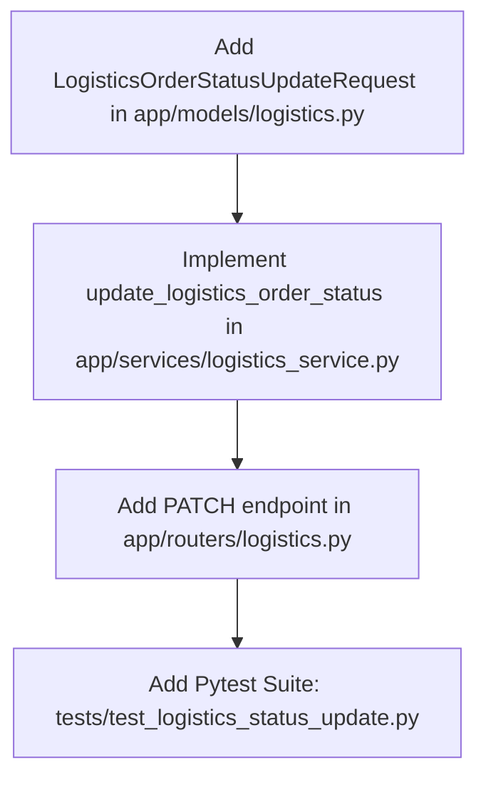

# Plan: Logistics Update Order Status Endpoint

> **Spec Reference**: `specs/002-logistics-update-order-status-endpoint/spec.md`
> **Branch**: `feat/logistics-dashboard`
> **Spec**: 002 of 003 in phase
> **Date**: 2026-09-06
> **Status**: Draft
>
> **CRITICAL CONTENT RULE**: DO NOT write implementation code or logic blocks in this document.
> Everything must be written in **pure text** (natural language, tables, bullet points). Only mock code
> shapes (e.g. JSON schemas or minimal type/interface signatures) are allowed, but **mock logic is
> strictly prohibited** (no function bodies, control flow, loops, or algorithms). Custom enums
> MUST be explained in pure text.

---

## 1. Technical Approach

This plan builds upon the logistics foundation created in Spec 001. It adds status update capabilities with robust state machine validation and automatic inventory restoration:

1. **Pydantic Request Model (`backend/app/models/logistics.py`)**: Add `LogisticsOrderStatusUpdateRequest` with a single validated `status` field.
2. **State Machine & Stock Restoration Logic (`backend/app/services/logistics_service.py`)**:
   - Implement `update_logistics_order_status` accepting the database client, order ID, and new status.
   - Fetch the existing order row from `user_orders`. If not found, raise HTTP 404 `ORDER_NOT_FOUND`.
   - Validate state transitions:
     - `pending` can transition to `confirmed` or `cancelled`.
     - `confirmed` can transition to `shipped` or `cancelled`.
     - `shipped` can transition to `delivered` or `cancelled`.
     - `delivered` can transition to `returned`.
     - `cancelled` and `returned` have no allowed transitions.
     - Reject any transition outside this graph with HTTP 400 `INVALID_STATUS_TRANSITION`.
   - Cancellation inventory restoration: If new status is `cancelled`, query `seller_products` using `order.product_id` and `order.seller_id`, increment the seller's `stock` by `order.quantity`, and update `seller_products`.
   - Update `user_orders.delivery_types` to the new status.
   - Return the updated order as a `LogisticsOrderItemResponse`.
3. **Router Layer (`backend/app/routers/logistics.py`)**:
   - Add `PATCH /api/v1/logistics/orders/{order_id}` with path parameter `order_id: int` and body `LogisticsOrderStatusUpdateRequest`.
   - Enforce `logistics` role check (`current_user.user_role == "logistics"`).
4. **Pytest Suite (`backend/tests/test_logistics_status_update.py`)**:
   - Test all valid transitions (`pending` -> `confirmed`, `confirmed` -> `shipped`, `shipped` -> `delivered`, `delivered` -> `returned`, active -> `cancelled`).
   - Test invalid transitions (`pending` -> `delivered`, terminal transitions).
   - Test stock restoration on cancellation.
   - Test role restrictions and non-existent order handling.

## 2. Dependencies on Prior Specs

| Prior Spec | What It Provides | What This Spec Uses |
|------------|-----------------|---------------------|
| `specs/001-logistics-view-orders-endpoint/` | Models in `backend/app/models/logistics.py`, base router in `backend/app/routers/logistics.py`, base service in `backend/app/services/logistics_service.py` | Extends models, router, and service with the status mutation workflow |

## 3. Files to Create

| File Path | Purpose |
|-----------|---------|
| `backend/tests/test_logistics_status_update.py` | Pytest test suite covering all transition scenarios, error codes, and stock adjustments |

## 4. Files to Modify

| File Path | Changes |
|-----------|---------|
| `backend/app/models/logistics.py` | Add `LogisticsOrderStatusUpdateRequest` request schema |
| `backend/app/services/logistics_service.py` | Add `update_logistics_order_status` function with transition rules and stock restoration |
| `backend/app/routers/logistics.py` | Add `PATCH /api/v1/logistics/orders/{order_id}` route with role guard and OpenAPI specs |

## 5. Dependencies & Order

## 6. Detailed Implementation Notes

### 6.1 — Backend: Models (`backend/app/models/logistics.py`)

- **Model `LogisticsOrderStatusUpdateRequest`**:
  - `status`: string, represents the requested new fulfillment status.
  - The `delivered_types` enum accepts: `pending`, `confirmed`, `shipped`, `delivered`, `cancelled`, or `returned`.
  - Add descriptive metadata string and example using `Field(description="Target fulfillment status", examples=["shipped"])`.

### 6.2 — Backend: Service (`backend/app/services/logistics_service.py`)

- **State Transition Graph Definition**:
  - Define a dictionary or mapping describing allowed transitions:
    - `pending` maps to a set containing `confirmed` and `cancelled`.
    - `confirmed` maps to a set containing `shipped` and `cancelled`.
    - `shipped` maps to a set containing `delivered` and `cancelled`.
    - `delivered` maps to a set containing `returned`.
    - `cancelled` and `returned` map to empty sets.
- **Function `update_logistics_order_status`**:
  - Accepts: `supabase_client: Client`, `order_id: int`, `new_status: str`.
  - Validate that `new_status` is in the set of valid `delivered_types`. If not, raise HTTP 400 `INVALID_STATUS`.
  - Query `user_orders` table for the row matching `order_id`. If no row found, raise HTTP 404 `ORDER_NOT_FOUND`.
  - Determine current status from the fetched row. If `new_status` is not in the allowed targets for current status, raise HTTP 400 with code `INVALID_STATUS_TRANSITION` and descriptive message explaining permitted targets.
  - If `new_status` is `cancelled`:
    - Retrieve `product_id`, `seller_id`, and `quantity` from the order row.
    - Query `seller_products` matching `product_id` and `seller_id`.
    - If found, calculate `new_stock = existing_stock + quantity` and execute update on `seller_products`.
  - Execute update on `user_orders` setting `delivery_types` to `new_status`.
  - Re-fetch or assemble the complete order row with product details and user names.
  - Return `LogisticsOrderItemResponse`.

### 6.3 — Backend: Router (`backend/app/routers/logistics.py`)

- **Endpoint `PATCH /api/v1/logistics/orders/{order_id}`**:
  - Route decorator: path `"/orders/{order_id}"`, response model `LogisticsOrderItemResponse`, status code 200.
  - Summary: "Update delivery status for an order".
  - Description: "Transitions an order's delivery status according to state machine rules. Only accessible to logistics personnel. Restores seller stock on cancellation."
  - Tags: `["Logistics"]`.
  - Parameters: `order_id` (path, integer), `payload` (`LogisticsOrderStatusUpdateRequest`), `current_user` (dependency), `supabase_client` (dependency).
  - Enforce role check: Verify `current_user.user_role == "logistics"`. Raise HTTP 403 `FORBIDDEN` if not.
  - Call `update_logistics_order_status` with provided parameters.
  - Document response models for 200, 400, 401, 403, 404, and 500 status codes.

### 6.4 — Backend: Tests (`backend/tests/test_logistics_status_update.py`)

- Implement test cases covering:
  - Unauthenticated PATCH request returns 401 `MISSING_TOKEN`.
  - User with role `buyer` or `merchant` receives 403 `FORBIDDEN`.
  - Non-existent `order_id` returns 404 `ORDER_NOT_FOUND`.
  - Invalid target status (not in enum) returns 400 `INVALID_STATUS`.
  - Valid status transition `confirmed` -> `shipped` returns 200 with updated status.
  - Valid status transition `shipped` -> `delivered` returns 200 with updated status.
  - Valid status transition `delivered` -> `returned` returns 200 with updated status.
  - Cancellation transition (`shipped` -> `cancelled`) updates status and verifies seller product stock increment.
  - Invalid transition (`pending` -> `delivered`) returns 400 `INVALID_STATUS_TRANSITION`.
  - Transition from terminal state (`cancelled` -> `shipped`) returns 400 `INVALID_STATUS_TRANSITION`.

## 7. Testing Strategy

### Backend Tests (Pytest)
- State machine path testing: each valid branch must be exercised.
- Invalid transition testing: jumping forward, backward, or out of terminal states.
- Stock arithmetic verification: stock must accurately increase by order quantity on cancellation.
- Mock client verification: assert Supabase update calls for `user_orders` and `seller_products`.

### Manual Verification
- Send PATCH requests via OpenAPI docs or curl with logistics authorization.
- Verify status changes in the orders list.

## 8. Constitution Compliance Checklist

- [ ] All status mutation business logic in FastAPI backend (§4.1)
- [ ] Role-based access control checking `logistics` role (§4.2)
- [ ] Endpoint uses `/api/v1/` prefix (§4.3)
- [ ] Pydantic models with field-level descriptions and examples (§4.3)
- [ ] Standard error envelope for all error responses (§4.4)
- [ ] Predefined schema adhered to without database migrations (§5)
- [ ] Unit & integration tests written with Pytest (§14)
- [ ] Conventional Commits used for all commits (§13)

## 9. Risks & Mitigations

| Risk | Mitigation |
|------|-----------|
| Seller offer row missing when restoring stock on cancellation | Check if `seller_products` row exists; if missing, log a warning and complete the order cancellation rather than failing with an unhandled exception |
| Redundant status updates causing repeated stock restoration | State machine rejects transition if target status equals current status, preventing repeated stock additions |
