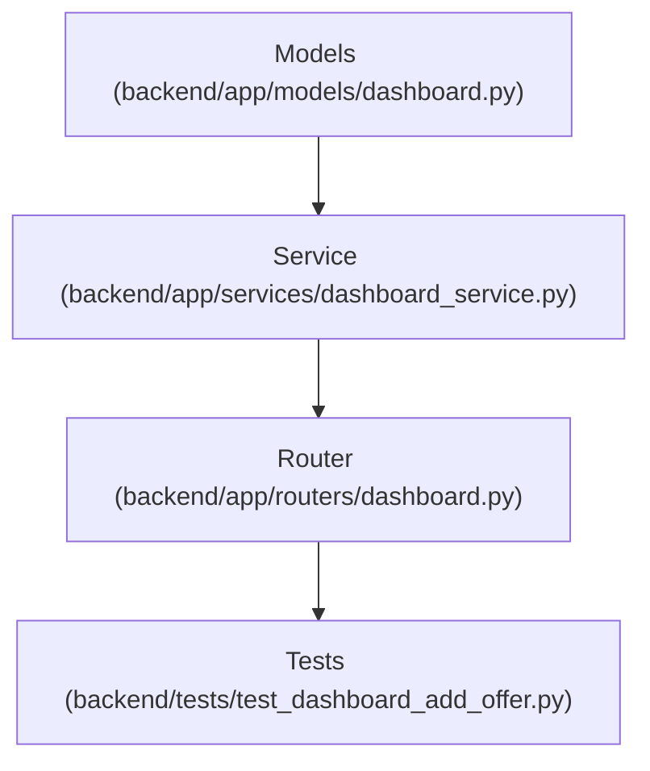

# Plan: Merchant Add Offer Endpoint

> **Spec Reference**: `specs/002-merchant-add-offer-endpoint/spec.md`
> **Branch**: `feat/merchant-dashboard`
> **Spec**: 002 of 006 in phase
> **Date**: 2026-09-06
> **Status**: Draft
>
> **CRITICAL CONTENT RULE**: DO NOT write implementation code or logic blocks in this document.
> Everything must be written in **pure text** (natural language, tables, bullet points). Only mock code
> shapes (e.g. JSON schemas or minimal type/interface signatures) are allowed, but **mock logic is
> strictly prohibited** (no function bodies, control flow, loops, or algorithms). Custom enums
> MUST be explained in pure text.

---

## 1. Technical Approach

Implement `POST /api/v1/dashboard/offers` to allow merchants to create an offer for an existing product.
Request models validate that price > 0, stock >= 0, and estimated delivery days >= 1.
The service function executes validation checks against Supabase:
1. Verifies the product exists in `products`. If not, raises 404 with `PRODUCT_NOT_FOUND`.
2. Checks `seller_products` to confirm no row exists with the same `(product_id, seller_id)`. If found, raises 409 with `DUPLICATE_OFFER`.
3. Inserts a new record into `seller_products` with a newly generated UUID.
4. Returns the created offer response model.
Integration tests in pytest verify all scenarios including success, duplicate detection, missing product, validation, and role protection.

## 2. Dependencies on Prior Specs

| Prior Spec | What It Provides | What This Spec Uses |
|------------|-----------------|---------------------|
| `specs/001-merchant-list-offers-endpoint/` | `backend/app/routers/dashboard.py`, `backend/app/models/dashboard.py`, `backend/app/services/dashboard_service.py` | Extends models, adds service function, and registers POST endpoint |

## 3. Files to Create

| File Path | Purpose |
|-----------|---------|
| `backend/tests/test_dashboard_add_offer.py` | Pytest tests for adding merchant offers to existing products |

## 4. Files to Modify

| File Path | Changes |
|-----------|---------|
| `backend/app/models/dashboard.py` | Add `MerchantOfferCreateRequest` and `MerchantOfferResponse` schemas |
| `backend/app/services/dashboard_service.py` | Add `create_merchant_offer` business logic |
| `backend/app/routers/dashboard.py` | Add `POST /offers` endpoint with role verification and error responses |

## 5. Dependencies & Order

## 6. Detailed Implementation Notes

> **REMINDER**: DO NOT write implementation code or logic blocks here! Everything must
> be written in pure text. Mock code shapes/signatures only; mock logic is strictly
> prohibited. Custom enums must be explained in pure text.

### 6.1 — Backend: Models (`backend/app/models/dashboard.py`)

- Define `MerchantOfferCreateRequest`:
  - `product_id`: UUID, identifier of the target product.
  - `price`: float, greater than 0 (`gt=0`).
  - `stock`: integer, greater than or equal to 0 (`ge=0`).
  - `estimated_delivery_days`: optional integer, greater than or equal to 1 (`ge=1`), defaults to null.
- Define `MerchantOfferResponse`:
  - `id`: UUID
  - `product_id`: UUID
  - `seller_id`: UUID
  - `price`: float
  - `stock`: integer
  - `estimated_delivery_days`: integer or null
  - `created_at`: datetime or ISO string or null

### 6.2 — Backend: Service (`backend/app/services/dashboard_service.py`)

- Define `create_merchant_offer`:
  - Inputs: `seller_id` (UUID), `payload` (MerchantOfferCreateRequest), `supabase_client` (Supabase Client).
  - Step 1: Query `products` table by `id == payload.product_id`. If result data is empty, raise `HTTPException(status_code=404)` with code `PRODUCT_NOT_FOUND`.
  - Step 2: Query `seller_products` table where `seller_id == seller_id` AND `product_id == payload.product_id`. If record exists, raise `HTTPException(status_code=409)` with code `DUPLICATE_OFFER`.
  - Step 3: Generate a new UUID for `id`. Insert row into `seller_products` with `id`, `product_id`, `seller_id`, `price`, `stock`, `estimated_delivery_days`, and ISO timestamp for `created_at`.
  - Step 4: Return mapped `MerchantOfferResponse`.

### 6.3 — Backend: Router (`backend/app/routers/dashboard.py`)

- Add route `@router.post("/offers", status_code=201, response_model=MerchantOfferResponse)`:
  - Summary: "Add merchant offer to existing product"
  - Enforce `current_user.user_role == "merchant"`. Raise 403 `FORBIDDEN` if non-merchant.
  - Invoke `create_merchant_offer` with `current_user.id`, payload, and `supabase_client`.
  - Return HTTP 201 with created offer data.
  - Document OpenAPI responses for 201, 401, 403, 404, 409, 422, and 500.

### 6.4 — Backend: Tests (`backend/tests/test_dashboard_add_offer.py`)

- Test cases:
  1. Success: Merchant adds offer to existing product; assert status 201 and returned fields match payload and seller ID.
  2. Non-existent product: Returns 404 with error code `PRODUCT_NOT_FOUND`.
  3. Duplicate offer: Existing offer with same seller and product returns 409 with error code `DUPLICATE_OFFER`.
  4. Validation errors: Zero or negative price, negative stock returns 422.
  5. Forbidden: Buyer account receives 403.
  6. Unauthorized: Missing or invalid token receives 401.

## 7. Testing Strategy

### Backend Tests (Pytest)
- Execute `uv run pytest backend/tests/test_dashboard_add_offer.py -v`.
- Verify all edge cases pass.

### Manual Verification
- Test creating an offer on an existing product in OpenAPI docs UI (`/docs`).
- Attempt creating the same offer a second time to verify the 409 error envelope.

## 8. Constitution Compliance Checklist

- [ ] All business logic in FastAPI (§4.1)
- [ ] Merchant role verified (§2)
- [ ] Prefixed with `/api/v1/` (§4.3)
- [ ] Pydantic models with validation constraints and descriptions (§4.3)
- [ ] Standard error envelope on 404, 409, 403 (§4.4)
- [ ] Pytest coverage for all paths (§14)

## 9. Risks & Mitigations

| Risk | Mitigation |
|------|-----------|
| Concurrent requests creating duplicate offers simultaneously | Unique constraint check in service; error handling catches potential duplicate key errors |
| Invalid delivery days or negative pricing | Pydantic field constraints enforce `gt=0` and `ge=0` before reaching service logic |
