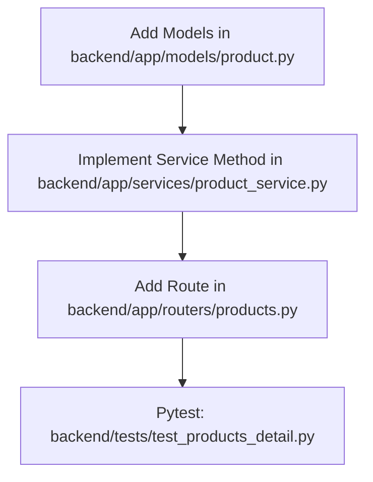

# Plan: Product Detail Endpoint

> **Spec Reference**: `specs/002-product-detail-endpoint/spec.md`
> **Branch**: `feat/product-catalog`
> **Spec**: 002 of 005 in phase
> **Date**: 2026-09-05
> **Status**: Draft
>
> **CRITICAL CONTENT RULE**: DO NOT write implementation code or logic blocks in this document.
> Everything must be written in **pure text** (natural language, tables, bullet points). Only mock code
> shapes (e.g. JSON schemas or minimal type/interface signatures) are allowed, but **mock logic is
> strictly prohibited** (no function bodies, control flow, loops, or algorithms). Custom enums
> MUST be explained in pure text.

---

## 1. Technical Approach

The Product Detail endpoint (`GET /api/v1/products/{product_id}`) extends the catalog service created in Spec 001.

1. **Path Parameter Validation**: FastAPI validates that `product_id` matches the UUID format. If invalid, FastAPI automatically generates an HTTP 422 response.
2. **Product Lookup**: The service layer queries the Supabase `products` table for `id = product_id`. If no row is found, an `ErrorDetail` (`RESOURCE_NOT_FOUND`) is returned and handled by the router to return an HTTP 404 `ErrorResponse`.
3. **Offers Retrieval & Sorting**: The service layer queries `seller_products` filtered by `product_id = product_id`, joined with `users` on `seller_id = users.id` to include the seller's `display_name`. Offers are sorted in memory or in the query by `price` ascending, followed by `estimated_delivery_days` ascending.
4. **Cheapest In-Stock Offer Resolution**: The service layer inspects the sorted offers and identifies the first offer where `stock > 0`. This is designated as `cheapest_offer`. If all offers have `stock == 0` or no offers exist, `cheapest_offer` is set to `None`.
5. **Response Serialization**: Returns `ProductDetailResponse` adhering to OpenAPI standards with field-level descriptions.

## 2. Dependencies on Prior Specs

| Prior Spec | What It Provides | What This Spec Uses |
|------------|-----------------|---------------------|
| `specs/001-list-products-endpoint/` | `backend/app/routers/products.py`, `backend/app/models/product.py`, `backend/app/services/product_service.py` | Extends existing router, models, and service layer with detail retrieval |

## 3. Files to Create

| File Path | Purpose |
|-----------|---------|
| `backend/tests/test_products_detail.py` | Pytest suite for product detail retrieval, sorting, 404 handling, and out-of-stock scenarios |

## 4. Files to Modify

| File Path | Changes |
|-----------|---------|
| `backend/app/models/product.py` | Add `SellerOfferItem` and `ProductDetailResponse` Pydantic models |
| `backend/app/services/product_service.py` | Add `get_product_by_id` function that queries product and its seller offers |
| `backend/app/routers/products.py` | Add `GET /api/v1/products/{product_id}` endpoint definition |

## 5. Dependencies & Order

## 6. Detailed Implementation Notes

### 6.1 — Backend: Models (`backend/app/models/product.py`)

- **`SellerOfferItem` Model**:
  - `seller_product_id`: UUID string.
  - `seller_id`: UUID string.
  - `seller_name`: String display name.
  - `price`: Float unit price.
  - `stock`: Integer inventory count.
  - `estimated_delivery_days`: Optional integer delivery days.
- **`ProductDetailResponse` Model**:
  - `id`: UUID string.
  - `name`: Product title string.
  - `description`: Detailed description string.
  - `brand`: Brand string.
  - `image_url`: Optional public image URL string.
  - `created_at`: ISO timestamp string.
  - `cheapest_offer`: Optional `CheapestOfferResponse` object (null if out of stock).
  - `offers`: List of `SellerOfferItem` objects sorted by price ascending.

### 6.2 — Backend: Service (`backend/app/services/product_service.py`)

- **`get_product_by_id` Function**:
  - **Inputs**: `supabase` client dependency, `product_id` (UUID string).
  - **Steps**:
    1. Query `products` table where `id = product_id`.
    2. If no record returned, return `ErrorDetail(code="RESOURCE_NOT_FOUND", message=f"Product with ID '{product_id}' was not found.")`
    3. Query `seller_products` where `product_id = product_id`, joining with `users` on `seller_id = users.id` selecting `display_name`.
    4. Sort offers by `price` ascending, then `estimated_delivery_days` ascending.
    5. Find the first offer with `stock > 0` to populate `cheapest_offer`. If none, set to `None`.
    6. Construct and return dictionary matching `ProductDetailResponse`.

### 6.3 — Backend: Router (`backend/app/routers/products.py`)

- **Route Definition**:
  - Method: `GET`
  - Path: `/api/v1/products/{product_id}`
  - Tags: `["Products"]`
  - Summary: `Get product details and all seller offers`
  - Description: Full markdown documentation describing the retrieval of product specifications, sorting of seller offers by price ascending, and calculation of the cheapest in-stock offer.
  - Responses: `200` returning `ProductDetailResponse`, `404` returning standard error envelope `ErrorResponse` with `RESOURCE_NOT_FOUND`, `422` for invalid UUID format.
  - Error Handling: If `product_service.get_product_by_id` returns `ErrorDetail`, return `JSONResponse(status_code=status.HTTP_404_NOT_FOUND, content=ErrorResponse(error=result).model_dump())`.

### 6.4 — Backend: Tests (`backend/tests/test_products_detail.py`)

- **Test Scenarios**:
  - `test_get_product_detail_success`: Query an existing product with multiple offers; verify 200 status, correct metadata, and offers list.
  - `test_get_product_detail_offers_sorted`: Verify that the offers array is strictly sorted by price ascending.
  - `test_get_product_detail_cheapest_in_stock`: Verify `cheapest_offer` reflects the lowest priced offer that has `stock > 0`.
  - `test_get_product_detail_all_out_of_stock`: Verify `cheapest_offer` is null when all offers have `stock == 0`, but all offers are still present in `offers`.
  - `test_get_product_detail_no_offers`: Verify product with zero offers returns 200 with empty offers array and null `cheapest_offer`.
  - `test_get_product_detail_not_found`: Query non-existent UUID; verify 404 status and standard error envelope code `RESOURCE_NOT_FOUND`.
  - `test_get_product_detail_invalid_uuid`: Pass invalid UUID string; verify 422 status.

## 7. Testing Strategy

### Backend Tests (Pytest)
- Run `uv run pytest backend/tests/test_products_detail.py`.
- Run complete backend test suite to ensure no regressions.

### Manual Verification
> **Server Process Timeout Rule**: Any server process started for manual verification MUST include an automatic timeout that automatically terminates and kills the process after X seconds (e.g. 20 seconds max).
- If starting the Uvicorn server for manual smoke tests: run with an automated timeout (max 20 seconds) that automatically kills the process after 20 seconds.
- Query `GET /api/v1/products/{id}` using curl or test client.
- Verify 404 error envelope response formatting by querying a non-existent UUID before the server process automatically terminates.

## 8. Constitution Compliance Checklist

- [ ] All business logic in FastAPI, not Next.js (§4.1)
- [ ] No Supabase JS client used (§4.1)
- [ ] Endpoint prefixed with `/api/v1/` (§4.3)
- [ ] Auto-generated OpenAPI docs with summary, description, tags, and Pydantic models (§4.3)
- [ ] Standard error envelope for 404 errors (§4.4)
- [ ] Naming conventions followed (§7)
- [ ] Tests written with Pytest (§14)
- [ ] Conventional Commits used (§13)

## 9. Risks & Mitigations

| Risk | Mitigation |
|------|-----------|
| Seller user account deleted or missing display name | Handle null display name gracefully with fallback string |
| Floating point price comparison in sorting | Cast or store prices using standard decimal or float representation consistently |
