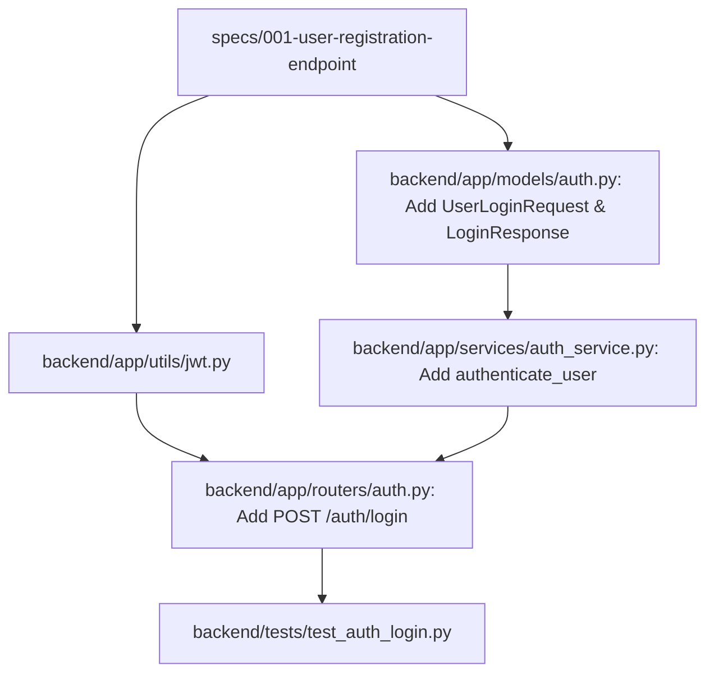

# Plan: User Login Endpoint

> **Spec Reference**: `specs/002-user-login-endpoint/spec.md`  
> **Branch**: `feat/authentication`  
> **Spec**: 002 of 006 in phase  
> **Date**: 2026-09-03  
> **Status**: Draft  

---

## 1. Technical Approach

The login endpoint (`POST /api/v1/auth/login`) implements user authentication, credential validation, JWT token issuance, and dual token delivery (httpOnly cookie + response body) with strict adherence to the Kalano Constitution:

1. **JWT Generation Utility (`backend/app/utils/jwt.py`)**:
   - Encapsulates JWT creation using `python-jose` (`jose.jwt.encode`).
   - Reads configuration values (`jwt_secret_key`, `jwt_algorithm`, `jwt_expiration_minutes`) directly from `app.dependencies.config.settings`.
   - Populates standard token claims: `user_id` (string UUID), `user_role` (string), and `exp` (UTC expiration timestamp).

2. **Validation & Modeling Layer (`backend/app/models/auth.py`)**:
   - Extends the existing auth models module created in Spec 001.
   - `UserLoginRequest`: Accepts `email` and `password`. Normalizes email (stripping whitespace and lowercasing) using Pydantic field validation.
   - `LoginResponse`: Returns `access_token: str`, `token_type: str = "bearer"`, and `user: UserResponse` (public profile). Excludes sensitive credential fields.

3. **Business Logic & Security Layer (`backend/app/services/auth_service.py`)**:
   - Implements `verify_password(plain_password: str, hashed_password: str) -> bool` using `argon2.PasswordHasher().verify(...)`, safely catching verification mismatch errors and returning a boolean.
   - Implements `authenticate_user(email: str, password: str, supabase_client: Client) -> dict | None`:
     - Queries the `users` table by normalized email.
     - Verifies the plaintext password against stored `password_hash`.
     - Returns user dictionary if valid, or `None` if the user does not exist or the password is wrong.

4. **Routing & Cookie Dispatch (`backend/app/routers/auth.py`)**:
   - Appends `POST /auth/login` to the existing `auth.router` (prefixed with `/api/v1`, tag `Auth`).
   - Injects `response: Response` (FastAPI `Response` object) and `supabase_client: Client = Depends(get_supabase_client)`.
   - Calls `authenticate_user()`. On failure (`None`), returns HTTP 401 with standard `ErrorResponse(error=ErrorDetail(code="INVALID_CREDENTIALS", message="Invalid email or password."))`.
   - On success, creates access token via `create_access_token()`, attaches the `kalano_token` cookie via `response.set_cookie(...)` with security flags (`httponly=True`, `samesite="lax"`, `secure=False`, `max_age=settings.jwt_expiration_minutes * 60`, `path="/"`), and returns `LoginResponse`.

5. **Testing Suite (`backend/tests/test_auth_login.py`)**:
   - Covers success (200 + token + cookie), incorrect password (401), non-existent user (401), missing fields (422), and email normalization.

---

## 2. Dependencies on Prior Specs

| Prior Spec | What It Provides | What This Spec Uses |
|---|---|---|
| `specs/001-user-registration-endpoint/` | `backend/app/models/auth.py` (`UserResponse`, `ErrorDetail`, `ErrorResponse`) | Imported into `LoginResponse` and login router |
| `specs/001-user-registration-endpoint/` | `backend/app/services/auth_service.py` (`PasswordHasher` setup) | Reuses hasher instance for password verification |
| `specs/001-user-registration-endpoint/` | `backend/app/routers/auth.py` (`router` mounted in `main.py`) | Mounts `POST /auth/login` endpoint on the existing router |

---

## 3. Files to Create

| File Path | Purpose |
|---|---|
| `backend/app/utils/jwt.py` | JWT utility module exposing `create_access_token()` using `python-jose` |
| `backend/tests/test_auth_login.py` | Comprehensive Pytest suite covering login success, failures, cookies, and tokens |

---

## 4. Files to Modify

| File Path | Changes |
|---|---|
| `backend/app/models/auth.py` | Add `UserLoginRequest` and `LoginResponse` Pydantic models |
| `backend/app/services/auth_service.py` | Add `verify_password()` and `authenticate_user()` functions |
| `backend/app/routers/auth.py` | Add `POST /auth/login` endpoint with cookie dispatch and 401 error envelope handling |

---

## 5. Dependencies & Order



Execution sequence:
1. **Utility**: Create `backend/app/utils/jwt.py` for token creation.
2. **Models**: Add `UserLoginRequest` and `LoginResponse` to `backend/app/models/auth.py`.
3. **Service**: Add `verify_password` and `authenticate_user` to `backend/app/services/auth_service.py`.
4. **Router**: Add `POST /auth/login` endpoint to `backend/app/routers/auth.py`.
5. **Tests**: Create `backend/tests/test_auth_login.py` and run full test suite.

---

## 6. Detailed Implementation Notes

### 6.1 — Backend: JWT Utility (`backend/app/utils/jwt.py`)

- **Imports**:
  ```python
  from datetime import datetime, timedelta, timezone
  from jose import jwt
  from app.dependencies.config import settings
  ```
- **Function Signature & Implementation**:
  ```python
  def create_access_token(data: dict, expires_delta: timedelta | None = None) -> str:
      to_encode = data.copy()
      if expires_delta:
          expire = datetime.now(timezone.utc) + expires_delta
      else:
          expire = datetime.now(timezone.utc) + timedelta(minutes=settings.jwt_expiration_minutes)
      
      to_encode.update({"exp": expire})
      encoded_jwt = jwt.encode(
          to_encode,
          settings.jwt_secret_key,
          algorithm=settings.jwt_algorithm,
      )
      return encoded_jwt
  ```
- **Timezone Safety**: Uses `datetime.now(timezone.utc)` (Python 3.12+ compliant) instead of deprecated `datetime.utcnow()`.

### 6.2 — Backend: Models (`backend/app/models/auth.py`)

Add the following models to `backend/app/models/auth.py`:

```python
from pydantic import BaseModel, Field, field_validator


class UserLoginRequest(BaseModel):
    email: str = Field(
        pattern=r"^[a-zA-Z0-9_.+-]+@[a-zA-Z0-9-]+\.[a-zA-Z0-9-.]+$",
        description="Registered user email address",
        examples=["buyer@example.com"],
    )
    password: str = Field(
        min_length=1,
        description="Plaintext password",
        examples=["securepassword123"],
    )

    @field_validator("email", mode="before")
    @classmethod
    def normalize_email(cls, v: str) -> str:
        if isinstance(v, str):
            return v.strip().lower()
        return v


class LoginResponse(BaseModel):
    access_token: str = Field(
        description="JWT access token for authentication",
        examples=["eyJhbGciOiJIUzI1NiIsInR5cCI6IkpXVCJ9..."],
    )
    token_type: str = Field(
        default="bearer",
        description="Authentication scheme identifier",
        examples=["bearer"],
    )
    user: UserResponse = Field(
        description="Public profile of the authenticated user",
    )
```

### 6.3 — Backend: Service (`backend/app/services/auth_service.py`)

Add the following password verification and authentication functions:

```python
from argon2 import PasswordHasher
from argon2.exceptions import InvalidHashError, VerificationError, VerifyMismatchError
from supabase import Client

# Reuses existing PasswordHasher instance `ph` from Spec 001

def verify_password(plain_password: str, hashed_password: str) -> bool:
    """Verifies a plaintext password against an Argon2 hash string."""
    try:
        return ph.verify(hashed_password, plain_password)
    except (VerifyMismatchError, VerificationError, InvalidHashError):
        return False


def authenticate_user(
    email: str,
    password: str,
    supabase_client: Client,
) -> dict | None:
    """
    Looks up user by normalized email and verifies their password.
    Returns the user record dict if authentication succeeds, otherwise None.
    """
    normalized_email = email.strip().lower()
    response = (
        supabase_client.table("users")
        .select("*")
        .eq("email", normalized_email)
        .execute()
    )

    if not response.data:
        return None

    user_record = response.data[0]
    stored_hash = user_record.get("password_hash")
    if not stored_hash or not verify_password(password, stored_hash):
        return None

    return user_record
```

### 6.4 — Backend: Router (`backend/app/routers/auth.py`)

Add the `POST /auth/login` endpoint to `backend/app/routers/auth.py`:

```python
from fastapi import APIRouter, Depends, Response, status
from fastapi.responses import JSONResponse
from supabase import Client

from app.dependencies.config import settings
from app.dependencies.database import get_supabase_client
from app.models.auth import (
    ErrorDetail,
    ErrorResponse,
    LoginResponse,
    UserLoginRequest,
    UserResponse,
)
from app.services.auth_service import authenticate_user
from app.utils.jwt import create_access_token

# (Existing router definition and /auth/register endpoint from Spec 001 remain unchanged)

@router.post(
    "/auth/login",
    response_model=LoginResponse,
    status_code=status.HTTP_200_OK,
    summary="Log in user",
    description="Authenticates a user by email and password, generates a signed JWT token, "
                "sets an httpOnly cookie ('kalano_token'), and returns the token and public profile.",
    responses={
        200: {
            "model": LoginResponse,
            "description": "User successfully authenticated.",
        },
        401: {
            "model": ErrorResponse,
            "description": "Invalid credentials (wrong password or non-existent email).",
        },
        422: {
            "description": "Validation error in request payload.",
        },
    },
)
def login(
    payload: UserLoginRequest,
    response: Response,
    supabase_client: Client = Depends(get_supabase_client),
) -> LoginResponse | JSONResponse:
    user = authenticate_user(
        email=payload.email,
        password=payload.password,
        supabase_client=supabase_client,
    )

    if not user:
        return JSONResponse(
            status_code=status.HTTP_401_UNAUTHORIZED,
            content=ErrorResponse(
                error=ErrorDetail(
                    code="INVALID_CREDENTIALS",
                    message="Invalid email or password.",
                )
            ).model_dump(),
        )

    # Prepare token claims
    token_claims = {
        "user_id": str(user["id"]),
        "user_role": user["user_role"],
    }
    access_token = create_access_token(data=token_claims)

    # Set httpOnly cookie
    response.set_cookie(
        key="kalano_token",
        value=access_token,
        httponly=True,
        samesite="lax",
        secure=False,
        max_age=settings.jwt_expiration_minutes * 60,
        path="/",
    )

    return LoginResponse(
        access_token=access_token,
        token_type="bearer",
        user=UserResponse(**user),
    )
```

### 6.5 — Backend: Tests (`backend/tests/test_auth_login.py`)

Implement the test suite using pytest and `client` fixture:

1. **`test_login_success`**:
   - Mock Supabase returning user with valid Argon2 hash.
   - Send `POST /api/v1/auth/login` with correct password.
   - Assert status `200`.
   - Assert `access_token` present and non-empty.
   - Assert `token_type == "bearer"`.
   - Assert `user` object matches expected profile and excludes `password_hash`.
   - Assert cookie `kalano_token` is present in response cookies or `Set-Cookie` header.
2. **`test_login_cookie_attributes`**:
   - Inspect raw `Set-Cookie` header.
   - Verify flags: `HttpOnly`, `SameSite=lax` (or `samesite=lax`), `Path=/`, and `Max-Age=3600` (or `max-age=3600`).
3. **`test_login_jwt_claims`**:
   - Decode issued `access_token` with `jose.jwt.decode(..., settings.jwt_secret_key, algorithms=[settings.jwt_algorithm])`.
   - Assert decoded `user_id` matches user's UUID string.
   - Assert decoded `user_role` matches user's role.
   - Assert decoded `exp` claim is a future timestamp within expected expiration window.
4. **`test_login_wrong_password`**:
   - Mock Supabase returning user with hash of `"correctpassword"`.
   - Send `POST /api/v1/auth/login` with `"wrongpassword"`.
   - Assert status `401`.
   - Assert response body matches `{"error": {"code": "INVALID_CREDENTIALS", "message": "Invalid email or password."}}`.
   - Assert `kalano_token` is not set in cookies.
5. **`test_login_nonexistent_user`**:
   - Mock Supabase returning empty list `[]`.
   - Send `POST /api/v1/auth/login` with non-existent email.
   - Assert status `401`.
   - Assert identical response envelope: `{"error": {"code": "INVALID_CREDENTIALS", "message": "Invalid email or password."}}`.
   - Assert `kalano_token` is not set in cookies.
6. **`test_login_email_case_insensitivity`**:
   - Store user with email `buyer@example.com`.
   - Login with `Buyer@Example.COM` (mixed case).
   - Assert status `200` and successful authentication.
7. **`test_login_missing_email`**:
   - Payload without `email`.
   - Assert status `422`.
8. **`test_login_missing_password`**:
   - Payload without `password`.
   - Assert status `422`.

---

## 7. Testing Strategy

### Backend Tests (Pytest)

- Run command: `uv run pytest backend/tests/test_auth_login.py -v`.
- Supabase client queries are mocked using `monkeypatch` to simulate database queries deterministically without network dependencies.
- Passwords for test users are hashed in test setup using `argon2.PasswordHasher().hash("testpassword123")` so real cryptographic verification executes during tests.
- JWT decoding in tests validates both cryptographic signature and claim content.

### Manual Verification

1. Start the backend API under a strict timeout constraint (run as a managed background task with a maximum 30-second timeout, or terminate immediately after verification via `manage_task kill` to prevent the agent from waiting indefinitely): `uv run uvicorn app.main:app --port 8000`.
2. Open OpenAPI documentation at `http://localhost:8000/docs` (or fetch `http://localhost:8000/openapi.json`).
3. Locate `POST /api/v1/auth/login` under the `Auth` tag.
4. Test with valid credentials: check 200 response, JWT in body, and `Set-Cookie` header in browser network panel.
5. Test with invalid password: check 401 error envelope and absence of session cookie.
6. Test with unregistered email: check identical 401 error envelope.
7. Stop the server immediately after verification to return the agent to working state.

---

## 8. Constitution Compliance Checklist

- [x] All business logic in FastAPI, not Next.js (§4.1)
- [x] Using argon2 for password verification, not Supabase Auth (§4.2)
- [x] JWT in httpOnly cookie named `kalano_token` (§4.2)
- [x] All endpoints prefixed with `/api/v1/` (`/api/v1/auth/login`) (§4.3)
- [x] Pydantic models with field descriptions and examples (§4.3)
- [x] Standard error envelope for all errors (`{"error": {"code": "...", "message": "..."}}`) (§4.4)
- [x] Naming conventions followed (snake_case in Python, kebab-case in URLs) (§7)
- [x] Tests written for all endpoints, error conditions, and cookies (§14)
- [x] Conventional Commits used for all changes (§13)

---

## 9. Risks & Mitigations

| Risk | Impact | Mitigation |
|---|---|---|
| User enumeration via timing differences between user lookup and argon2 verification | An attacker could guess valid emails based on response times | In future iterations or if desired, a dummy argon2 hash verification could be run when user is not found. For this learning project, returning identical 401 error payloads provides primary anti-enumeration protection. |
| Cookie not received by frontend due to CORS / domain mismatch | Frontend authentication state fails to persist | CORS middleware in `app/main.py` explicitly sets `allow_credentials=True` and `allow_origins=[settings.frontend_url]`. Cookie uses `samesite="lax"` and `path="/"`. |
| Python 3.12 deprecation of `datetime.utcnow()` | Generates deprecation warnings or timezone errors | Explicitly use `datetime.now(timezone.utc)` for expiration calculation. |
| Token expiration discrepancy between cookie and JWT | Cookie remains while token is expired or vice versa | Both JWT `exp` claim and cookie `max_age` are derived directly from `settings.jwt_expiration_minutes`. |
