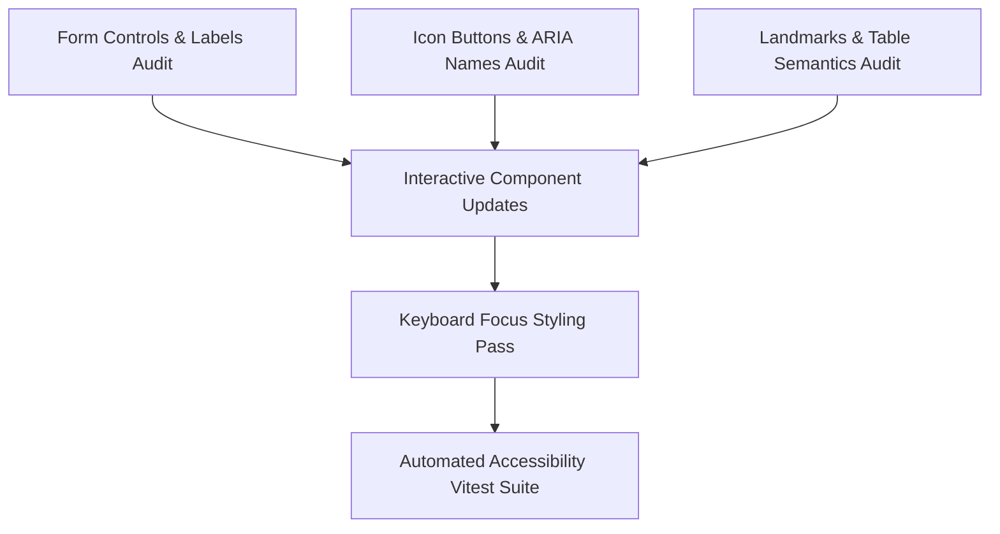

# Plan: Accessibility Pass

> **Spec Reference**: `specs/003-accessibility-pass/spec.md`
> **Branch**: `feat/polish-and-integration`
> **Spec**: 003 of 006 in phase
> **Date**: 2026-09-07
> **Status**: Draft
>
> **CRITICAL CONTENT RULE**: DO NOT write implementation code or logic blocks in this document.
> Everything must be written in **pure text** (natural language, tables, bullet points). Only mock code
> shapes (e.g. JSON schemas or minimal type/interface signatures) are allowed, but **mock logic is
> strictly prohibited** (no function bodies, control flow, loops, or algorithms). Custom enums
> MUST be explained in pure text.

---

## 1. Technical Approach

The implementation will systematically review and refactor frontend components and pages to ensure total alignment with Section 12 (Accessibility) of the Constitution and WCAG 2.1 AA standards.

1. **Form Labels & Error Connections**:
   - Ensure every form field in Auth, Checkout, and Dashboard forms has explicit `<Label htmlFor={id}>` connected to `<Input id={id}>`.
   - Wire `aria-invalid={Boolean(errors.field)}` and `aria-describedby={errors.field ? `${id}-error` : undefined}`.
2. **Accessible Names for Icons & Triggers**:
   - Audit all instances of Lucide icons inside `<button>` or `<a>` tags. Add descriptive `aria-label` strings (e.g. `aria-label="Increase item quantity"`).
   - Add `aria-hidden="true"` to visual icons accompanied by text.
3. **Semantic Landmarks & Table Headers**:
   - Wrap top-level route contents in `<main>`.
   - Wrap navigation containers in `<nav aria-label="...">`.
   - Ensure tables in `/orders`, `/dashboard`, and `/logistics` have `<thead>` with `<th scope="col">`.
4. **Keyboard & Focus Styling**:
   - Verify all interactive controls have Tailwind utility classes `focus-visible:outline-none focus-visible:ring-2 focus-visible:ring-ring focus-visible:ring-offset-2`.
5. **Automated Accessibility Testing**:
   - Create a Vitest test suite that verifies DOM attributes, form labels, and keyboard behaviors across key components.

## 2. Dependencies on Prior Specs

| Prior Spec | What It Provides | What This Spec Uses |
|------------|-----------------|---------------------|
| `specs/001-shared-layout-and-navigation/` | Navbar, Footer, and search components | Audits navigation ARIA labels, focus states, and landmarks |
| `specs/002-loading-and-error-states/` | ErrorState, Skeletons, and Toaster | Audits error alerts, `role="alert"`, and live region announcements |

## 3. Files to Create

| File Path | Purpose |
|-----------|---------|
| `frontend/__tests__/accessibility.test.tsx` | Vitest test suite auditing component ARIA attributes, labels, and landmarks |

## 4. Files to Modify

| File Path | Changes |
|-----------|---------|
| `frontend/components/layout/navbar.tsx` | Ensure landmark `<nav aria-label="Main Navigation">`, brand label, and focus rings |
| `frontend/components/layout/nav-search.tsx` | Add explicit `aria-label` to search input and submit button |
| `frontend/components/layout/cart-badge.tsx` | Ensure dynamic `aria-label` announces cart item count |
| `frontend/components/layout/user-nav.tsx` | Ensure accessible menu triggers, roles, and focus-visible rings |
| `frontend/components/search-bar.tsx` | Add accessible label and search button aria attributes |
| `frontend/components/product-card.tsx` | Add accessible product link text and descriptive image alt tags |
| `frontend/components/seller-offers-table.tsx` | Add semantic `scope="col"` headers and accessible action buttons |
| `frontend/app/login/page.tsx` | Connect form labels to inputs via `htmlFor`/`id` and add `aria-invalid` |
| `frontend/app/signup/page.tsx` | Connect form labels to inputs and ensure role selector has accessible radio/group label |
| `frontend/app/cart/page.tsx` | Add descriptive `aria-label` to quantity +/- buttons and delete action |
| `frontend/app/checkout/page.tsx` | Connect shipping address form labels and simulated payment buttons |
| `frontend/app/orders/page.tsx` | Add semantic table structure with `scope="col"` on order columns |
| `frontend/app/dashboard/page.tsx` | Add accessible form controls, tab controls (`role="tablist"`), and table headers |
| `frontend/app/logistics/page.tsx` | Add accessible table headers and status transition buttons |

## 5. Dependencies & Order

## 6. Detailed Implementation Notes

### 6.1 — Form Label Associations

- **Auth Pages (`app/login/page.tsx`, `app/signup/page.tsx`)**:
  - Email input: `<Label htmlFor="login-email">Email Address</Label><Input id="login-email" type="email" ... />`.
  - Password input: `<Label htmlFor="login-password">Password</Label><Input id="login-password" type="password" ... />`.
  - Role Selector: Use `<RadioGroup aria-label="Account Type">` or `<fieldset><legend>Select your account role</legend>...</fieldset>`.
- **Checkout Page (`app/checkout/page.tsx`)**:
  - Delivery Address: `<Label htmlFor="delivery-address">Delivery Address</Label><Textarea id="delivery-address" ... />`.

### 6.2 — Icon Buttons & Interactive Names

- **Cart Page (`app/cart/page.tsx`)**:
  - Decrement button: `<Button aria-label="Decrease quantity for [Product Name]">`.
  - Increment button: `<Button aria-label="Increase quantity for [Product Name]">`.
  - Delete button: `<Button aria-label="Remove [Product Name] from cart">`.
- **Product Card (`components/product-card.tsx`)**:
  - Link: `<Link aria-label="View details for [Product Name] by [Brand]">`.
  - Image: `<Image alt="Photo of [Product Name]" ... />` (never empty or generic "product image").

### 6.3 — Table Semantics

- **Orders & Logistics Tables (`app/orders/page.tsx`, `app/logistics/page.tsx`, `components/seller-offers-table.tsx`)**:
  - Header cells: `<th scope="col" className="...">Product</th>`.
  - Data cells: `<td className="...">...</td>`.
  - Actions column: `<th scope="col" aria-label="Actions">Actions</th>`.

### 6.4 — Keyboard Navigation

- Ensure every interactive trigger has `focus-visible:ring-2 focus-visible:ring-primary focus-visible:ring-offset-2`.
- Verify tab index order is strictly natural source order (no positive `tabIndex` values).

## 7. Testing Strategy

### Frontend Tests (Vitest)
- Test `frontend/__tests__/accessibility.test.tsx`:
  - Verify `NavSearch` has `aria-label="Search products"`.
  - Verify `CartBadge` announces item count in `aria-label`.
  - Verify `LoginForm` inputs are associated with their labels by `id`.
  - Verify `CartItem` increment/decrement buttons have distinct, descriptive `aria-label` attributes.
  - Verify table components contain `th` elements with `scope="col"`.

### Manual Verification
- Unplug or avoid using the mouse: Tab through `/` -> `/products` -> `/products/[id]` -> `/cart` -> `/checkout`.
- Verify active focus indicator is clearly visible at every step.
- Verify screen reader / accessibility tree inspection in Chrome DevTools shows 0 missing accessible name violations.

## 8. Constitution Compliance Checklist

- [x] Semantic HTML used (`<main>`, `<nav>`, `<section>`, `<button>`) (§12)
- [x] `aria-label` attributes on all icon-only interactive elements (§12)
- [x] Keyboard navigation verified for all flows (§12)
- [x] Color contrast ratios verified for text and badges (§12)
- [x] Vitest tests written (§14)

## 9. Risks & Mitigations

| Risk | Mitigation |
|------|-----------|
| Hidden labels disrupting existing UI layouts | Use standard `sr-only` class on `<Label>` elements when a visible text label is visually excluded by design. |
| Mismatched `htmlFor` and `id` causing silent accessibility failures | Write explicit automated tests checking label and input association. |
