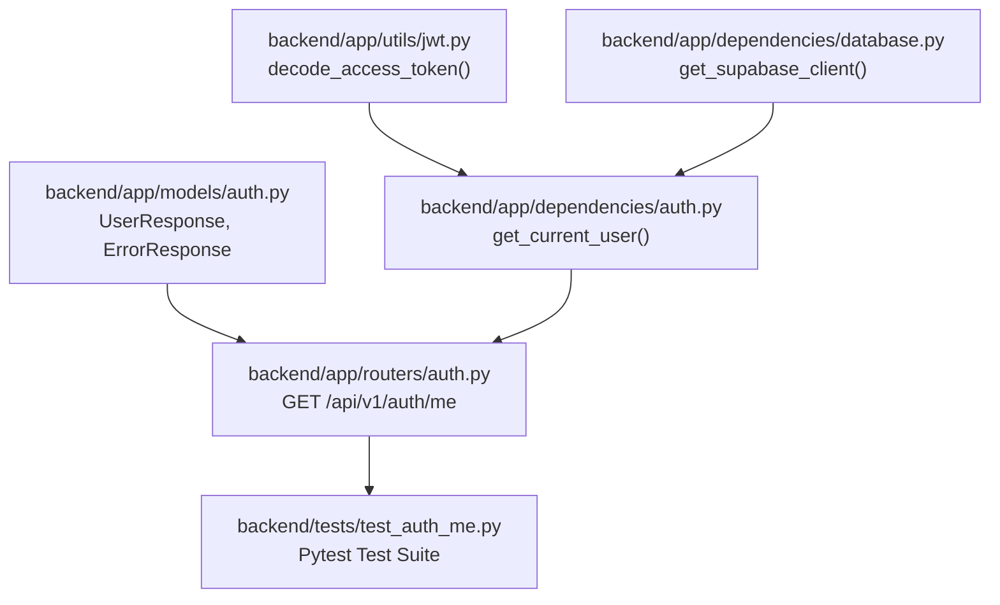

# Plan: Auth Dependency & Current User Endpoint

> **Spec Reference**: `specs/003-auth-dependency-and-current-user/spec.md`  
> **Branch**: `feat/authentication`  
> **Spec**: 003 of 006 in phase  
> **Date**: 2026-09-03  
> **Status**: Draft  

---

## 1. Technical Approach

The implementation introduces the authentication gatekeeper dependency `get_current_user` and the authenticated user profile endpoint `GET /api/v1/auth/me`.

### Architectural Principles & Design Decisions

1. **Separation of Concerns**:
   - **Token Cryptography (`backend/app/utils/jwt.py`)**: `decode_access_token` encapsulates JWT decoding, secret key verification, algorithm enforcement, and expiration validation using `python-jose`. It abstracts cryptographic operations from HTTP request handling.
   - **Dependency Injection (`backend/app/dependencies/auth.py`)**: `get_current_user` extracts authentication credentials from the incoming HTTP request (`Request`), validates them against the JWT utility, queries the database, and injects the resolved user entity into routes.
   - **Router (`backend/app/routers/auth.py`)**: Exposes `GET /auth/me` (prefixed with `/api/v1`), delegates authentication to `Depends(get_current_user)`, and serializes the user profile into `UserResponse`.
   - **Models (`backend/app/models/auth.py`)**: Reuses `UserResponse` and `ErrorResponse` defined in Spec 001.

2. **Credential Resolution Order (Cookie with Header Fallback)**:
   - Primary: Checks for the `kalano_token` httpOnly cookie in `request.cookies`. This aligns with the browser-based security model specified in the Kalano Constitution (§4.2).
   - Fallback: Checks the `Authorization` header for `Bearer <token>`. This supports OpenAPI `/docs`, programmatic API testing, and non-browser clients.
   - If a token is provided in neither, an HTTP `401 Unauthorized` with error code `MISSING_TOKEN` is raised.

3. **Database Lookups & Freshness**:
   - `get_current_user` validates that the user identified in the token payload still exists in the Supabase `users` table. If the user account was deleted or invalidated after the token was issued, an HTTP `401 Unauthorized` with error code `USER_NOT_FOUND` is raised.
   - Returns the complete user record dictionary to the route. The route maps it into `UserResponse`, guaranteeing `password_hash` is excluded.

4. **Error Envelope Consistency**:
   - All 401 exceptions use `HTTPException(status_code=401, detail={"error": {"code": "...", "message": "..."}})` to strictly conform to the platform error standard (§4.4).

---

## 2. Dependencies on Prior Specs

| Prior Spec | What It Provides | What This Spec Uses |
|---|---|---|
| `specs/001-user-registration-endpoint/` | `UserResponse`, `ErrorResponse`, `ErrorDetail` in `backend/app/models/auth.py`; `users` table schema | Return type for `/auth/me`, error response models, and database record fields |
| `specs/002-user-login-endpoint/` | `create_access_token` in `backend/app/utils/jwt.py`; login token structure (`user_id`, `user_role`, `exp`); `kalano_token` cookie convention | Token format and test token generation |

---

## 3. Files to Create

| File Path | Purpose |
|---|---|
| `backend/app/dependencies/auth.py` | Implements the `get_current_user(request: Request) -> dict` FastAPI dependency |
| `backend/tests/test_auth_me.py` | Pytest test suite covering `GET /api/v1/auth/me` and the `get_current_user` dependency |

---

## 4. Files to Modify

| File Path | Changes |
|---|---|
| `backend/app/utils/jwt.py` | Add `decode_access_token(token: str) -> dict | None` function using `jose.jwt.decode` |
| `backend/app/routers/auth.py` | Add `GET /auth/me` endpoint utilizing `Depends(get_current_user)` and returning `UserResponse` |

---

## 5. Dependencies & Order



---

## 6. Detailed Implementation Notes

### 6.1 — Backend: JWT Utility (`backend/app/utils/jwt.py`)

Add the `decode_access_token` function to decode and verify JWT strings:

```python
from jose import jwt, JWTError, ExpiredSignatureError
from app.dependencies.config import settings

def decode_access_token(token: str) -> dict | None:
    """
    Decodes and validates an HMAC-SHA256 JWT access token.
    
    Verifies the signature using settings.jwt_secret_key and checks token expiration.
    Returns the claims dictionary if valid, or None if invalid or expired.
    """
    try:
        payload = jwt.decode(
            token,
            settings.jwt_secret_key,
            algorithms=[settings.jwt_algorithm],
        )
        return payload
    except (JWTError, ExpiredSignatureError):
        return None
```

### 6.2 — Backend: Auth Dependency (`backend/app/dependencies/auth.py`)

Implement `get_current_user` to resolve the authenticated user from the request:

```python
from fastapi import Request, HTTPException, status
from app.utils.jwt import decode_access_token
from app.dependencies.database import get_supabase_client


async def get_current_user(request: Request) -> dict:
    """
    FastAPI dependency to extract and authenticate the current user.
    
    1. Checks the 'kalano_token' httpOnly cookie first.
    2. Falls back to 'Authorization: Bearer <token>' header if cookie is absent.
    3. Decodes and verifies the JWT token.
    4. Fetches the user record from the Supabase 'users' table.
    5. Returns the user database record dictionary.
    
    Raises:
        HTTPException(401): If token is missing (MISSING_TOKEN), invalid/expired (INVALID_TOKEN),
                            or if user no longer exists in the database (USER_NOT_FOUND).
    """
    # 1. Check httpOnly cookie first
    token = request.cookies.get("kalano_token")

    # 2. Fall back to Authorization header
    if not token:
        auth_header = request.headers.get("Authorization")
        if auth_header and auth_header.startswith("Bearer "):
            token = auth_header.split(" ", 1)[1].strip()

    # 3. No token provided
    if not token:
        raise HTTPException(
            status_code=status.HTTP_401_UNAUTHORIZED,
            detail={
                "error": {
                    "code": "MISSING_TOKEN",
                    "message": "Authentication required.",
                }
            },
        )

    # 4. Decode and verify token
    payload = decode_access_token(token)
    if not payload:
        raise HTTPException(
            status_code=status.HTTP_401_UNAUTHORIZED,
            detail={
                "error": {
                    "code": "INVALID_TOKEN",
                    "message": "Token is invalid or expired.",
                }
            },
        )

    user_id = payload.get("user_id")
    if not user_id:
        raise HTTPException(
            status_code=status.HTTP_401_UNAUTHORIZED,
            detail={
                "error": {
                    "code": "INVALID_TOKEN",
                    "message": "Token is invalid or expired.",
                }
            },
        )

    # 5. Fetch user from Supabase
    client = get_supabase_client()
    result = client.table("users").select("*").eq("id", user_id).execute()

    if not result.data:
        raise HTTPException(
            status_code=status.HTTP_401_UNAUTHORIZED,
            detail={
                "error": {
                    "code": "USER_NOT_FOUND",
                    "message": "User no longer exists.",
                }
            },
        )

    return result.data[0]
```

### 6.3 — Backend: Router (`backend/app/routers/auth.py`)

Add the `GET /auth/me` endpoint to the existing `auth` router:

```python
from fastapi import APIRouter, Depends, status
from app.dependencies.auth import get_current_user
from app.models.auth import UserResponse, ErrorResponse

router = APIRouter(prefix="/api/v1/auth", tags=["Auth"])

# (Existing endpoints: POST /register, POST /login ...)

@router.get(
    "/me",
    response_model=UserResponse,
    status_code=status.HTTP_200_OK,
    summary="Get current user profile",
    description="Returns the profile of the currently authenticated user. Requires a valid JWT access token provided via httpOnly cookie (kalano_token) or Authorization Bearer header.",
    responses={
        status.HTTP_401_UNAUTHORIZED: {
            "model": ErrorResponse,
            "description": "Missing, invalid, or expired token, or user no longer exists",
        },
    },
)
async def get_me(current_user: dict = Depends(get_current_user)) -> UserResponse:
    """
    Returns the public user profile for the authenticated caller.
    Excludes sensitive fields like password_hash.
    """
    return UserResponse(**current_user)
```

### 6.4 — Backend: Tests (`backend/tests/test_auth_me.py`)

Create a comprehensive Pytest test suite testing all paths:
- Mock `get_supabase_client` to control database returns without hitting a live database.
- Utilize `create_access_token` or generate test JWTs directly using `jose.jwt.encode`.
- Use FastAPI `TestClient(app)` to invoke `GET /api/v1/auth/me`.
- Test both cookie authentication (`client.get(..., cookies={"kalano_token": token})`) and header authentication (`client.get(..., headers={"Authorization": f"Bearer {token}"})`).

---

## 7. Testing Strategy

### Backend Tests (Pytest)

The test file `backend/tests/test_auth_me.py` must include the following test cases:

1. **`test_me_with_valid_cookie_token`**:
   - Arrange: Mock Supabase to return a valid user record (`id="uuid-1"`, `email="test@example.com"`, etc.). Generate valid JWT with `user_id="uuid-1"`.
   - Act: `client.get("/api/v1/auth/me", cookies={"kalano_token": token})`.
   - Assert: HTTP `200 OK`. Response body matches `UserResponse` fields (`id`, `email`, `display_name`, `user_role`). `password_hash` is not present.

2. **`test_me_with_valid_bearer_token`**:
   - Arrange: Mock Supabase to return user. Generate valid JWT.
   - Act: `client.get("/api/v1/auth/me", headers={"Authorization": f"Bearer {token}"})`.
   - Assert: HTTP `200 OK`. Response body matches `UserResponse`.

3. **`test_me_cookie_precedence`**:
   - Arrange: Cookie contains valid token for User A. Header contains valid token for User B.
   - Act: Request with both cookie and header.
   - Assert: HTTP `200 OK`. Response matches User A (cookie took precedence).

4. **`test_me_no_token`**:
   - Act: `client.get("/api/v1/auth/me")` with no cookies and no headers.
   - Assert: HTTP `401 Unauthorized`. Response: `{"error": {"code": "MISSING_TOKEN", "message": "Authentication required."}}`.

5. **`test_me_expired_token`**:
   - Arrange: Create JWT with `exp` timestamp in the past (`datetime.now(timezone.utc) - timedelta(minutes=10)`).
   - Act: Request with expired token.
   - Assert: HTTP `401 Unauthorized`. Response: `{"error": {"code": "INVALID_TOKEN", "message": "Token is invalid or expired."}}`.

6. **`test_me_invalid_token_string`**:
   - Act: Request with `cookies={"kalano_token": "not-a-real-jwt"}`.
   - Assert: HTTP `401 Unauthorized`. Response: `{"error": {"code": "INVALID_TOKEN", "message": "Token is invalid or expired."}}`.

7. **`test_me_invalid_signature`**:
   - Arrange: Create JWT signed with an untrusted secret key (`"wrong-secret-key-32-chars-long"`).
   - Act: Request with the wrongly-signed token.
   - Assert: HTTP `401 Unauthorized`. Response: `{"error": {"code": "INVALID_TOKEN", "message": "Token is invalid or expired."}}`.

8. **`test_me_token_missing_user_id`**:
   - Arrange: Create JWT payload without `user_id` (e.g., only `{"user_role": "buyer"}`).
   - Act: Request with token.
   - Assert: HTTP `401 Unauthorized`. Response: `{"error": {"code": "INVALID_TOKEN", "message": "Token is invalid or expired."}}`.

9. **`test_me_user_not_found`**:
   - Arrange: Valid JWT with `user_id="deleted-uuid"`. Mock Supabase to return `result.data = []`.
   - Act: Request with token.
   - Assert: HTTP `401 Unauthorized`. Response: `{"error": {"code": "USER_NOT_FOUND", "message": "User no longer exists."}}`.

10. **`test_me_malformed_auth_header`**:
    - Act: Request with `headers={"Authorization": "Token 12345"}` and `headers={"Authorization": "Bearer "}`.
    - Assert: HTTP `401 Unauthorized`. Error code `MISSING_TOKEN`.

### Manual Verification Steps

1. Start the backend API under a strict timeout constraint (run as a background task with a maximum 30-second timeout, or terminate immediately after curl verification via `manage_task kill` to prevent the agent from waiting indefinitely): `uv run uvicorn app.main:app --port 8000`.
2. Inspect OpenAPI docs at `http://localhost:8000/docs` (or fetch `http://localhost:8000/openapi.json`):
   - Verify `GET /api/v1/auth/me` appears under tag `Auth`.
   - Verify 200 response model is `UserResponse`.
   - Verify 401 response model is `ErrorResponse`.
3. Test using `curl`:
   ```bash
   # Test missing token -> 401
   curl -i http://localhost:8000/api/v1/auth/me
   
   # Test invalid bearer -> 401
   curl -i -H "Authorization: Bearer invalidtoken" http://localhost:8000/api/v1/auth/me
   ```
4. Immediately stop the server (`manage_task kill` or timeout) to bring the agent back to working.

---

## 8. Constitution Compliance Checklist

- [x] All business logic in FastAPI, not Next.js (§4.1)
- [x] Custom auth token validation with HMAC-SHA256, not Supabase Auth (§4.2)
- [x] Checks httpOnly cookie `kalano_token` first (§4.2)
- [x] Authorization Bearer header supported as secondary fallback (confirmed design)
- [x] All endpoints prefixed with `/api/v1/` (`/api/v1/auth/me`) (§4.3)
- [x] Pydantic models with field descriptions used for responses and errors (§4.3)
- [x] Standard error envelope returned for all 401 errors (`{"error": {"code": "...", "message": "..."}}`) (§4.4)
- [x] Predefined Supabase schema respected without migrations (§5)
- [x] Naming conventions followed (`snake_case` functions/files, `kebab-case` routes) (§7)
- [x] Comprehensive Pytest test suite covering all positive and negative scenarios (§14)
- [x] Conventional Commits used for all changes (§13)

---

## 9. Risks & Mitigations

| Risk | Mitigation |
|---|---|
| Database latency on every authenticated request | `select("*").eq("id", user_id)` queries the primary key index on `users.id`, providing near-instant lookups (<5ms). |
| Exception formatting mismatch if FastAPI defaults wrap detail | The dependency raises `HTTPException(status_code=401, detail={"error": {"code": ..., "message": ...}})`. FastAPI's JSON response serializes this dictionary directly under `detail` unless an application-level exception handler intercepts it. The test suite will assert the exact response shape. |
| Timezone discrepancies when evaluating token `exp` | Always use standard UTC timestamps (`datetime.now(timezone.utc)`) in JWT issuance and verification to prevent clock skew issues. |
| Potential token confusion if both cookie and header are provided | The spec strictly enforces precedence: cookie is evaluated first; if cookie is present, it is used exclusively. |
