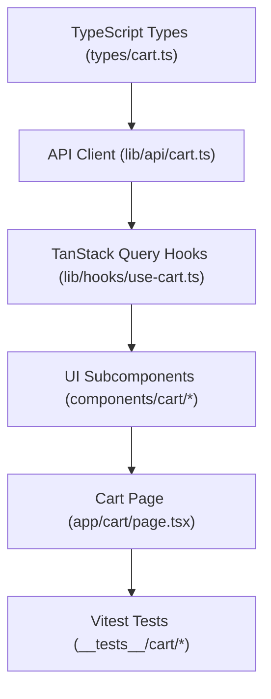

# Plan: Cart Frontend — Dedicated Cart Page

> **Spec Reference**: `specs/003-cart-frontend-page/spec.md`
> **Branch**: `feat/cart`
> **Spec**: 003 of 004 in phase
> **Date**: 2026-09-05
> **Status**: Draft
>
> **CRITICAL CONTENT RULE**: DO NOT write implementation code or logic blocks in this document.
> Everything must be written in **pure text** (natural language, tables, bullet points). Only mock code
> shapes (e.g. JSON schemas or minimal type/interface signatures) are allowed, but **mock logic is
> strictly prohibited** (no function bodies, control flow, loops, or algorithms). Custom enums
> MUST be explained in pure text.

---

## 1. Technical Approach

The frontend cart page implementation integrates seamlessly with the existing Next.js App Router and TanStack Query architecture:

1. **TypeScript Type Definitions**: Create `frontend/types/cart.ts` defining `CartItem`, `CartResponse`, `CartItemUpdateInput`, and error shapes mirroring the backend OpenAPI schemas.
2. **API Client Functions**: Create `frontend/lib/api/cart.ts` providing pure `fetch` functions:
   - `getCart`: calls `GET /api/v1/cart`.
   - `updateCartItemQuantity`: calls `PATCH /api/v1/cart/items/{item_id}`.
   - `deleteCartItem`: calls `DELETE /api/v1/cart/items/{item_id}`.
3. **Custom React Query Hooks**: Create `frontend/lib/hooks/use-cart.ts` exposing:
   - `useCart`: Query hook for fetching and caching cart data (`queryKey: ['cart']`).
   - `useUpdateCartItem`: Mutation hook for updating item quantity with automatic query invalidation.
   - `useDeleteCartItem`: Mutation hook for removing an item with query invalidation.
4. **UI Components**: Build modular, accessible components in `frontend/components/cart/`:
   - `CartItemList`: Renders table/list of cart items.
   - `CartItemRow`: Individual row showing thumbnail, details, quantity stepper, subtotal, and remove button.
   - `CartSummary`: Sidebar card showing subtotal, shipping notice, total, and checkout CTA button.
   - `CartEmptyState`: Friendly empty illustration with catalog navigation button.
   - `CartSkeleton`: Loading placeholder skeleton.
5. **Page Entry Point**: Create `frontend/app/cart/page.tsx` composing the components, handling loading, error, empty, and populated states.
6. **Testing**: Write Vitest unit and integration tests in `frontend/__tests__/cart/cart-page.test.tsx` verifying user interactions and rendering states.

## 2. Dependencies on Prior Specs

| Prior Spec | What It Provides | What This Spec Uses |
|------------|-----------------|---------------------|
| `specs/002-cart-backend-view-modify/` | Endpoints `GET /api/v1/cart`, `PATCH`, `DELETE` | Consumed by the API client and TanStack Query hooks |
| Phase 2 Authentication | `middleware.ts`, `AuthContext`, `useAuth` | Enforcing authentication and buyer role verification |

## 3. Files to Create

| File Path | Purpose |
|-----------|---------|
| `frontend/types/cart.ts` | TypeScript interfaces for cart responses, items, and mutation inputs |
| `frontend/lib/api/cart.ts` | Pure `fetch` wrapper functions for cart endpoints |
| `frontend/lib/hooks/use-cart.ts` | React Query hooks for fetching cart data and executing mutations |
| `frontend/components/cart/cart-item-row.tsx` | Component displaying an individual cart item with quantity controls |
| `frontend/components/cart/cart-item-list.tsx` | Component listing all items in the cart |
| `frontend/components/cart/cart-summary.tsx` | Order summary sidebar with totals and checkout button |
| `frontend/components/cart/cart-empty-state.tsx` | Empty state placeholder with link to catalog |
| `frontend/components/cart/cart-skeleton.tsx` | Skeleton loading state for cart page |
| `frontend/app/cart/page.tsx` | Next.js App Router page for `/cart` |
| `frontend/__tests__/cart/cart-page.test.tsx` | Vitest tests for cart page rendering and interactions |

## 4. Files to Modify

| File Path | Changes |
|-----------|---------|
| `frontend/components/navbar.tsx` (or header component) | Ensure cart link/icon properly links to `/cart` with badge support |

## 5. Dependencies & Order

## 6. Detailed Implementation Notes

### 6.1 — Frontend Types (`frontend/types/cart.ts`)

- Define `CartItem`:
  - `id`: number
  - `seller_product_id`: string
  - `product_id`: string
  - `product_name`: string
  - `product_brand`: string
  - `product_image_url`: string or null
  - `seller_id`: string
  - `seller_name`: string
  - `unit_price`: number
  - `stock`: number
  - `estimated_delivery_days`: number or null
  - `quantity`: number
  - `subtotal`: number
  - `created_at`: string
- Define `CartResponse`:
  - `id`: number
  - `user_id`: string
  - `items`: array of `CartItem`
  - `total_items`: number
  - `total_price`: number
- Define `CartItemUpdateInput`:
  - `quantity`: number

### 6.2 — API Client (`frontend/lib/api/cart.ts`)

- `getCart`: Sends `fetch` GET to `/api/v1/cart` including credentials. Checks response status; parses JSON. If non-ok, throws structured error. Returns `CartResponse`.
- `updateCartItemQuantity`: Sends `fetch` PATCH to `/api/v1/cart/items/{item_id}` with JSON body `{ quantity }` and credentials. Throws structured error on failure. Returns updated item.
- `deleteCartItem`: Sends `fetch` DELETE to `/api/v1/cart/items/{item_id}` with credentials. Throws structured error on failure. Returns deletion confirmation.

### 6.3 — TanStack Query Hooks (`frontend/lib/hooks/use-cart.ts`)

- `useCart`:
  - Calls `useQuery` with `queryKey: ['cart']` and queryFn `getCart`.
- `useUpdateCartItem`:
  - Calls `useMutation` with mutationFn accepting `{ itemId, quantity }` and calling `updateCartItemQuantity`.
  - In `onSuccess`, calls `queryClient.invalidateQueries({ queryKey: ['cart'] })`.
- `useDeleteCartItem`:
  - Calls `useMutation` with mutationFn accepting `itemId` and calling `deleteCartItem`.
  - In `onSuccess`, calls `queryClient.invalidateQueries({ queryKey: ['cart'] })`.

### 6.4 — UI Components (`frontend/components/cart/`)

- `CartItemRow`:
  - Receives `item: CartItem`, `onUpdateQuantity: (quantity: number) => void`, `onRemove: () => void`, `isUpdating: boolean`, `isRemoving: boolean`.
  - Displays thumbnail with fallback icon if image URL is missing.
  - Links product title to `/products/${item.product_id}`.
  - Stepper controls: minus button (disabled if quantity is 1 or updating), quantity number text, plus button (disabled if quantity >= stock or updating).
  - Shows "Max stock reached" badge if `quantity >= stock`.
  - Formats unit price and subtotal using dollar currency formatting.
  - Remove button with trash icon and `aria-label="Remove [product_name] from cart"`.
- `CartSummary`:
  - Receives `totalPrice: number`, `totalItems: number`, `isEmpty: boolean`.
  - Shows price breakdown, delivery notice ("Fulfilled by Kalano Logistics"), and final total.
  - "Proceed to Checkout" button linking to `/checkout` (disabled if `isEmpty`).
- `CartEmptyState`:
  - Displays empty cart graphic/icon, headline "Your cart is empty", subtext, and a button linking to `/products`.
- `CartSkeleton`:
  - Shows pulsing placeholder rows and summary card mimicking the layout.

### 6.5 — Page (`frontend/app/cart/page.tsx`)

- Page component decorated with `"use client"`.
- Checks user role via `useAuth`: if user is not `buyer`, displays informative notice and links to appropriate dashboard.
- Uses `useCart`, `useUpdateCartItem`, `useDeleteCartItem`.
- Handles `isLoading` by rendering `CartSkeleton`.
- Handles `isError` by rendering error message with retry button.
- If data has zero items, renders `CartEmptyState`.
- If data has items, renders responsive grid with `CartItemList` and `CartSummary`.

### 6.6 — Vitest Tests (`frontend/__tests__/cart/cart-page.test.tsx`)

- Test 1: Renders loading skeleton when query is loading.
- Test 2: Renders empty cart state when cart has no items.
- Test 3: Renders item list with correct names, prices, quantities, and totals when items exist.
- Test 4: Clicking increment calls mutation with new quantity.
- Test 5: Increment button is disabled when quantity reaches stock limit.
- Test 6: Clicking remove calls delete mutation.
- Test 7: "Proceed to Checkout" button navigates to `/checkout`.

## 7. Testing Strategy

### Frontend Tests (Vitest)
- Test components using `@testing-library/react`.
- Mock API client methods or mock network requests.
- Verify accessible roles, labels, and state transitions.

### Manual Verification
- Log in as buyer.
- Navigate to `/cart` when empty; verify empty state.
- Add items from catalog, visit `/cart`, verify item display, increment/decrement, and removal.
- Verify non-buyer user sees role warning.

## 8. Constitution Compliance Checklist

- [ ] Thin frontend client; all business logic in FastAPI (§4.1)
- [ ] No Supabase JS client used in frontend (§4.1)
- [ ] TanStack Query for server state management (§3)
- [ ] Accessible buttons with `aria-label` attributes (§12)
- [ ] Responsive desktop-first layout (§12)
- [ ] Tests written with Vitest (§14)

## 9. Risks & Mitigations

| Risk | Mitigation |
|------|-----------|
| Rapid clicking causing race condition updates | Disable quantity buttons during pending mutation |
| Out of sync cart count in navigation | Invalidate `['cart']` query cache on all cart mutations |
| Missing product image leading to broken UI | Provide fallback image/icon component |
