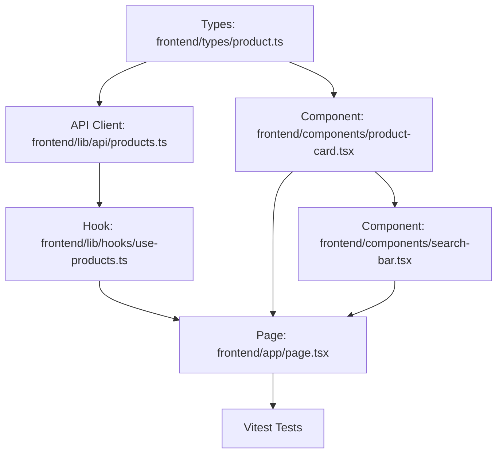

# Plan: Landing Page (Home)

> **Spec Reference**: `specs/003-landing-page/spec.md`
> **Branch**: `feat/product-catalog`
> **Spec**: 003 of 005 in phase
> **Date**: 2026-09-05
> **Status**: Draft
>
> **CRITICAL CONTENT RULE**: DO NOT write implementation code or logic blocks in this document.
> Everything must be written in **pure text** (natural language, tables, bullet points). Only mock code
> shapes (e.g. JSON schemas or minimal type/interface signatures) are allowed, but **mock logic is
> strictly prohibited** (no function bodies, control flow, loops, or algorithms). Custom enums
> MUST be explained in pure text.

---

## 1. Technical Approach

The Landing Page (`frontend/app/page.tsx`) will be upgraded from the initial scaffolding page to a full discovery storefront.

1. **Type Definitions**: Create TypeScript interfaces in `frontend/types/product.ts` representing `Product`, `CheapestOffer`, and `ProductsListResponse` mirroring the FastAPI backend schemas.
2. **API Client & Hook**:
   - Create `frontend/lib/api/products.ts` containing `getProducts({ limit, offset, q })` which calls `GET /api/v1/products` using native `fetch`.
   - Create TanStack Query custom hook `frontend/lib/hooks/use-products.ts` wrapping `useQuery` for automatic caching, loading, and error states.
3. **Reusable Components**:
   - `frontend/components/product-card.tsx`: Card component displaying image, brand, title, lowest price or out of stock tag, linking to `/products/[id]`.
   - `frontend/components/search-bar.tsx`: Search form with accessible text input and submit action that pushes `/products?q={query}` using Next.js `useRouter`.
   - `frontend/components/product-card-skeleton.tsx`: Shimmer placeholder for loading state.
4. **Landing Page Structure**:
   - Replaces `frontend/app/page.tsx` with a responsive desktop-first layout including hero section, search bar, and "Featured Products" grid.
5. **Testing**: Write Vitest unit tests for `ProductCard`, `SearchBar`, and the home page.

## 2. Dependencies on Prior Specs

| Prior Spec | What It Provides | What This Spec Uses |
|------------|-----------------|---------------------|
| `specs/001-list-products-endpoint/` | `GET /api/v1/products` endpoint | Fetches product list for featured grid |

## 3. Files to Create

| File Path | Purpose |
|-----------|---------|
| `frontend/types/product.ts` | TypeScript types for products, offers, and list response |
| `frontend/lib/api/products.ts` | Fetch client function for `GET /api/v1/products` |
| `frontend/lib/hooks/use-products.ts` | TanStack Query hook `useProducts` |
| `frontend/components/product-card.tsx` | Reusable product card component |
| `frontend/components/product-card-skeleton.tsx` | Skeleton placeholder for product card loading |
| `frontend/components/search-bar.tsx` | Reusable search input component |
| `frontend/__tests__/components/product-card.test.tsx` | Vitest test for ProductCard rendering and out-of-stock badge |
| `frontend/__tests__/components/search-bar.test.tsx` | Vitest test for SearchBar interaction and navigation |
| `frontend/__tests__/pages/home.test.tsx` | Vitest test for homepage states (loading, success, error) |

## 4. Files to Modify

| File Path | Changes |
|-----------|---------|
| `frontend/app/page.tsx` | Replace placeholder hero with interactive search and featured product catalog grid |

## 5. Dependencies & Order

## 6. Detailed Implementation Notes

### 6.1 — Frontend: Types (`frontend/types/product.ts`)

- Define TypeScript interfaces:
  - `CheapestOffer`: `seller_product_id` (string), `seller_id` (string), `seller_name` (string), `price` (number), `stock` (number), `estimated_delivery_days` (number or null).
  - `ProductListItem`: `id` (string), `name` (string), `description` (string), `brand` (string), `image_url` (string or null), `cheapest_offer` (`CheapestOffer` or null).
  - `ProductsListResponse`: `items` (array of `ProductListItem`), `total` (number), `limit` (number), `offset` (number).
  - `GetProductsParams`: `limit` (number), `offset` (number), `q` (optional string).

### 6.2 — Frontend: API Client (`frontend/lib/api/products.ts`)

- Function `getProducts(params: GetProductsParams)`:
  - Constructs URL query string using `limit`, `offset`, and optional `q`.
  - Executes `fetch` against `${API_BASE_URL}/api/v1/products?${queryString}`.
  - Checks `response.ok`; if false, parses error envelope or throws descriptive error.
  - Returns parsed JSON matching `ProductsListResponse`.

### 6.3 — Frontend: Hook (`frontend/lib/hooks/use-products.ts`)

- Hook `useProducts(params: GetProductsParams)`:
  - Calls `useQuery` with query key `['products', params]`.
  - Invokes `getProducts(params)`.
  - Keeps previous data while fetching new pagination or search parameters.

### 6.4 — Frontend: Components

- **`ProductCard` (`frontend/components/product-card.tsx`)**:
  - Props: `product: ProductListItem`.
  - Renders image with fallback placeholder when `image_url` is null.
  - Displays brand name in muted small font.
  - Displays product title truncated to 2 lines.
  - Displays price: "$XX.XX" or an "Out of Stock" badge when `cheapest_offer` is null.
  - Wrapped in a Next.js `Link` to `/products/${product.id}`.
- **`SearchBar` (`frontend/components/search-bar.tsx`)**:
  - Props: `initialQuery?: string`, `placeholder?: string`, `className?: string`.
  - Form with accessible input element and submit button with Search icon.
  - On submit, trims input value and uses `router.push('/products?q=' + encodeURIComponent(query))`.

### 6.5 — Frontend: Page (`frontend/app/page.tsx`)

- Uses client component structure with `useProducts({ limit: 8, offset: 0 })`.
- Top Section: Hero headline, sub-headline, and prominent `SearchBar`.
- Middle Section: "Featured Products" section header, "View all" link to `/products`.
- Grid Section:
  - Loading: renders 8 `ProductCardSkeleton` components.
  - Error: displays error card with retry button invoking `refetch`.
  - Empty: renders empty state message.
  - Success: renders `ProductCard` for each item in `data.items`.

### 6.6 — Frontend: Tests

- `ProductCard.test.tsx`: Verify product title, brand, and price render; verify out of stock badge renders when offer is null.
- `SearchBar.test.tsx`: Verify typing text and submitting calls router navigation with encoded query.
- `Home.test.tsx`: Verify rendering of hero, search bar, skeleton state, and successful products list.

## 7. Testing Strategy

### Frontend Tests (Vitest)
- Execute `pnpm test` in the `frontend` directory.
- Verify component isolation tests and user interaction mocks pass cleanly.

### Manual Verification
> **Server Process Timeout Rule**: Any server process started for manual verification (Next.js dev server or FastAPI Uvicorn) MUST include an automatic timeout that automatically terminates and kills the process after X seconds (e.g. 20–30 seconds max).
- Start frontend dev server (`pnpm dev`) and backend (`uv run uvicorn app.main:app`) with an automated timeout (max 25 seconds) configured to kill the processes after the timeout expires.
- Visit `http://localhost:3000/`.
- Verify hero layout and search bar.
- Verify featured product cards display properly with prices and out-of-stock badges.
- Verify clicking search navigates to `/products?q=...` before the server processes automatically terminate.

## 8. Constitution Compliance Checklist

- [ ] Thin client: fetches directly from FastAPI backend (§4.1)
- [ ] No Supabase JS client in frontend (§4.1)
- [ ] Semantic HTML and accessibility labels used (§12)
- [ ] Desktop-first responsive layout down to tablet (§12)
- [ ] Naming conventions followed (§7)
- [ ] Vitest tests written for components and pages (§14)
- [ ] Conventional Commits used (§13)

## 9. Risks & Mitigations

| Risk | Mitigation |
|------|-----------|
| Backend API not reachable during page render | Provide graceful error state with retry button; handle fetch error cleanly |
| Missing or broken image URLs | Render styled SVG / geometric icon placeholder when `image_url` is null or fails to load |
