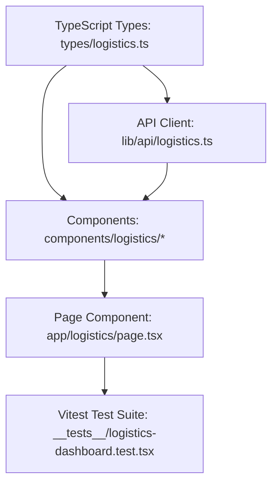

# Plan: Logistics Dashboard Frontend

> **Spec Reference**: `specs/003-logistics-dashboard-frontend/spec.md`
> **Branch**: `feat/logistics-dashboard`
> **Spec**: 003 of 003 in phase
> **Date**: 2026-09-06
> **Status**: Draft
>
> **CRITICAL CONTENT RULE**: DO NOT write implementation code or logic blocks in this document.
> Everything must be written in **pure text** (natural language, tables, bullet points). Only mock code
> shapes (e.g. JSON schemas or minimal type/interface signatures) are allowed, but **mock logic is
> strictly prohibited** (no function bodies, control flow, loops, or algorithms). Custom enums
> MUST be explained in pure text.

---

## 1. Technical Approach

The frontend logistics dashboard provides a centralized, role-protected interface for logistics operators to monitor and advance order fulfillment across the Kalano platform:

1. **TypeScript Definitions (`frontend/types/logistics.ts`)**: Define types mirroring the backend response and request contracts: `LogisticsOrderItem`, `LogisticsOrderStatus`, and `LogisticsStatusUpdateRequest`.
2. **API Client Layer (`frontend/lib/api/logistics.ts`)**: Create type-safe fetch helper functions:
   - `fetchLogisticsOrders(status?: string)`
   - `updateLogisticsOrderStatus(orderId: number, status: string)`
3. **UI Components (`frontend/components/logistics/`)**:
   - `LogisticsHeader`: Header displaying Kalano branding, Logistics Dashboard indicator, operator account badge, and quick navigation.
   - `LogisticsMetrics`: Four summary cards showing total orders, pending pickups, shipments in transit, and completed deliveries.
   - `LogisticsFilterBar`: Tab bar for status filtering plus search input for live text search.
   - `LogisticsTable`: Comprehensive accessible data table displaying order details, customer addresses, merchant information, status badges, and contextual action buttons.
   - `LogisticsStatusBadge`: Component rendering color-coded badges for each delivery status.
   - `LogisticsActionModal`: Reusable confirmation modal for destructive actions like order cancellation or return.
4. **Dashboard Page (`frontend/app/logistics/page.tsx`)**:
   - Assemble components using TanStack Query `useQuery` to fetch order collections and `useMutation` to handle status transitions with automatic query invalidation and toast feedback.
   - Enforce authentication check and role verification (`user.user_role === "logistics"`), rendering an Access Denied fallback when unauthorized.
5. **Vitest Unit & Integration Tests (`frontend/__tests__/logistics-dashboard.test.tsx`)**:
   - Test loading skeleton display.
   - Test role authorization and Access Denied handling.
   - Test rendering of metrics, search filtering, and orders table.
   - Test status action button clicks and mutation execution.

## 2. Dependencies on Prior Specs

| Prior Spec | What It Provides | What This Spec Uses |
|------------|-----------------|---------------------|
| `specs/001-logistics-view-orders-endpoint/` | `GET /api/v1/logistics/orders` endpoint and data structure | Consumed by `fetchLogisticsOrders` API client function and TanStack Query |
| `specs/002-logistics-update-order-status-endpoint/` | `PATCH /api/v1/logistics/orders/{order_id}` endpoint and transition logic | Consumed by `updateLogisticsOrderStatus` API client and mutation hooks |

## 3. Files to Create

| File Path | Purpose |
|-----------|---------|
| `frontend/types/logistics.ts` | TypeScript types for logistics order items, status types, and mutation payloads |
| `frontend/lib/api/logistics.ts` | API client functions wrapping `GET` and `PATCH` requests to the logistics endpoints |
| `frontend/components/logistics/logistics-header.tsx` | Header bar with branding and operator profile information |
| `frontend/components/logistics/logistics-metrics.tsx` | Metric summary cards displaying aggregate order counts |
| `frontend/components/logistics/logistics-filter-bar.tsx` | Status filter tabs and search filter input |
| `frontend/components/logistics/logistics-status-badge.tsx` | Color-coded status badge component |
| `frontend/components/logistics/logistics-table.tsx` | Data table displaying orders, line items, and contextual action triggers |
| `frontend/components/logistics/logistics-confirm-dialog.tsx` | Confirmation dialog for order cancellation and return processing |
| `frontend/app/logistics/page.tsx` | Main `/logistics` page component orchestrating data and subcomponents |
| `frontend/__tests__/logistics-dashboard.test.tsx` | Vitest component and page test suite |

## 4. Files to Modify

| File Path | Changes |
|-----------|---------|
| None (all integration files already support `/logistics` in middleware) | — |

## 5. Dependencies & Order

## 6. Detailed Implementation Notes

### 6.1 — Frontend: Types (`frontend/types/logistics.ts`)

- **Type `LogisticsDeliveryStatus`**:
  - The delivery status accepts: `pending`, `confirmed`, `shipped`, `delivered`, `cancelled`, or `returned`.
- **Interface `LogisticsOrderItem`**:
  - `id`: number
  - `product_id`: string
  - `product_name`: string
  - `product_brand`: string
  - `product_image_url`: string or null
  - `seller_id`: string
  - `seller_name`: string
  - `buyer_id`: string or null
  - `buyer_name`: string
  - `address`: string
  - `bought_price`: number
  - `quantity`: number
  - `subtotal`: number
  - `delivery_types`: string
  - `created_at`: string
- **Interface `LogisticsStatusUpdateRequest`**:
  - `status`: string

### 6.2 — Frontend: API Client (`frontend/lib/api/logistics.ts`)

- **Function `fetchLogisticsOrders(status?: string)`**:
  - Constructs URL with optional `?status=` query parameter.
  - Calls `fetch` with credentials include option.
  - Throws formatted error if response status is not OK.
  - Returns `Promise<LogisticsOrderItem[]>`.
- **Function `updateLogisticsOrderStatus(orderId: number, status: string)`**:
  - Sends `PATCH` to `/api/v1/logistics/orders/${orderId}` with JSON body containing `status`.
  - Throws formatted error if response status is not OK.
  - Returns `Promise<LogisticsOrderItem>`.

### 6.3 — Frontend: Components (`frontend/components/logistics/`)

- **`LogisticsStatusBadge`**:
  - Renders a badge with specific Tailwind classes depending on the status value:
    - `pending`: amber background and amber text
    - `confirmed`: sky blue background and blue text
    - `shipped`: purple background and purple text
    - `delivered`: emerald green background and green text
    - `cancelled`: rose red background and red text
    - `returned`: slate gray background and gray text
- **`LogisticsMetrics`**:
  - Calculates metrics from order list: total count, pending count, in-transit count (`confirmed` + `shipped`), and delivered count.
  - Renders 4 responsive cards with title, count, and status icon.
- **`LogisticsFilterBar`**:
  - Renders tabs for "All", "Pending", "Confirmed", "Shipped", "Delivered", "Cancelled", "Returned".
  - Renders search input with magnifying glass icon and clear button.
  - Dispatches selected tab and search term changes to parent.
- **`LogisticsConfirmDialog`**:
  - Simple modal dialog asking user to confirm destructive actions ("Cancel Order" or "Process Return").
  - Includes "Cancel" and "Confirm" buttons with loading state.
- **`LogisticsTable`**:
  - Renders HTML table with full accessible headers.
  - For each row, displays order ID, formatted date, product info, seller name, buyer name & shipping address, quantity, subtotal formatted as currency, status badge, and action buttons.
  - Contextual buttons:
    - For `pending`: "Confirm Pickup" and "Cancel"
    - For `confirmed`: "Mark Shipped" and "Cancel"
    - For `shipped`: Primary "End Delivery" button and "Cancel"
    - For `delivered`: "Process Return"
    - For `cancelled` / `returned`: "Completed" text label

### 6.4 — Frontend: Page Component (`frontend/app/logistics/page.tsx`)

- Uses `"use client"` directive.
- Uses `useAuth` hook to evaluate authentication and role.
- If loading, renders a full-page pulse skeleton.
- If not authenticated, redirects to `/login?redirect=/logistics`.
- If authenticated and `user.user_role !== "logistics"`, renders Access Denied card with link to home.
- Uses `useQuery` with key `["logistics-orders", selectedStatus]` to fetch orders.
- Uses `useMutation` with `updateLogisticsOrderStatus`, invalidating the query cache on success and displaying toast notifications.
- Computes filtered orders based on active status tab and search keyword.

### 6.5 — Frontend: Tests (`frontend/__tests__/logistics-dashboard.test.tsx`)

- Test 1: Shows loading skeleton when `isLoading` is true.
- Test 2: Renders Access Denied view when logged-in user is a buyer.
- Test 3: Renders orders table and metrics cards for logistics user.
- Test 4: Filters rows when user types into the search input.
- Test 5: Triggers status mutation when "End Delivery" button is clicked.

## 7. Testing Strategy

### Frontend Tests (Vitest)
- Component rendering tests with mocked TanStack Query and AuthContext.
- User interaction tests using React Testing Library (`@testing-library/react` and `userEvent`).
- Snapshot or DOM query assertions verifying proper columns, badges, and action buttons.

### Manual Verification
- Log in with logistics credentials (`logistics@kalano.com`).
- Verify access to `/logistics`.
- Verify metric counts match visible orders.
- Advance an order: click "Mark Shipped", verify badge changes to "shipped".
- Click "End Delivery", verify badge updates to "delivered".
- Test filtering tabs and text search.

## 8. Constitution Compliance Checklist

- [ ] Thin Next.js client, strictly consuming backend REST API (§4.1)
- [ ] No Supabase JS client in frontend (§4.1)
- [ ] Role check restricts page to `logistics` role (§4.2, §8)
- [ ] Uses TanStack Query for server state management (§3)
- [ ] Clean naming conventions (kebab-case files, PascalCase components) (§7)
- [ ] Desktop-first responsive layout with semantic HTML (§12)
- [ ] Vitest tests for UI components and user actions (§14)

## 9. Risks & Mitigations

| Risk | Mitigation |
|------|-----------|
| Network latency causing button spamming | Disable button and show spinner while mutation is pending (`mutation.isPending`) |
| Accidental order cancellation | Enforce confirmation dialog modal before dispatching cancellation request |
