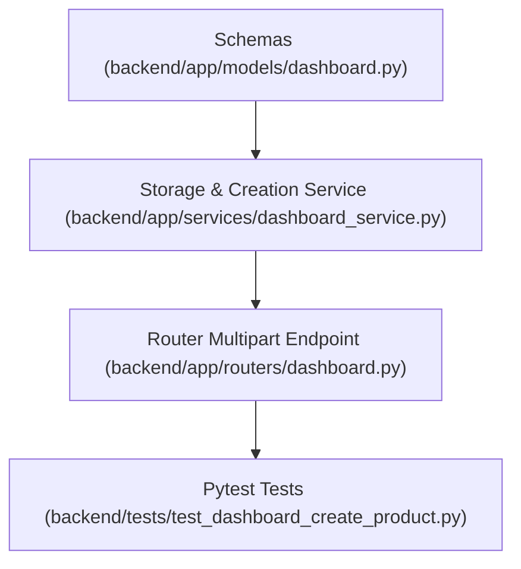

# Plan: Merchant Create Product and Offer Endpoint

> **Spec Reference**: `specs/003-merchant-create-product-offer-endpoint/spec.md`
> **Branch**: `feat/merchant-dashboard`
> **Spec**: 003 of 006 in phase
> **Date**: 2026-09-06
> **Status**: Draft
>
> **CRITICAL CONTENT RULE**: DO NOT write implementation code or logic blocks in this document.
> Everything must be written in **pure text** (natural language, tables, bullet points). Only mock code
> shapes (e.g. JSON schemas or minimal type/interface signatures) are allowed, but **mock logic is
> strictly prohibited** (no function bodies, control flow, loops, or algorithms). Custom enums
> MUST be explained in pure text.

---

## 1. Technical Approach

Implement `POST /api/v1/dashboard/products` handling multipart form data.
The endpoint accepts product metadata fields (`name`, `description`, `brand`), offer numeric fields (`price`, `stock`, `estimated_delivery_days`), and an optional `UploadFile` (`image`).
A storage helper function in `backend/app/services/dashboard_service.py` handles image upload to Supabase Storage:
- Validates file content type (image/jpeg, image/png, image/webp).
- Reads file contents and uploads to the `products` bucket with a collision-resistant filename prefix.
- Retrieves public URL from Supabase Storage client.
The service function creates a row in the `products` table, then inserts a row in the `seller_products` table linking the product to the merchant. Both records are returned in a combined `MerchantProductCreateResponse`.
Tests in pytest mock the Supabase Storage upload method to test success with image, success without image, storage error handling, and role validation.

## 2. Dependencies on Prior Specs

| Prior Spec | What It Provides | What This Spec Uses |
|------------|-----------------|---------------------|
| `specs/001-merchant-list-offers-endpoint/` | Dashboard router, models, and service layer | Extends router and service |
| `specs/002-merchant-add-offer-endpoint/` | `MerchantOfferResponse` schema | Reuses offer response model |

## 3. Files to Create

| File Path | Purpose |
|-----------|---------|
| `backend/tests/test_dashboard_create_product.py` | Pytest tests for creating new product and initial offer |

## 4. Files to Modify

| File Path | Changes |
|-----------|---------|
| `backend/app/models/dashboard.py` | Add `ProductDetailRecord` and `MerchantProductCreateResponse` schemas |
| `backend/app/services/dashboard_service.py` | Add `upload_product_image` and `create_product_and_offer` business logic |
| `backend/app/routers/dashboard.py` | Add `POST /products` multipart endpoint |

## 5. Dependencies & Order

## 6. Detailed Implementation Notes

> **REMINDER**: DO NOT write implementation code or logic blocks here! Everything must
> be written in pure text. Mock code shapes/signatures only; mock logic is strictly
> prohibited. Custom enums must be explained in pure text.

### 6.1 — Backend: Models (`backend/app/models/dashboard.py`)

- Define `ProductRecordModel`:
  - `id`: UUID
  - `name`: string
  - `description`: string
  - `brand`: string
  - `image_url`: string or null
  - `created_at`: datetime or ISO string or null
- Define `MerchantProductCreateResponse`:
  - `product`: `ProductRecordModel`
  - `offer`: `MerchantOfferResponse` (from Spec 002)

### 6.2 — Backend: Service (`backend/app/services/dashboard_service.py`)

- Define `upload_product_image`:
  - Inputs: `image_file` (UploadFile or binary data), `filename` (string), `content_type` (string), `supabase_client`.
  - Generates unique path `products/{uuid}_{filename}`.
  - Calls `supabase_client.storage.from_("products").upload(...)`.
  - Retrieves and returns public URL via `supabase_client.storage.from_("products").get_public_url(...)`.
  - Catches storage exceptions and raises `HTTPException(400)` with error code `IMAGE_UPLOAD_FAILED`.
- Define `create_product_and_offer`:
  - Inputs: `seller_id` (UUID), `name` (str), `description` (str), `brand` (str), `price` (float), `stock` (int), `estimated_delivery_days` (optional int), `image_file` (optional UploadFile), `supabase_client`.
  - Step 1: If `image_file` is present and has a filename, invoke `upload_product_image` to obtain public `image_url`. Otherwise, `image_url` is null.
  - Step 2: Generate product UUID. Insert row into `products` table with generated ID, name, description, brand, `image_url`, and current timestamp.
  - Step 3: Generate offer UUID. Insert row into `seller_products` with offer ID, product ID, seller ID, price, stock, estimated delivery days, and current timestamp.
  - Step 4: Return `MerchantProductCreateResponse` containing both created records.

### 6.3 — Backend: Router (`backend/app/routers/dashboard.py`)

- Add route `@router.post("/products", status_code=201, response_model=MerchantProductCreateResponse)`:
  - Consumes multipart form parameters:
    - `name: str = Form(...)`
    - `description: str = Form(...)`
    - `brand: str = Form(...)`
    - `price: float = Form(..., gt=0)`
    - `stock: int = Form(..., ge=0)`
    - `estimated_delivery_days: int | None = Form(default=None, ge=1)`
    - `image: UploadFile | None = File(default=None)`
  - Verifies `current_user.user_role == "merchant"`. Returns 403 `FORBIDDEN` if non-merchant.
  - Calls `create_product_and_offer` in service layer.
  - Returns HTTP 201 with response body.
  - Documents status codes 201, 400, 401, 403, 422, 500.

### 6.4 — Backend: Tests (`backend/tests/test_dashboard_create_product.py`)

- Test cases:
  1. Success with image: Upload multipart form with a mock JPEG file; verify product created with image_url and offer created with merchant ID.
  2. Success without image: Submit form without image; verify product created with `image_url = None`.
  3. Storage failure: Mock storage upload throwing an exception; verify HTTP 400 with code `IMAGE_UPLOAD_FAILED`.
  4. Validation failure: Negative price, negative stock, or missing name; verify HTTP 422.
  5. Forbidden: Buyer role receives HTTP 403 `FORBIDDEN`.
  6. Unauthorized: Unauthenticated request receives HTTP 401.

## 7. Testing Strategy

### Backend Tests (Pytest)
- Execute `uv run pytest backend/tests/test_dashboard_create_product.py -v`.
- Mock Supabase Storage operations using `unittest.mock.MagicMock` to ensure deterministic execution without external network calls.

### Manual Verification
- Use Swagger UI (`/docs`) to test `POST /api/v1/dashboard/products` with file upload.
- Verify new product is listed in `GET /api/v1/products` and in `GET /api/v1/dashboard/offers`.

## 8. Constitution Compliance Checklist

- [ ] All business logic in FastAPI (§4.1)
- [ ] Product images stored in Supabase Storage (§11)
- [ ] Role check enforces merchant access (§2)
- [ ] Endpoint prefixed with `/api/v1/` (§4.3)
- [ ] OpenAPI docs detail summary, parameters, and responses (§4.3)
- [ ] Standard error envelope on failure (§4.4)
- [ ] Pytest suite covers image and non-image flows (§14)

## 9. Risks & Mitigations

| Risk | Mitigation |
|------|-----------|
| Supabase Storage bucket `products` might not exist or lacks public permissions | Service gracefully catches upload error and returns `IMAGE_UPLOAD_FAILED` with clear message |
| Partial write: product created but offer creation fails | Wrap or sequence database insertions; verify validation beforehand |
