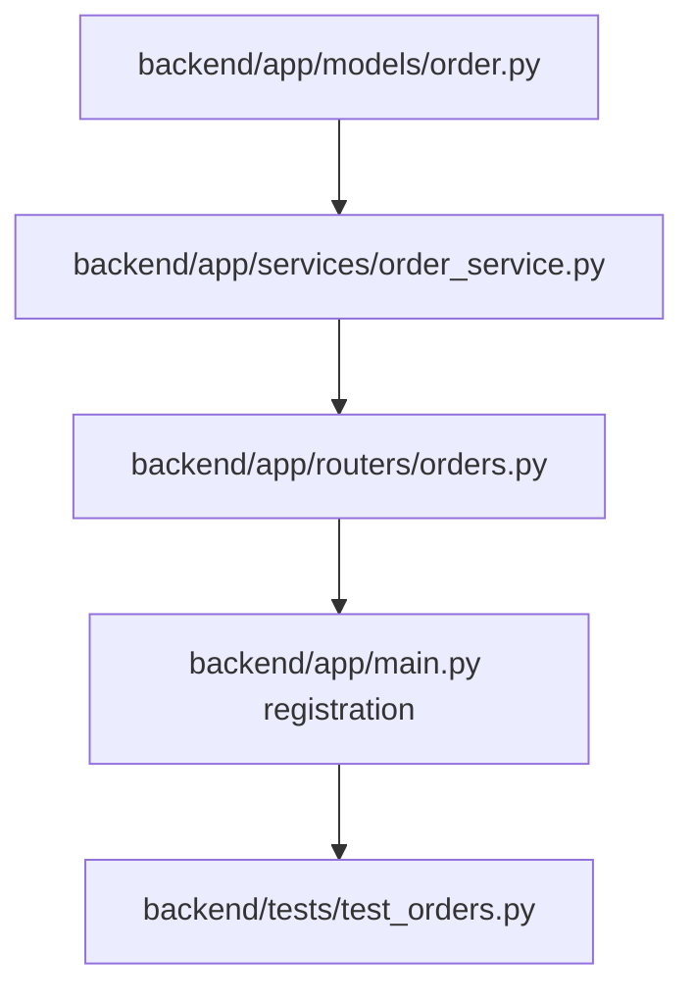

# Plan: Order History Endpoint

> **Spec Reference**: `specs/003-order-history-endpoint/spec.md`
> **Branch**: `feat/checkout-and-orders`
> **Spec**: 003 of 004 in phase
> **Date**: 2026-09-05
> **Status**: Draft
>
> **CRITICAL CONTENT RULE**: DO NOT write implementation code or logic blocks in this document.
> Everything must be written in **pure text** (natural language, tables, bullet points). Only mock code
> shapes (e.g. JSON schemas or minimal type/interface signatures) are allowed, but **mock logic is
> strictly prohibited** (no function bodies, control flow, loops, or algorithms). Custom enums
> MUST be explained in pure text.

---

## 1. Technical Approach

The order history endpoint is implemented as part of a new orders router in FastAPI:
- A new router `backend/app/routers/orders.py` defines the `GET /api/v1/orders` endpoint.
- A dedicated service layer `backend/app/services/order_service.py` encapsulates logic for querying `user_orders` by `buyer_id`, joining with `products` and `users` (seller) tables, sorting by `created_at` descending, and calculating item subtotals.
- Pydantic models in `backend/app/models/order.py` define response models with OpenAPI field descriptions.
- FastAPI dependency injection (`get_current_user` and `get_supabase_client`) ensures buyer role authorization and provides database connectivity.

## 2. Dependencies on Prior Specs

| Prior Spec | What It Provides | What This Spec Uses |
|------------|-----------------|---------------------|
| `specs/001-checkout-endpoint/` | Creates `user_orders` records during checkout | Queries the `user_orders` table populated by checkout |
| Phase 2 (Auth) | `get_current_user` dependency | Validates buyer identity and role |

## 3. Files to Create

| File Path | Purpose |
|-----------|---------|
| `backend/app/models/order.py` | Pydantic response models for individual orders and order history list |
| `backend/app/services/order_service.py` | Business logic for fetching and enriching buyer order history |
| `backend/app/routers/orders.py` | FastAPI route definition for `GET /api/v1/orders` |
| `backend/tests/test_orders.py` | Pytest unit and integration tests for order history retrieval |

## 4. Files to Modify

| File Path | Changes |
|-----------|---------|
| `backend/app/main.py` | Register the new `orders.router` under the FastAPI application |

## 5. Dependencies & Order

## 6. Detailed Implementation Notes

### 6.1 — Backend: Models (`backend/app/models/order.py`)

- **OrderDetailResponse**:
  - `id`: integer, unique identifier of the order.
  - `product_id`: UUID, unique identifier of the product.
  - `product_name`: string, title of the product.
  - `product_brand`: string, brand of the product.
  - `product_image_url`: string or null, URL of the product image.
  - `seller_id`: UUID, unique identifier of the merchant.
  - `seller_name`: string, display name of the seller.
  - `bought_price`: float, unit purchase price.
  - `quantity`: integer, number of units ordered.
  - `subtotal`: float, computed line total (`bought_price * quantity`).
  - `delivery_types`: string, delivery status. The `delivery_types` enum accepts values: `pending`, `confirmed`, `shipped`, `delivered`, `cancelled`, or `returned`.
  - `address`: string, shipping address.
  - `created_at`: datetime or ISO string, timestamp when the order was placed.
- **OrderListResponse**:
  - `orders`: list of `OrderDetailResponse` items.
  - `total_orders`: integer, count of total orders returned.

### 6.2 — Backend: Service (`backend/app/services/order_service.py`)

- **get_buyer_orders**:
  - Accepts Supabase client instance, user ID (UUID), and user role (string).
  - Role check: Verifies `user_role` equals `buyer`. If not, raises HTTP 403 Forbidden with `FORBIDDEN` error code.
  - Query `user_orders` table:
    - Filter by `buyer_id` matching user ID.
    - Order by `created_at` descending.
  - Enrich each order record:
    - Fetch product row from `products` table using `product_id` (retrieving `name`, `brand`, and `image_url`).
    - Fetch seller row from `users` table using `seller_id` (retrieving `display_name`).
    - Compute `subtotal` = `bought_price * quantity`.
  - Return `OrderListResponse` populated with all enriched order records and `total_orders` count.

### 6.3 — Backend: Router (`backend/app/routers/orders.py`)

- Route path: `GET /api/v1/orders`.
- Tags: `["Orders"]`.
- Summary: "List buyer order history".
- Dependencies: `get_current_user` and `get_supabase_client`.
- Response model: `OrderListResponse`.
- Error responses documented: HTTP 401 (`UNAUTHORIZED`) and HTTP 403 (`FORBIDDEN`).

### 6.4 — Backend: Tests (`backend/tests/test_orders.py`)

- Test 1: Successful retrieval of multiple orders for an authenticated buyer, sorted descending by creation date.
- Test 2: Retrieval for a buyer with zero orders returns HTTP 200 with empty list and `total_orders: 0`.
- Test 3: Rejection of unauthenticated requests with HTTP 401.
- Test 4: Rejection of merchant user with HTTP 403 `FORBIDDEN`.
- Test 5: Rejection of logistics user with HTTP 403 `FORBIDDEN`.
- Test 6: Verification that subtotal is accurately calculated as `bought_price * quantity`.
- Test 7: Verification that product name, brand, image, and seller display name are properly mapped.

## 7. Testing Strategy

### Backend Tests (Pytest)
- Use `TestClient` with mocked database responses for `user_orders`, `products`, and `users`.
- Validate status codes, response shapes, and error envelope conformity.

### Manual Verification
- Place an order through checkout endpoint.
- Call `GET /api/v1/orders` and confirm the new order appears first with status `pending`.

## 8. Constitution Compliance Checklist

- [ ] All query and business logic in FastAPI, not Next.js (§4.1)
- [ ] Authentication verified using JWT dependency (§4.2)
- [ ] Endpoint prefixed with `/api/v1/` (§4.3)
- [ ] OpenAPI documentation with summary, description, and response codes (§4.3)
- [ ] Pydantic models with field descriptions and examples (§4.3)
- [ ] Standard error envelope for client and server errors (§4.4)
- [ ] Schema matches predefined `user_orders` table (§5)
- [ ] Custom enum `delivery_types` explained in pure text (§5)
- [ ] Tests written in Pytest covering all scenarios (§14)

## 9. Risks & Mitigations

| Risk | Mitigation |
|------|-----------|
| Deleted seller or product causing lookup failure | Use safe fallback defaults (e.g. "Unknown Seller" / "Unknown Product") when resolving foreign keys |
| Nullable address causing validation failure | Declare `address` as string with empty-string fallback |
