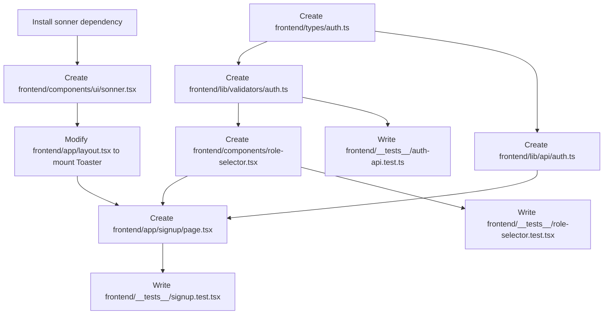

# Plan: Frontend Sign Up Page

> **Spec Reference**: `specs/004-frontend-signup-page/spec.md`  
> **Branch**: `feat/authentication`  
> **Spec**: 004 of 006 in phase  
> **Date**: 2026-09-03  
> **Status**: Draft  

---

## 1. Technical Approach

The `/signup` page is implemented as a client component (`"use client"`) using Next.js App Router, React 19, TypeScript, TailwindCSS v4, shadcn/ui primitives, TanStack Query v5, and Zod v4.

Key architectural decisions:
1. **Thin Client Pattern**: The frontend performs client-side form validation and mutation dispatching only. No database calls, no password hashing, and no authentication cookies are managed here; those remain strictly within the FastAPI backend (`POST /api/v1/auth/register`).
2. **Modular Role Selection**: Role selection is abstracted into an accessible `RoleSelector` component (`frontend/components/role-selector.tsx`). It renders two interactive cards (Merchant and Buyer) that support keyboard navigation, ARIA radio group semantics, and active visual styling, replacing standard select dropdowns or radio lists.
3. **Form & Validation State**: Form values and validation errors are managed via controlled React state (`useState`). Validation is performed on submission using Zod's `safeParse()`. Field-specific validation errors are mapped directly to input elements, and passwords are cross-verified client-side before any network traffic is initiated.
4. **Server State Management**: Server mutation lifecycle (pending state, error handling, success response) is handled by TanStack Query's `useMutation`. Duplicate submissions are locked out while `isPending` is true.
5. **Feedback & Notification**: Upon successful registration, a toast notification is dispatched via Sonner (`toast.success("Account created successfully!")`) and the user is routed to `/login` using Next.js `useRouter().push('/login')`. If an API error occurs, the standard envelope message (`{ error: { code, message } }`) is rendered in an alert banner.

---

## 2. Dependencies on Prior Specs

| Prior Spec | What It Provides | What This Spec Uses |
|------------|-----------------|---------------------|
| `specs/001-user-registration-endpoint/` | Backend API endpoint `POST /api/v1/auth/register` and Pydantic request/response models | Consumed by `registerUser` API client; contract defines payload shape and status codes |
| `specs/002-user-login-endpoint/` | Login endpoint and route `/login` | Serves as redirect destination upon successful registration |

---

## 3. Files to Create

| File Path | Purpose |
|-----------|---------|
| `frontend/types/auth.ts` | TypeScript interfaces for registration payload, user response, and API error envelope |
| `frontend/lib/validators/auth.ts` | Zod validation schema (`signupSchema`) and inferred TypeScript types |
| `frontend/lib/api/auth.ts` | Fetch-based API client wrapper `registerUser()` communicating with FastAPI |
| `frontend/components/role-selector.tsx` | Two-panel role selector component with Merchant and Buyer benefits lists |
| `frontend/components/ui/sonner.tsx` | shadcn toast component wrapper around `sonner` |
| `frontend/app/signup/page.tsx` | Next.js client page component hosting the signup form and mutation flow |
| `frontend/__tests__/role-selector.test.tsx` | Vitest unit and interaction tests for the RoleSelector component |
| `frontend/__tests__/auth-api.test.ts` | Vitest unit tests for the Zod schema validation and API client fetch handler |
| `frontend/__tests__/signup.test.tsx` | Vitest integration tests for the `/signup` page rendering, validation, submission, and errors |

---

## 4. Files to Modify

| File Path | Changes |
|-----------|---------|
| `frontend/app/layout.tsx` | Mount the `<Toaster />` component from `@/components/ui/sonner` inside `RootLayout` |
| `frontend/package.json` | Add `sonner` and `next-themes` (required by sonner/shadcn) dependencies |

---

## 5. Dependencies & Order



---

## 6. Detailed Implementation Notes

### 6.1 — Frontend: Types (`frontend/types/auth.ts`)

Define canonical interfaces strictly mirroring backend Pydantic models:

```typescript
export type UserRole = "buyer" | "merchant" | "logistics";

export interface UserRegisterPayload {
  email: string;
  password: string;
  display_name: string;
  user_role: "buyer" | "merchant";
}

export interface UserResponse {
  id: string;
  created_at: string;
  email: string;
  display_name: string;
  user_role: string;
  address: string | null;
}

export interface ApiError {
  error: {
    code: string;
    message: string;
  };
}
```

### 6.2 — Frontend: Validators (`frontend/lib/validators/auth.ts`)

Build client-side Zod schema with custom refinement for password confirmation:

```typescript
import { z } from "zod";

export const signupSchema = z
  .object({
    display_name: z
      .string()
      .trim()
      .min(1, "Display name is required"),
    email: z
      .string()
      .trim()
      .email("Invalid email address"),
    password: z
      .string()
      .min(8, "Password must be at least 8 characters"),
    confirm_password: z.string().min(1, "Please confirm your password"),
    user_role: z.enum(["buyer", "merchant"], {
      errorMap: () => ({ message: "Please select a role" }),
    }),
  })
  .refine((data) => data.password === data.confirm_password, {
    message: "Passwords do not match",
    path: ["confirm_password"],
  });

export type SignupFormData = z.infer<typeof signupSchema>;
```

### 6.3 — Frontend: API Client (`frontend/lib/api/auth.ts`)

Fetch wrapper ensuring JSON headers, response code verification, and standard error envelope extraction:

```typescript
import { ApiError, UserRegisterPayload, UserResponse } from "@/types/auth";

const API_BASE_URL = process.env.NEXT_PUBLIC_API_URL || "http://localhost:8000";

export async function registerUser(data: UserRegisterPayload): Promise<UserResponse> {
  const res = await fetch(`${API_BASE_URL}/api/v1/auth/register`, {
    method: "POST",
    headers: {
      "Content-Type": "application/json",
    },
    body: JSON.stringify(data),
  });

  if (!res.ok) {
    let errorBody: ApiError;
    try {
      errorBody = await res.json();
    } catch {
      throw {
        error: {
          code: "UNKNOWN_ERROR",
          message: `Request failed with status code ${res.status}`,
        },
      } as ApiError;
    }
    throw errorBody;
  }

  return res.json();
}
```

### 6.4 — Frontend: Role Selector (`frontend/components/role-selector.tsx`)

A two-panel interactive card component:
- **Props**:
  - `selectedRole: "buyer" | "merchant" | null`
  - `onRoleSelect: (role: "buyer" | "merchant") => void`
  - `errorMessage?: string`
- **Markup Structure**:
  - Container with `role="radiogroup"` and `aria-label="Select account type"`.
  - Grid with two clickable panels (buttons or divs with `role="radio"` and keyboard listeners).
  - Left panel: `Store` icon, "Merchant" title, list of benefits:
    - List products on the marketplace
    - Set your own prices
    - Manage your inventory
    - Track orders
  - Right panel: `ShoppingBag` icon, "Buyer" title, list of benefits:
    - Browse thousands of products
    - Compare seller prices
    - Track your orders
    - Easy checkout
  - Selected state applies `border-primary bg-primary/5 ring-2 ring-primary/20 text-foreground`.
  - Unselected state applies `border-border bg-card hover:border-muted-foreground/30 hover:bg-muted/30`.
  - Below grid: conditional render of `{errorMessage && <p className="text-xs text-destructive mt-1.5">{errorMessage}</p>}`.

### 6.5 — Toast Notification Provider (`frontend/components/ui/sonner.tsx` & `layout.tsx`)

1. Install `sonner` via pnpm.
2. Create `frontend/components/ui/sonner.tsx` exporting `<Toaster />`.
3. In `frontend/app/layout.tsx`, import `Toaster` and place inside `<Providers>`:
   ```tsx
   <Providers>
     {children}
     <Toaster position="top-right" richColors />
   </Providers>
   ```

### 6.6 — Frontend: Sign Up Page (`frontend/app/signup/page.tsx`)

- Top-level directive: `"use client"`
- State:
  - Controlled inputs: `displayName`, `email`, `password`, `confirmPassword`, `selectedRole`.
  - Field errors: `fieldErrors: Record<string, string>`.
  - Top-level API error: `apiError: string | null`.
- Hooks:
  - `router = useRouter()` from `next/navigation`.
  - `registerMutation = useMutation({ mutationFn: registerUser, onSuccess: ..., onError: ... })`.
- Handlers:
  - `handleSubmit(e: React.FormEvent)`:
    - Prevent default.
    - Clear previous errors.
    - Run `signupSchema.safeParse({ display_name, email, password, confirm_password, user_role })`.
    - If `!result.success`: format Zod issues into `fieldErrors` map.
    - If valid: call `registerMutation.mutate({ email, password, display_name, user_role })`.
  - Success callback:
    - `toast.success("Account created successfully!")`.
    - `router.push("/login")`.
  - Error callback:
    - Parse API envelope `err?.error?.message` or display fallback message.

### 6.7 — Frontend: Tests

Create comprehensive tests in `frontend/__tests__/`:
1. `role-selector.test.tsx`:
   - Verify both panels render titles, icons, and 4 benefits each.
   - Verify clicking Merchant panel triggers `onRoleSelect("merchant")`.
   - Verify clicking Buyer panel triggers `onRoleSelect("buyer")`.
   - Verify active border/ring class when `selectedRole` is set.
   - Verify error message displays when `errorMessage` prop is passed.
2. `auth-api.test.ts`:
   - Test `signupSchema` validation (valid input passes, missing fields fail, email format fails, password < 8 fails, mismatch fails).
   - Test `registerUser()` with mock fetch (success response resolves data, 400/409 rejects with `ApiError`).
3. `signup.test.tsx`:
   - Renders all form elements: role selector, 4 inputs with labels, submit button, login link.
   - Submitting empty form displays all validation errors and blocks fetch.
   - Submitting mismatched passwords displays mismatch error.
   - Successful submission calls `registerUser`, displays toast, and pushes `/login`.
   - API failure renders API error banner and leaves inputs editable.

---

## 7. Testing Strategy

### Frontend Unit & Integration Tests (Vitest + Testing Library)
- **RoleSelector Component**:
  - Panel rendering, list items, keyboard and click selection events, ARIA attributes.
- **Zod Validator**:
  - Boundary checks on password length, whitespace trimming on display name and email, password equality check.
- **API Client**:
  - Mock global `fetch` to return `200 OK` and verify returned JSON.
  - Mock global `fetch` to return `409 Conflict` and verify rejection with parsed error envelope.
- **Sign Up Page Integration**:
  - Test user filling out form, selecting role, clicking submit, verifying API call payload, and route navigation.
  - Test error banner rendering upon API rejection.

### Manual Verification
1. Start the frontend dev server under an explicit timeout constraint (run as a background task with a maximum 30–60 second timeout, or terminate immediately after verification via `manage_task kill` to prevent the agent from waiting indefinitely): `pnpm dev`.
2. Browse to `http://localhost:3000/signup`.
3. Inspect layout on desktop (1440px) and mobile viewport (375px).
4. Test keyboard navigation: Tab into role selector, select role with Enter, Tab through inputs, fill values, submit with Enter.
5. Try submitting an empty form to observe inline error messages.
6. Attempt registering an already registered email to observe the API error banner.
7. Register a new user with valid details, confirm toast appears, and confirm redirection to `/login`.
8. Terminate the dev server process immediately after verification to return the agent to working state.

---

## 8. Constitution Compliance Checklist

- [x] All business logic in FastAPI, not Next.js (§4.1)
- [x] No Supabase JS client in frontend (§4.1)
- [x] Using argon2 for password hashing, not Supabase Auth (§4.2)
- [x] All endpoints prefixed with `/api/v1/` (§4.3)
- [x] Standard error envelope `{ error: { code, message } }` parsed and displayed (§4.4)
- [x] Naming conventions followed (kebab-case files, PascalCase components, camelCase functions) (§7)
- [x] Tests written for all components and endpoints (§14)
- [x] Semantic HTML and accessibility requirements satisfied (§12)
- [x] Conventional Commits planned (§13)

---

## 9. Risks & Mitigations

| Risk | Mitigation |
|------|-----------|
| Router navigation happens before the user sees the toast notification | Sonner persists toasts across route transitions in Next.js App Router when mounted at `RootLayout`. |
| Zod v4 syntax variations | Use standard Zod `.refine()` and `safeParse()`, verified against current installed Zod version. |
| User rapidly clicks Submit triggering multiple requests | Button is disabled whenever `mutation.isPending` is true. |
| Backend returns an unexpected non-JSON error (e.g. 502/504 Bad Gateway) | `registerUser` wraps response parsing in `try/catch` and generates a fallback `UNKNOWN_ERROR` envelope. |
