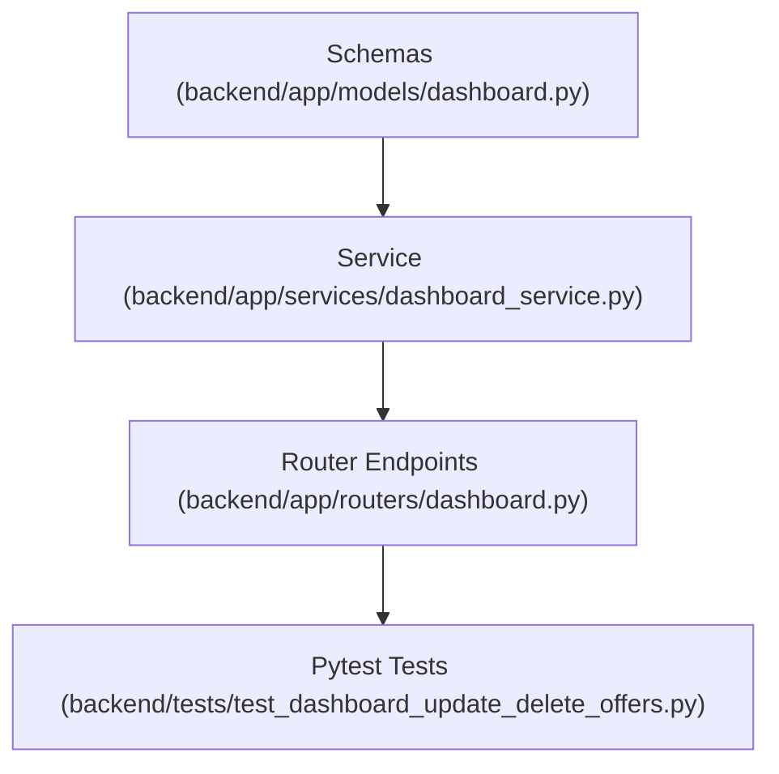

# Plan: Merchant Update and Delete Offers Endpoints

> **Spec Reference**: `specs/004-merchant-update-delete-offers-endpoints/spec.md`
> **Branch**: `feat/merchant-dashboard`
> **Spec**: 004 of 006 in phase
> **Date**: 2026-09-06
> **Status**: Draft
>
> **CRITICAL CONTENT RULE**: DO NOT write implementation code or logic blocks in this document.
> Everything must be written in **pure text** (natural language, tables, bullet points). Only mock code
> shapes (e.g. JSON schemas or minimal type/interface signatures) are allowed, but **mock logic is
> strictly prohibited** (no function bodies, control flow, loops, or algorithms). Custom enums
> MUST be explained in pure text.

---

## 1. Technical Approach

Implement `PATCH /api/v1/dashboard/offers/{offer_id}` and `DELETE /api/v1/dashboard/offers/{offer_id}`.
Both endpoints perform ownership validation before making mutations:
1. Query `seller_products` by `offer_id`.
2. If record is missing, raise HTTP 404 with code `OFFER_NOT_FOUND`.
3. If `record.seller_id != current_user.id`, raise HTTP 403 with code `FORBIDDEN`.
For PATCH: Validate that at least one update field is present. Update provided columns (`price`, `stock`, `estimated_delivery_days`) and return updated `MerchantOfferResponse`.
For DELETE: Remove any matching `cart_items` referencing this `seller_product_id`, then delete from `seller_products`. Return `MerchantOfferDeleteResponse`.
Pytest integration tests verify updating, deleting, non-existent offers, and unauthorized attempts on other sellers' records.

## 2. Dependencies on Prior Specs

| Prior Spec | What It Provides | What This Spec Uses |
|------------|-----------------|---------------------|
| `specs/001-merchant-list-offers-endpoint/` | Dashboard router and service module | Extends router and service |
| `specs/002-merchant-add-offer-endpoint/` | `MerchantOfferResponse` schema | Response model for update |

## 3. Files to Create

| File Path | Purpose |
|-----------|---------|
| `backend/tests/test_dashboard_update_delete_offers.py` | Pytest tests for updating and deleting merchant offers |

## 4. Files to Modify

| File Path | Changes |
|-----------|---------|
| `backend/app/models/dashboard.py` | Add `MerchantOfferUpdateRequest` and `MerchantOfferDeleteResponse` schemas |
| `backend/app/services/dashboard_service.py` | Add `update_merchant_offer` and `delete_merchant_offer` business logic |
| `backend/app/routers/dashboard.py` | Add `PATCH /offers/{offer_id}` and `DELETE /offers/{offer_id}` endpoints |

## 5. Dependencies & Order

## 6. Detailed Implementation Notes

> **REMINDER**: DO NOT write implementation code or logic blocks here! Everything must
> be written in pure text. Mock code shapes/signatures only; mock logic is strictly
> prohibited. Custom enums must be explained in pure text.

### 6.1 — Backend: Models (`backend/app/models/dashboard.py`)

- Define `MerchantOfferUpdateRequest`:
  - `price`: optional float greater than 0 (`gt=0`), default None.
  - `stock`: optional integer greater than or equal to 0 (`ge=0`), default None.
  - `estimated_delivery_days`: optional integer greater than or equal to 1 (`ge=1`), default None.
- Define `MerchantOfferDeleteResponse`:
  - `message`: string
  - `id`: UUID

### 6.2 — Backend: Service (`backend/app/services/dashboard_service.py`)

- Define `verify_offer_ownership`:
  - Inputs: `offer_id` (UUID), `seller_id` (UUID), `supabase_client`.
  - Queries `seller_products` by `id == offer_id`.
  - If no record found: raises `HTTPException(status_code=404)` with code `OFFER_NOT_FOUND`.
  - If `record.seller_id != seller_id`: raises `HTTPException(status_code=403)` with code `FORBIDDEN`.
  - Returns existing offer record dictionary.
- Define `update_merchant_offer`:
  - Inputs: `offer_id` (UUID), `seller_id` (UUID), `payload` (MerchantOfferUpdateRequest), `supabase_client`.
  - Calls `verify_offer_ownership`.
  - Filters out `None` values from payload. If update dictionary is empty, raises `HTTPException(status_code=400)` with code `EMPTY_UPDATE`.
  - Updates `seller_products` where `id == offer_id`.
  - Returns updated `MerchantOfferResponse`.
- Define `delete_merchant_offer`:
  - Inputs: `offer_id` (UUID), `seller_id` (UUID), `supabase_client`.
  - Calls `verify_offer_ownership`.
  - Deletes referencing rows from `cart_items` where `seller_product_id == offer_id`.
  - Deletes row from `seller_products` where `id == offer_id`.
  - Returns `MerchantOfferDeleteResponse`.

### 6.3 — Backend: Router (`backend/app/routers/dashboard.py`)

- Add `PATCH /offers/{offer_id}`:
  - Path parameter: `offer_id: UUID`.
  - Enforce merchant role check (`user_role == "merchant"`).
  - Calls `update_merchant_offer` in service layer.
  - Returns `MerchantOfferResponse`.
  - Documents status codes 200, 400, 401, 403, 404, 422, 500.
- Add `DELETE /offers/{offer_id}`:
  - Path parameter: `offer_id: UUID`.
  - Enforce merchant role check (`user_role == "merchant"`).
  - Calls `delete_merchant_offer` in service layer.
  - Returns `MerchantOfferDeleteResponse`.
  - Documents status codes 200, 401, 403, 404, 500.

### 6.4 — Backend: Tests (`backend/tests/test_dashboard_update_delete_offers.py`)

- Test cases:
  1. Successful PATCH price and stock: Verify status 200 and updated fields.
  2. PATCH empty body: Verify status 400 with `EMPTY_UPDATE`.
  3. PATCH invalid fields: Negative price/stock yields status 422.
  4. PATCH another merchant's offer: Yields status 403 `FORBIDDEN`.
  5. PATCH non-existent offer: Yields status 404 `OFFER_NOT_FOUND`.
  6. Successful DELETE: Removes offer and returns status 200 with confirmation message.
  7. DELETE another merchant's offer: Yields status 403 `FORBIDDEN`.
  8. DELETE non-existent offer: Yields status 404 `OFFER_NOT_FOUND`.
  9. Unauthenticated or non-merchant role access: Yields 401 / 403.

## 7. Testing Strategy

### Backend Tests (Pytest)
- Run `uv run pytest backend/tests/test_dashboard_update_delete_offers.py -v`.
- Test all ownership, validation, and error branches.

### Manual Verification
- Test modifying price and stock in `/docs` interactive UI.
- Verify updated values reflect in `GET /api/v1/dashboard/offers`.
- Test deletion and verify offer disappears from offers list.

## 8. Constitution Compliance Checklist

- [ ] All business logic and ownership validation in FastAPI (§4.1)
- [ ] Role check enforces merchant access (§2)
- [ ] Prefixed with `/api/v1/` (§4.3)
- [ ] OpenAPI documentation with parameter descriptions and models (§4.3)
- [ ] Standard error envelope for 400, 403, 404 (§4.4)
- [ ] Pytest coverage for all endpoints (§14)

## 9. Risks & Mitigations

| Risk | Mitigation |
|------|-----------|
| Deletion could cause foreign key errors if referenced in cart_items | Service clears matching cart_items before removing the seller_products row |
| Cross-tenant modification where merchant A updates merchant B's listing | Centralized `verify_offer_ownership` helper strictly checks `seller_id == current_user.id` |
