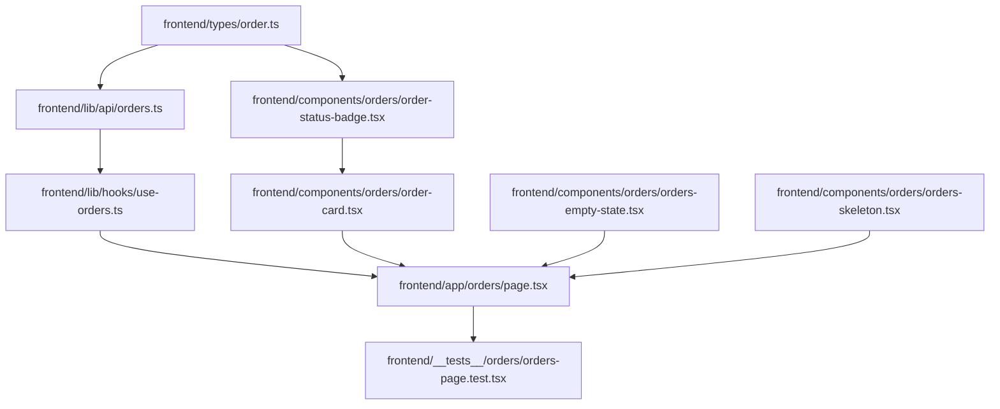

# Plan: Order History Frontend Page

> **Spec Reference**: `specs/004-order-history-frontend-page/spec.md`
> **Branch**: `feat/checkout-and-orders`
> **Spec**: 004 of 004 in phase
> **Date**: 2026-09-05
> **Status**: Draft
>
> **CRITICAL CONTENT RULE**: DO NOT write implementation code or logic blocks in this document.
> Everything must be written in **pure text** (natural language, tables, bullet points). Only mock code
> shapes (e.g. JSON schemas or minimal type/interface signatures) are allowed, but **mock logic is
> strictly prohibited** (no function bodies, control flow, loops, or algorithms). Custom enums
> MUST be explained in pure text.

---

## 1. Technical Approach

The order history frontend feature is implemented as a client component page in Next.js (`frontend/app/orders/page.tsx`).
- It communicates with the backend `GET /api/v1/orders` endpoint via an API client function in `frontend/lib/api/orders.ts`.
- TypeScript types matching backend order models are declared in `frontend/types/order.ts`.
- Server state is managed via a dedicated custom hook `frontend/lib/hooks/use-orders.ts` backed by TanStack Query (`useQuery`), using the query key `["orders"]`.
- The user interface is composed of specialized presentation components in `frontend/components/orders/`:
  - `order-status-badge.tsx`: Renders visual badge with status-specific colors (pending, confirmed, shipped, delivered, cancelled, returned).
  - `order-card.tsx`: Renders individual order cards with item thumbnail, details, price breakdown, seller info, and delivery address.
  - `orders-empty-state.tsx`: Renders empty orders illustration and call-to-action button linking to catalog.
  - `orders-skeleton.tsx`: Skeleton loader for initial data retrieval.
- Comprehensive unit and integration tests are written in `frontend/__tests__/orders/orders-page.test.tsx`.

## 2. Dependencies on Prior Specs

| Prior Spec | What It Provides | What This Spec Uses |
|------------|-----------------|---------------------|
| `specs/003-order-history-endpoint/` | `GET /api/v1/orders` endpoint | Consumed by API client function and hook |
| `specs/002-checkout-frontend-page/` | Checkout flow redirecting to `/orders` | Displays success toast when coming from checkout |
| Phase 2 (Auth) | Auth context and route protection | Ensures buyer authentication before page render |

## 3. Files to Create

| File Path | Purpose |
|-----------|---------|
| `frontend/types/order.ts` | TypeScript types for order objects, delivery status, and order list responses |
| `frontend/lib/api/orders.ts` | API client function fetching `/api/v1/orders` |
| `frontend/lib/hooks/use-orders.ts` | Custom TanStack Query hook managing order history state |
| `frontend/components/orders/order-status-badge.tsx` | Visual delivery status badge with color mappings |
| `frontend/components/orders/order-card.tsx` | Individual order card layout and details |
| `frontend/components/orders/orders-empty-state.tsx` | Empty state view when buyer has no orders |
| `frontend/components/orders/orders-skeleton.tsx` | Skeleton loading view for order list |
| `frontend/app/orders/page.tsx` | Order history page component |
| `frontend/__tests__/orders/orders-page.test.tsx` | Vitest tests for order history page and components |

## 4. Files to Modify

| File Path | Changes |
|-----------|---------|
| None | Page and components are completely additive to existing codebase |

## 5. Dependencies & Order

## 6. Detailed Implementation Notes

### 6.1 — Frontend: Types (`frontend/types/order.ts`)

- **DeliveryStatus**:
  - String union type accepting: `"pending" | "confirmed" | "shipped" | "delivered" | "cancelled" | "returned"`.
- **OrderItem**:
  - `id`: number.
  - `product_id`: string.
  - `product_name`: string.
  - `product_brand`: string.
  - `product_image_url`: string or null.
  - `seller_id`: string.
  - `seller_name`: string.
  - `bought_price`: number.
  - `quantity`: number.
  - `subtotal`: number.
  - `delivery_types`: DeliveryStatus.
  - `address`: string.
  - `created_at`: string.
- **OrderListResponse**:
  - `orders`: array of `OrderItem`.
  - `total_orders`: number.

### 6.2 — Frontend: API Client (`frontend/lib/api/orders.ts`)

- Function `fetchBuyerOrders`:
  - Performs GET request to `${API_BASE_URL}/api/v1/orders`.
  - Passes `credentials: "include"` for cookie authentication.
  - Parses JSON response or throws `ApiError` envelope if failed.
  - Returns `OrderListResponse`.

### 6.3 — Frontend: Hook (`frontend/lib/hooks/use-orders.ts`)

- Hook `useOrders`:
  - Wraps TanStack `useQuery`.
  - Uses query key `["orders"]`.
  - Calls `fetchBuyerOrders` query function.
  - Exposes `orders`, `totalOrders`, `isLoading`, `isError`, `error`, and `refetch`.

### 6.4 — Frontend: Components (`frontend/components/orders/`)

- **order-status-badge.tsx**:
  - Props: `status` (`DeliveryStatus`).
  - Maps status to human label and Tailwind styling:
    - `pending` -> "Order Placed" with yellow/amber background and text.
    - `confirmed` -> "Ready for Pickup" with blue background and text.
    - `shipped` -> "In Transit" with purple/indigo background and text.
    - `delivered` -> "Delivered" with green/emerald background and text.
    - `cancelled` -> "Cancelled" with red background and text.
    - `returned` -> "Returned" with gray/slate background and text.
- **order-card.tsx**:
  - Props: `order` (`OrderItem`).
  - Card header: Displays "Order #[id]", formatted date (e.g. `toLocaleDateString`), and `OrderStatusBadge`.
  - Body: Left side has product image (or fallback icon); middle has product name (linking to `/products/[id]`), brand, seller name, unit price, and quantity; right side has subtotal formatted as currency.
  - Footer: Displays destination shipping address with a location pin icon.
- **orders-empty-state.tsx**:
  - Displays package/shopping bag icon, "No orders yet" header, brief explanation, and primary button navigating to `/products`.
- **orders-skeleton.tsx**:
  - Renders 3 animated skeleton order cards.

### 6.5 — Frontend: Page (`frontend/app/orders/page.tsx`)

- Client component marked with `"use client"`.
- Reads `user` from `useAuth()`.
- Reads `orders`, `isLoading`, `isError`, `refetch` from `useOrders()`.
- If loading: renders `OrdersSkeleton`.
- If error: renders error message with "Try again" button calling `refetch()`.
- If `orders.length === 0`: renders `OrdersEmptyState`.
- If orders present: renders header with order count and mapped `OrderCard` items.

### 6.6 — Frontend: Tests (`frontend/__tests__/orders/orders-page.test.tsx`)

- Test 1: Renders loading skeleton while query is loading.
- Test 2: Renders empty state card when orders array is empty.
- Test 3: Renders list of order cards with correct product names, prices, sellers, and dates when orders are returned.
- Test 4: Status badges apply appropriate styling and text for different order statuses (`pending`, `delivered`, etc.).
- Test 5: Renders error message with retry button when query errors.
- Test 6: Clicking retry invokes refetch.

## 7. Testing Strategy

### Frontend Tests (Vitest)
- Mock `@/lib/hooks/use-orders` and `@/lib/api/orders`.
- Test component renders across loading, error, empty, and populated states.
- Verify status badge mappings.

### Manual Verification
- Navigate to `/orders` after checking out in local development.
- Verify order card details match placed order.

## 8. Constitution Compliance Checklist

- [ ] Thin client: no backend queries or database access in Next.js (§4.1)
- [ ] Uses TanStack Query for server state (§3)
- [ ] Protected route checked by Next.js middleware (§4.2)
- [ ] TailwindCSS and shadcn/ui styling conventions (§3)
- [ ] Desktop-first responsive layout (§12)
- [ ] Semantic HTML and accessibility labels (§12)
- [ ] Vitest unit/integration tests written (§14)

## 9. Risks & Mitigations

| Risk | Mitigation |
|------|-----------|
| Null product images crashing image renderer | Fallback image placeholder component displayed when URL is null |
| Stale order history after checkout | Invalidate `["orders"]` query cache during checkout completion |
| Invalid delivery status returned | Default fallback badge styling in `OrderStatusBadge` |
