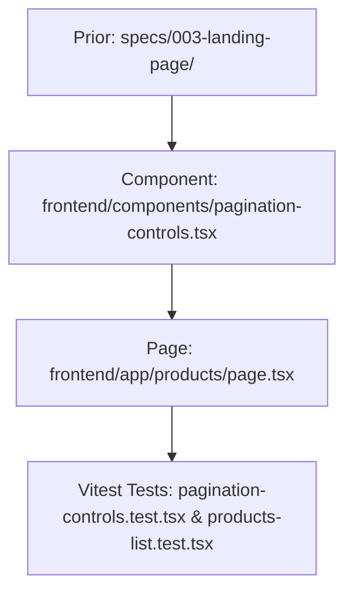

# Plan: Product Search & Listing Page

> **Spec Reference**: `specs/004-product-search-listing-page/spec.md`
> **Branch**: `feat/product-catalog`
> **Spec**: 004 of 005 in phase
> **Date**: 2026-09-05
> **Status**: Draft
>
> **CRITICAL CONTENT RULE**: DO NOT write implementation code or logic blocks in this document.
> Everything must be written in **pure text** (natural language, tables, bullet points). Only mock code
> shapes (e.g. JSON schemas or minimal type/interface signatures) are allowed, but **mock logic is
> strictly prohibited** (no function bodies, control flow, loops, or algorithms). Custom enums
> MUST be explained in pure text.

---

## 1. Technical Approach

The Product Search & Listing Page (`frontend/app/products/page.tsx`) will be created as a Next.js App Router client component that synchronizes state with URL search parameters via `useSearchParams` and `useRouter`.

1. **Search Parameter Extraction**:
   - Extract `q`, `limit`, and `offset` from URL `useSearchParams()`.
   - Validate and sanitize parameters (default `limit = 20`, default `offset = 0`).
2. **Data Fetching via TanStack Query**:
   - Call `useProducts({ limit, offset, q })` imported from `frontend/lib/hooks/use-products.ts`.
   - TanStack Query automatically refetches whenever query parameters change.
3. **Reusable Pagination Component**:
   - Create `frontend/components/pagination-controls.tsx`: Renders "Previous", "Next", and current page status ("Page X of Y"), triggering URL parameter updates.
4. **Catalog Header & Search Sync**:
   - Reuse `SearchBar` component at the top of the page, initializing with the active query `q`.
   - Provide a "Clear" link when `q` is non-empty.
   - Display dynamic header: "Results for 'keyword' (N items)" or "All Products (N items)".
5. **Empty & Error UI**:
   - Create empty state view with prompt to reset search.
   - Create error view with retry button.
6. **Testing**:
   - Unit and integration tests using Vitest and React Testing Library in `frontend/__tests__/pages/products-list.test.tsx`.

## 2. Dependencies on Prior Specs

| Prior Spec | What It Provides | What This Spec Uses |
|------------|-----------------|---------------------|
| `specs/001-list-products-endpoint/` | Backend API `GET /api/v1/products` | Powers data fetching for the catalog |
| `specs/003-landing-page/` | `ProductCard`, `ProductCardSkeleton`, `SearchBar`, `useProducts` hook, product types | Reuses existing UI components and data fetching layer |

## 3. Files to Create

| File Path | Purpose |
|-----------|---------|
| `frontend/components/pagination-controls.tsx` | Reusable pagination bar with Previous/Next and page counter |
| `frontend/app/products/page.tsx` | Next.js catalog search and product listing page |
| `frontend/__tests__/components/pagination-controls.test.tsx` | Vitest test for pagination component |
| `frontend/__tests__/pages/products-list.test.tsx` | Vitest test for products listing page with search params |

## 4. Files to Modify

| File Path | Changes |
|-----------|---------|
| None | Entirely new page and component files |

## 5. Dependencies & Order

## 6. Detailed Implementation Notes

### 6.1 — Frontend: Pagination Component (`frontend/components/pagination-controls.tsx`)

- **Props**:
  - `total`: Total items count (number).
  - `limit`: Items per page (number).
  - `offset`: Current offset (number).
  - `onPageChange`: Callback receiving new offset `(newOffset: number) => void`.
- **Behavior**:
  - Computes `currentPage = Math.floor(offset / limit) + 1`.
  - Computes `totalPages = Math.max(1, Math.ceil(total / limit))`.
  - Renders `<nav aria-label="Pagination">`.
  - "Previous" button disabled when `offset === 0`.
  - "Next" button disabled when `offset + limit >= total`.
  - Page indicator text: "Page {currentPage} of {totalPages}".

### 6.2 — Frontend: Catalog Page (`frontend/app/products/page.tsx`)

- **Component Architecture**:
  - Client component wrapped in a React `Suspense` boundary (required by Next.js when using `useSearchParams`).
  - Reads `searchParams`: `q` (string), `limit` (parsed int, fallback 20), `offset` (parsed int, fallback 0).
  - State / Query: `useProducts({ limit, offset, q })`.
  - Search submission handler: Updates URL search parameters using `router.push(/products?q=...&limit=20&offset=0)`.
  - Pagination handler: Updates URL parameter `offset` and scrolls window smoothly to top.
  - Page sections:
    - Search Bar container with active query pre-filled.
    - Result stats header showing total items or empty notification.
    - Product grid: renders `ProductCardSkeleton` on loading, `ProductCard` list on success.
    - Empty state when `data.items.length === 0` and not loading.
    - `PaginationControls` rendered at bottom when `data.total > limit`.

### 6.3 — Frontend: Tests (`frontend/__tests__/pages/products-list.test.tsx`)

- **Test Scenarios**:
  - Renders catalog page with mock products list and displays correct items count.
  - Pre-fills search bar when URL query parameter `?q=keyboard` is present.
  - Submitting new search updates URL parameters and resets offset to 0.
  - Clicking Next page updates offset parameter.
  - Shows "No products found" empty state when search returns zero items.
  - Disables Previous button on first page and Next button on last page.

## 7. Testing Strategy

### Frontend Tests (Vitest)
- Run `pnpm test` targeting `pagination-controls.test.tsx` and `products-list.test.tsx`.
- Mock Next.js navigation hooks (`useRouter`, `useSearchParams`).
- Verify proper DOM structure and accessible attributes.

### Manual Verification
> **Server Process Timeout Rule**: Any server process started for manual verification (Next.js dev server or FastAPI Uvicorn) MUST include an automatic timeout that automatically terminates and kills the process after X seconds (e.g. 20–30 seconds max).
- Start frontend dev server (`pnpm dev`) and backend (`uv run uvicorn app.main:app`) with an automated timeout (max 25 seconds) configured to kill the processes after the timeout expires.
- Navigate to `/products`.
- Test typing query in search bar and pressing Enter.
- Verify URL updates to `/products?q=query&limit=20&offset=0`.
- Verify pagination buttons update page and offset properly before the server processes automatically terminate.

## 8. Constitution Compliance Checklist

- [ ] All business logic and queries remain in FastAPI (§4.1)
- [ ] No Supabase JS client in frontend (§4.1)
- [ ] All endpoints called are prefixed with `/api/v1/` (§4.3)
- [ ] Semantic HTML and accessibility labels used (`aria-label`, `<nav>`) (§12)
- [ ] Desktop-first responsive layout down to tablet (§12)
- [ ] Naming conventions followed (`kebab-case` files, `PascalCase` components) (§7)
- [ ] Vitest tests written (§14)
- [ ] Conventional Commits used (§13)

## 9. Risks & Mitigations

| Risk | Mitigation |
|------|-----------|
| Next.js App Router `useSearchParams` de-opting to client-side rendering | Wrap the component consuming `useSearchParams` in `<Suspense>` boundary in `page.tsx` |
| Invalid query parameter values (e.g. letters in offset) | Safely parse integers with fallback defaults (`parseInt(val) || 0`) |
