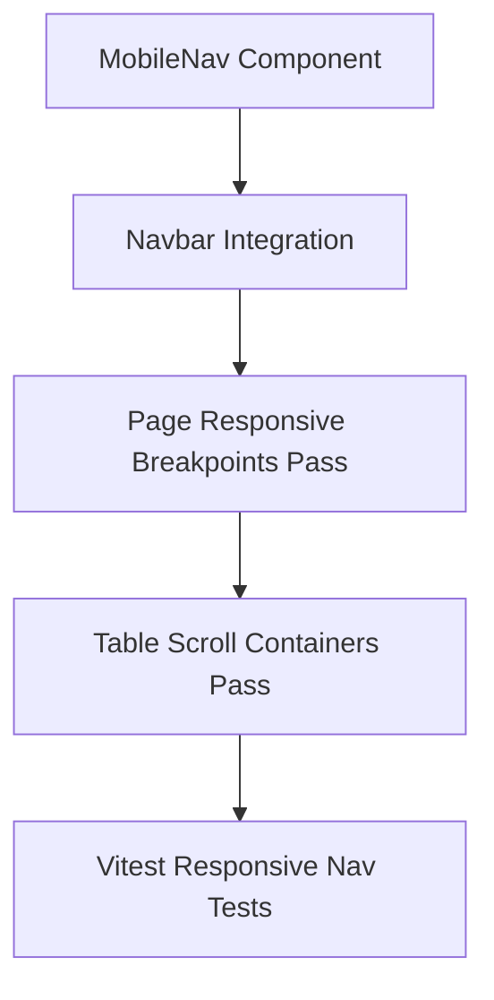

# Plan: Responsive Design Pass

> **Spec Reference**: `specs/004-responsive-design-pass/spec.md`
> **Branch**: `feat/polish-and-integration`
> **Spec**: 004 of 006 in phase
> **Date**: 2026-09-07
> **Status**: Draft
>
> **CRITICAL CONTENT RULE**: DO NOT write implementation code or logic blocks in this document.
> Everything must be written in **pure text** (natural language, tables, bullet points). Only mock code
> shapes (e.g. JSON schemas or minimal type/interface signatures) are allowed, but **mock logic is
> strictly prohibited** (no function bodies, control flow, loops, or algorithms). Custom enums
> MUST be explained in pure text.

---

## 1. Technical Approach

This plan establishes fluid responsive layouts across all views down to tablet breakpoints (768px `md` and 640px `sm`) following Section 12 of the Constitution.

1. **Collapsible Mobile/Tablet Navigation**:
   - Create `MobileNav` component using shadcn/ui `Sheet` primitive (or accessible slide-over drawer).
   - On viewports below `md`, desktop navigation links hide (`hidden md:flex`) and the hamburger trigger appears (`md:hidden`).
   - Opening the drawer presents the search bar, category navigation links, role-specific links, and auth controls with comfortable touch targets.
2. **Adaptive Catalog Grid**:
   - Replace fixed grid classes with responsive utility classes: `grid-cols-1 sm:grid-cols-2 md:grid-cols-3 lg:grid-cols-4 gap-4 sm:gap-6`.
3. **Stacked 2-Column Views**:
   - Product Detail (`/products/[id]`): Change desktop side-by-side grid (`grid-cols-1 lg:grid-cols-2`) to stacked flow on tablet.
   - Checkout (`/checkout`): Change side-by-side layout to vertical stack (`flex flex-col lg:flex-row gap-8`).
4. **Horizontal Scroll Table Wrappers**:
   - Wrap data tables on `/orders`, `/dashboard`, and `/logistics` in `
`.
   - Set minimum column widths to prevent column collapse.

## 2. Dependencies on Prior Specs

| Prior Spec | What It Provides | What This Spec Uses |
|------------|-----------------|---------------------|
| `specs/001-shared-layout-and-navigation/` | Base Navbar, Footer, and Search components | Extends Navbar with `MobileNav` drawer |
| `specs/002-loading-and-error-states/` | Skeletons and ErrorState components | Ensures skeletons adapt to responsive grid columns |
| `specs/003-accessibility-pass/` | ARIA labels and focus indicators | Ensures mobile drawer traps focus and manages keyboard interactions |

## 3. Files to Create

| File Path | Purpose |
|-----------|---------|
| `frontend/components/layout/mobile-nav.tsx` | Slide-out sheet / drawer component for tablet and mobile viewports |
| `frontend/__tests__/responsive-nav.test.tsx` | Vitest tests verifying mobile menu toggle and responsive rendering |

## 4. Files to Modify

| File Path | Changes |
|-----------|---------|
| `frontend/components/layout/navbar.tsx` | Add hamburger menu trigger button and integrate `MobileNav` drawer |
| `frontend/app/page.tsx` | Adjust hero section padding and product grid column breakpoints |
| `frontend/app/products/page.tsx` | Adjust search/filter bar and product catalog grid responsive classes |
| `frontend/app/products/[id]/page.tsx` | Update grid layout to stack cleanly on tablet (`lg:grid-cols-2`) |
| `frontend/app/cart/page.tsx` | Wrap cart table in responsive container and stack summary panel |
| `frontend/app/checkout/page.tsx` | Stack summary and address/payment forms vertically on tablet |
| `frontend/app/orders/page.tsx` | Wrap orders table in `overflow-x-auto` container with min-width constraints |
| `frontend/app/dashboard/page.tsx` | Wrap offers and incoming orders tables in responsive scroll containers |
| `frontend/app/logistics/page.tsx` | Wrap logistics orders table in responsive scroll container |

## 5. Dependencies & Order

## 6. Detailed Implementation Notes

### 6.1 — Frontend: `MobileNav` (`frontend/components/layout/mobile-nav.tsx`)

- Component: `MobileNav`
- State: Open/closed boolean state.
- Trigger: Hamburger `Menu` icon button with `aria-label="Open navigation menu"`, hidden on `md` and above (`md:hidden`).
- Drawer: Uses shadcn/ui `Sheet` or accessible slide-out overlay.
- Content:
  - Brand header with close button.
  - Search input for quick queries.
  - Vertical list of navigation links (Home, Catalog).
  - Role-specific links (Dashboard for merchants, Logistics for logistics, Orders for buyers).
  - Auth buttons (Log In, Sign Up, or Log Out).
- Behavior: Closes automatically upon link click or route change.

### 6.2 — Frontend: Product Grids & Details

- **Catalog Grid (`app/page.tsx` & `app/products/page.tsx`)**:
  - Class: `grid grid-cols-1 sm:grid-cols-2 md:grid-cols-3 lg:grid-cols-4 gap-6`.
  - Ensures cards do not crowd each other on tablet portrait screens.
- **Product Detail (`app/products/[id]/page.tsx`)**:
  - Class: `grid grid-cols-1 lg:grid-cols-2 gap-8 lg:gap-12`.
  - On tablet portrait (`<1024px`), image renders full width at top, followed by product details and offers table.

### 6.3 — Frontend: Table Scroll Containers

- **Table Wrapper Pattern**:
  - Encapsulate `<table>` in `
`.
  - Apply `min-w-[640px]` to `<table>` element so table columns never shrink below readable thresholds.
  - Add horizontal padding to cell content for comfortable touch viewing.

### 6.4 — Frontend: Checkout & Cart Responsive Stacking

- **Cart Page (`app/cart/page.tsx`)**:
  - Layout: `flex flex-col lg:flex-row gap-8 items-start`.
  - Cart item list takes `w-full lg:flex-1`.
  - Cart order summary takes `w-full lg:w-96` and remains visible at the bottom on tablet or alongside on desktop.
- **Checkout Page (`app/checkout/page.tsx`)**:
  - Layout: `flex flex-col lg:flex-row gap-8`.
  - Form fields take `w-full lg:flex-1`. Order summary card takes `w-full lg:w-96`.

## 7. Testing Strategy

### Frontend Tests (Vitest)
- Test `frontend/__tests__/responsive-nav.test.tsx`:
  - Verify hamburger trigger is rendered with accessible name.
  - Verify opening mobile menu displays navigation links.
  - Verify clicking a link closes the menu.
  - Verify unauthenticated vs authenticated states inside mobile drawer.

### Manual Verification
- Resize browser window to 768px (iPad portrait) in Chrome DevTools:
  - Verify hamburger button appears in navbar and desktop links hide.
  - Open hamburger drawer; verify search, links, and auth buttons work.
  - Verify product catalog displays 2-3 neat columns without horizontal overflow.
  - Verify order history and logistics tables scroll smoothly without distorting page width.
- Resize browser window to 640px (large phone / small tablet):
  - Verify product cards stack to 1-2 columns cleanly.
  - Verify checkout stacks order summary below shipping address.

## 8. Constitution Compliance Checklist

- [x] Desktop-first layout, fully responsive down to tablet breakpoints (768px / 640px) (§12)
- [x] Semantic HTML maintained in drawer and tables (§12)
- [x] Accessible names on hamburger and drawer close triggers (§12)
- [x] Vitest tests written (§14)

## 9. Risks & Mitigations

| Risk | Mitigation |
|------|-----------|
| Page-level horizontal scrollbar appearing unexpectedly on narrow screens | Set `overflow-x-hidden` on main container and ensure table wrappers have explicit `overflow-x-auto`. |
| Drawer state persisting after window resized from tablet to desktop | Add window resize listener or use CSS-driven media queries to ensure desktop nav appears seamlessly. |
