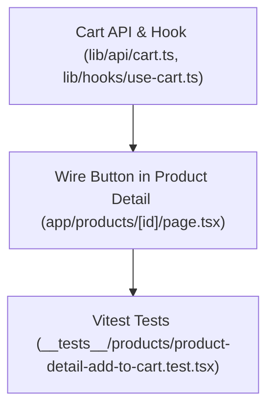

# Plan: Wire "Add to Cart" on Product Detail Page

> **Spec Reference**: `specs/004-wire-add-to-cart-product-page/spec.md`
> **Branch**: `feat/cart`
> **Spec**: 004 of 004 in phase
> **Date**: 2026-09-05
> **Status**: Draft
>
> **CRITICAL CONTENT RULE**: DO NOT write implementation code or logic blocks in this document.
> Everything must be written in **pure text** (natural language, tables, bullet points). Only mock code
> shapes (e.g. JSON schemas or minimal type/interface signatures) are allowed, but **mock logic is
> strictly prohibited** (no function bodies, control flow, loops, or algorithms). Custom enums
> MUST be explained in pure text.

---

## 1. Technical Approach

This plan connects the existing product detail page (`frontend/app/products/[id]/page.tsx`) to the cart functionality created in previous specs:

1. **Cart Hook Extension**: Ensure `useAddToCart` mutation hook exists in `frontend/lib/hooks/use-cart.ts` (or create it), calling `addToCart` from `frontend/lib/api/cart.ts` (`POST /api/v1/cart/items`). On success, it invalidates the `['cart']` query cache.
2. **Product Detail Page Integration**:
   - Access auth state via `useAuth()` in `frontend/app/products/[id]/page.tsx`.
   - Access router via Next.js `useRouter()`.
   - Instantiate `useAddToCart` mutation.
   - Attach an `onClick` handler to the "Add to Cart" button:
     - Check `user` from `useAuth`: if absent or unauthenticated, call `router.push(/login?redirect=/products/${productId})`.
     - If authenticated, trigger `addToCartMutation.mutate({ seller_product_id: activeOffer.seller_product_id, quantity: 1 })`.
     - Display a loading spinner and disable the button while `isPending` is true.
     - In `onSuccess`, show a toast notification using the project's toast library or custom alert banner with a link to navigate to `/cart`.
     - In `onError`, display an error toast notification with the backend message (e.g. `INSUFFICIENT_STOCK`).
3. **Testing**: Write Vitest tests in `frontend/__tests__/products/product-detail-add-to-cart.test.tsx` verifying:
   - Clicking Add to Cart when unauthenticated redirects to login with the redirect param.
   - Clicking Add to Cart when authenticated calls the cart API with selected offer ID.
   - Selecting an alternative seller from the table updates the offer ID passed to the mutation.
   - Success and error toasts are triggered appropriately.

## 2. Dependencies on Prior Specs

| Prior Spec | What It Provides | What This Spec Uses |
|------------|-----------------|---------------------|
| `specs/001-cart-backend-add-item/` | `POST /api/v1/cart/items` API endpoint | Backend endpoint invoked when adding items |
| `specs/003-cart-frontend-page/` | `frontend/lib/api/cart.ts` and `frontend/lib/hooks/use-cart.ts` | Reuses or extends cart API client and mutation hook |

## 3. Files to Create

| File Path | Purpose |
|-----------|---------|
| `frontend/__tests__/products/product-detail-add-to-cart.test.tsx` | Vitest tests for the Add to Cart button flow on product detail page |

## 4. Files to Modify

| File Path | Changes |
|-----------|---------|
| `frontend/lib/api/cart.ts` | Ensure `addToCart` API function exists |
| `frontend/lib/hooks/use-cart.ts` | Ensure `useAddToCart` mutation hook exists |
| `frontend/app/products/[id]/page.tsx` | Wire the "Add to Cart" button with auth check, mutation, loading state, and toast feedback |

## 5. Dependencies & Order

## 6. Detailed Implementation Notes

### 6.1 — API Client & Hook (`frontend/lib/api/cart.ts`, `frontend/lib/hooks/use-cart.ts`)

- **addToCart API function**:
  - Accepts `{ seller_product_id: string, quantity: number }`.
  - Performs `fetch` POST to `/api/v1/cart/items` with credentials.
  - Returns `CartItemResponse` or throws formatted error.
- **useAddToCart hook**:
  - Uses `useMutation` with `addToCart`.
  - Invalidates `queryClient.invalidateQueries({ queryKey: ['cart'] })` on success.

### 6.2 — Product Detail Page (`frontend/app/products/[id]/page.tsx`)

- Import `useAuth` from `@/lib/hooks/use-auth`.
- Import `useRouter` from `next/navigation`.
- Import `useAddToCart` from `@/lib/hooks/use-cart`.
- Set up mutation:
  - Configure `onSuccess` callback to display success toast with action button to view `/cart`.
  - Configure `onError` callback to display error toast with server error message.
- Wire button handler:
  - If `!user`, redirect using `router.push('/login?redirect=' + encodeURIComponent('/products/' + productId))`.
  - If `user`, execute `addToCartMutation.mutate({ seller_product_id: activeOffer.seller_product_id, quantity: 1 })`.
- Update button UI:
  - If `isPending`, display spinner with text "Adding to Cart..." and set `disabled={true}`.
  - If offer is out of stock, retain existing "Out of Stock" disabled button.

### 6.3 — Vitest Tests (`frontend/__tests__/products/product-detail-add-to-cart.test.tsx`)

- Test 1: When user is not authenticated, clicking "Add to Cart" triggers router navigation to `/login?redirect=/products/[id]`.
- Test 2: When user is authenticated, clicking "Add to Cart" executes `addToCart` with default cheapest seller offer ID.
- Test 3: When user clicks an alternative seller in the table and clicks "Add to Cart", mutation receives the selected seller's offer ID.
- Test 4: During mutation flight, the button shows loading state and is disabled.
- Test 5: On error response (e.g. insufficient stock), error toast is shown.

## 7. Testing Strategy

### Frontend Tests (Vitest)
- Render `ProductDetailPage` within `QueryClientProvider` and `AuthContext` test mocks.
- Mock router push and mock `addToCart` API calls.
- Verify redirect paths, mutation payloads, and UI feedback.

### Manual Verification
- Log out, navigate to `/products/[id]`, click "Add to Cart" -> verify redirect to `/login?redirect=/products/[id]`.
- Log in as buyer -> verify redirect back to `/products/[id]`.
- Click "Add to Cart" on cheapest offer -> verify success toast and cart count update.
- Select alternative seller from table, click "Add to Cart" -> verify second offer added.

## 8. Constitution Compliance Checklist

- [ ] Next.js is a thin client; calls FastAPI `POST /api/v1/cart/items` (§4.1)
- [ ] No Supabase JS in frontend (§4.1)
- [ ] Uses TanStack Query for server state mutation and cache invalidation (§3)
- [ ] Accessible button with aria-labels (§12)
- [ ] Pytest and Vitest tests written (§14)

## 9. Risks & Mitigations

| Risk | Mitigation |
|------|-----------|
| Rapid repeated clicks creating duplicate additions | Button is disabled while `isPending` is true |
| Redirect path decoding issues | Use `encodeURIComponent` when setting the `redirect` search parameter |
