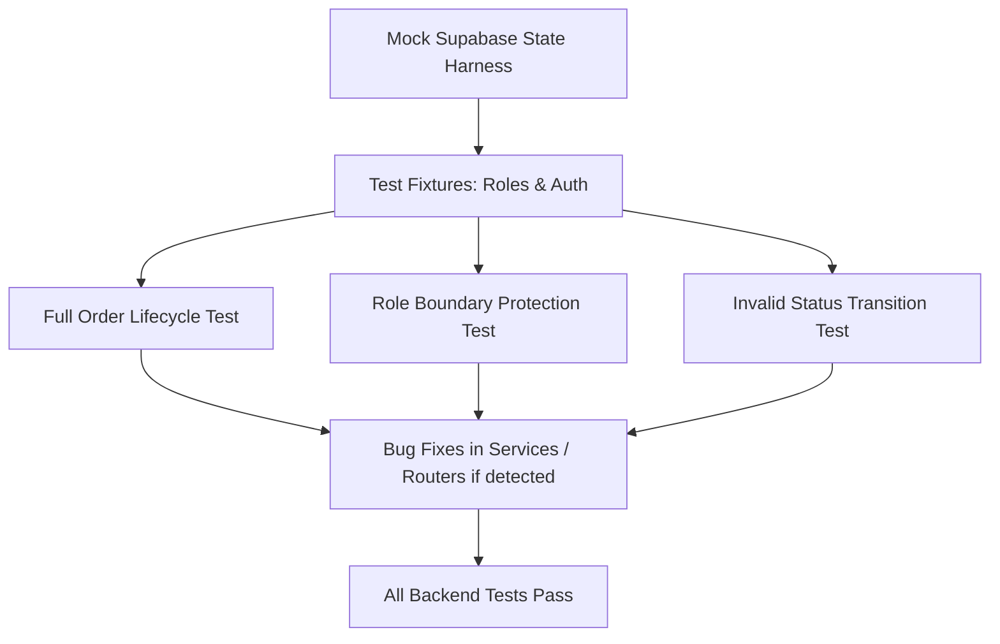

# Plan: End-to-End Smoke Test

> **Spec Reference**: `specs/005-end-to-end-smoke-test/spec.md`
> **Branch**: `feat/polish-and-integration`
> **Spec**: 005 of 006 in phase
> **Date**: 2026-09-07
> **Status**: Draft
>
> **CRITICAL CONTENT RULE**: DO NOT write implementation code or logic blocks in this document.
> Everything must be written in **pure text** (natural language, tables, bullet points). Only mock code
> shapes (e.g. JSON schemas or minimal type/interface signatures) are allowed, but **mock logic is
> strictly prohibited** (no function bodies, control flow, loops, or algorithms). Custom enums
> MUST be explained in pure text.

---

## 1. Technical Approach

The technical strategy implements an end-to-end integration test file `backend/tests/test_e2e_smoke.py` utilizing FastAPI's `TestClient` and Pytest fixtures.

1. **In-Memory Database / Mock Client Harness**:
   - Leverage existing `conftest.py` setup and mock Supabase client utilities to execute realistic database operations across simulated tables (`users`, `products`, `seller_products`, `carts`, `cart_items`, `user_orders`).
2. **Multi-Role Session Simulation**:
   - Helper fixtures to register, log in, and produce valid JWT authentication tokens or authorization headers for:
     - `merchant_client` (User with `merchant` role)
     - `buyer_client` (User with `buyer` role)
     - `logistics_client` (User with `logistics` role)
3. **Sequential Flow Execution**:
   - `test_e2e_full_order_lifecycle`:
     - Merchant registers, logs in, creates a product with offer (price: 50, stock: 10, days: 3).
     - Buyer registers, searches product, views detail, adds 2 units to cart.
     - Buyer views cart, submits checkout with address `"123 Market St"`.
     - Checks that order was created with status `pending` and stock decreased to 8.
     - Merchant queries orders, sees pending order, marks ready for pickup (`confirmed`).
     - Logistics queries orders with `confirmed` status, updates to `shipped`, then updates to `delivered`.
     - Buyer queries order history, verifies final status is `delivered`.
4. **Security & Boundary Tests**:
   - `test_e2e_role_boundaries`: Verifies 403 Forbidden for buyers hitting merchant/logistics endpoints, and merchants hitting logistics endpoints.
   - `test_e2e_invalid_status_transitions`: Verifies 400 Bad Request when attempting disallowed transitions (e.g., `pending` directly to `delivered`).
5. **Defect Remediation**:
   - If any router or service has minor discrepancies uncovered by the full lifecycle, apply targeted fixes to `backend/app/routers/` or `backend/app/services/`.

## 2. Dependencies on Prior Specs

| Prior Spec | What It Provides | What This Spec Uses |
|------------|-----------------|---------------------|
| None | Backend tests from Phases 1–7 provide endpoint foundations | Can be developed independently or in parallel with frontend polish |

## 3. Files to Create

| File Path | Purpose |
|-----------|---------|
| `backend/tests/test_e2e_smoke.py` | Pytest end-to-end multi-role integration smoke test suite |

## 4. Files to Modify

| File Path | Changes |
|-----------|---------|
| `backend/app/main.py` | Address any cross-cutting routing/middleware issues if discovered during e2e testing |
| `backend/app/services/` (if needed) | Fix any subtle lifecycle bugs uncovered during e2e testing |

## 5. Dependencies & Order

## 6. Detailed Implementation Notes

### 6.1 — Backend: `test_e2e_smoke.py`

- **Test Fixtures**:
  - `client`: Standard FastAPI `TestClient(app)`.
  - `mock_db`: Dictionary-based state or mock Supabase client mirroring table rows for `users`, `products`, `seller_products`, `carts`, `cart_items`, and `user_orders`.
- **Test Functions**:
  1. `test_e2e_full_lifecycle`:
     - Step 1: Merchant registration (`POST /api/v1/auth/register`, role `merchant`).
     - Step 2: Merchant login (`POST /api/v1/auth/login`), extract token.
     - Step 3: Merchant product creation (`POST /api/v1/dashboard/products`) with initial offer.
     - Step 4: Buyer registration (`POST /api/v1/auth/register`, role `buyer`).
     - Step 5: Buyer login (`POST /api/v1/auth/login`), extract token.
     - Step 6: Buyer catalog search (`GET /api/v1/products?q=...`), select cheapest offer.
     - Step 7: Buyer cart insertion (`POST /api/v1/cart/items`), quantity = 2.
     - Step 8: Buyer checkout (`POST /api/v1/checkout`, address provided).
     - Step 9: Verify stock decremented in `seller_products`.
     - Step 10: Merchant checks orders (`GET /api/v1/dashboard/orders`), sets ready for pickup (`confirmed`).
     - Step 11: Logistics checks orders (`GET /api/v1/logistics/orders`), sets `shipped`, then `delivered`.
     - Step 12: Buyer checks order history (`GET /api/v1/orders`), verifies status is `delivered`.
  2. `test_e2e_role_restrictions`:
     - Verify buyer gets 403 on `/api/v1/dashboard/orders` and `/api/v1/logistics/orders`.
     - Verify merchant gets 403 on `/api/v1/logistics/orders`.
  3. `test_e2e_stock_boundary`:
     - Attempting to purchase more than available inventory returns 400 with `INSUFFICIENT_STOCK`.

## 7. Testing Strategy

### Backend Tests (Pytest)
- Command: `uv run pytest backend/tests/test_e2e_smoke.py -v`
- Assertions:
  - All HTTP response codes match expected values (`200`, `201`, `400`, `403`).
  - Response bodies match Pydantic schemas.
  - Final order state is `delivered`.
  - Product stock is reduced by purchased quantity.

### Manual Verification
- Run the full suite with `pytest` and verify clean 0 failure output across all test suites in the repository.

## 8. Constitution Compliance Checklist

- [x] Strictly tests FastAPI endpoints, zero backend code in Next.js (§4.1)
- [x] Argon2 password hashing used during user creation (§4.2)
- [x] JWT token generated and passed in Authorization header/cookie (§4.2)
- [x] All endpoints prefixed with `/api/v1/` (§4.3)
- [x] Standard error envelopes verified on failure scenarios (§4.4)
- [x] Respects database schema tables and custom enums (§5)
- [x] Conventional Commits used (§13)
- [x] All tests pass (§14)

## 9. Risks & Mitigations

| Risk | Mitigation |
|------|-----------|
| State leakage between test steps | Ensure the fixture establishes clean database state or isolates UUIDs/emails with unique timestamp suffixes. |
| Missing mock client methods in conftest | Verify existing mock patterns in `test_checkout.py` and `test_dashboard_orders.py` and reuse consistent patterns. |
