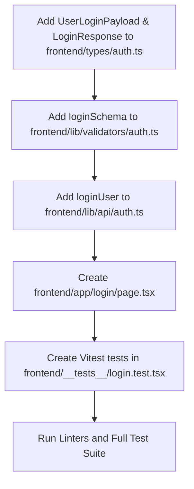

# Plan: Frontend Login Page

> **Spec Reference**: `specs/005-frontend-login-page/spec.md`  
> **Branch**: `feat/authentication`  
> **Spec**: 005 of 006 in phase  
> **Date**: 2026-09-03  
> **Status**: Draft  

---

## 1. Technical Approach

The `/login` page is implemented as a client component (`"use client"`) in the Next.js App Router. It coordinates user authentication with the FastAPI backend while delegating session state to an `httpOnly` cookie.

Key technical decisions:
1. **Thin Client Architecture**: The page contains no credential hashing, token generation, or database logic. It submits credentials via `fetch` to `POST /api/v1/auth/login` and handles the response.
2. **Native Cookie Management**: The fetch request explicitly sets `credentials: "include"`. This allows the browser to automatically accept and store the `kalano_token` httpOnly cookie returned in the `Set-Cookie` header by the backend.
3. **TanStack Query Mutation**: `useMutation` manages the asynchronous lifecycle (`isPending`, `isError`, `error`, `mutateAsync`), ensuring clean separation between UI state, pending feedback, and error state.
4. **Client-Side Validation**: Zod (`loginSchema`) validates the email format and non-empty password before any network request is fired, providing instant visual feedback.
5. **Component Design**: Built using existing shadcn/ui components (`Card`, `CardHeader`, `CardTitle`, `CardDescription`, `CardContent`, `CardFooter`, `Input`, `Button`, `Label`), matching the design system of the `/signup` page.
6. **Accessible Navigation**: After successful login, `useRouter().push('/')` transitions the user to the landing page. An inline link allows instant navigation to `/signup`.

---

## 2. Dependencies on Prior Specs

| Prior Spec | What It Provides | What This Spec Uses |
|---|---|---|
| `specs/002-user-login-endpoint/` | Backend `POST /api/v1/auth/login` endpoint, argon2 verification, `Set-Cookie` httpOnly JWT header | Consumed by `loginUser()` via `fetch` with `credentials: "include"` |
| `specs/004-frontend-signup-page/` | `frontend/types/auth.ts` (`UserResponse`, `ApiError`), `frontend/lib/api/auth.ts` (`API_BASE_URL`), `frontend/lib/validators/auth.ts`, installed UI components | Reuses and extends auth types, API client module, validation schema module, and card/input components |

---

## 3. Files to Create

| File Path | Purpose |
|---|---|
| `frontend/app/login/page.tsx` | Main `/login` route client component rendering the login card, form, validation feedback, and handling submission. |
| `frontend/__tests__/login.test.tsx` | Comprehensive Vitest unit and integration tests covering form rendering, Zod validation errors, API mutation submission, loading state, error display, and signup navigation. |

---

## 4. Files to Modify

| File Path | Changes |
|---|---|
| `frontend/types/auth.ts` | Add `UserLoginPayload` and `LoginResponse` interfaces. |
| `frontend/lib/validators/auth.ts` | Add `loginSchema` Zod validation schema and export `LoginFormData` type. |
| `frontend/lib/api/auth.ts` | Add `loginUser(data: UserLoginPayload): Promise<LoginResponse>` function with `credentials: "include"`. |

---

## 5. Dependencies & Order



---

## 6. Detailed Implementation Notes

### 6.1 — Frontend Types (`frontend/types/auth.ts`)

Extend `frontend/types/auth.ts` with login request and response contracts:

```typescript
export interface UserLoginPayload {
  email: string;
  password: string;
}

export interface LoginResponse {
  access_token: string;
  token_type: string;
  user: UserResponse;
}
```

*Note*: `UserResponse` and `ApiError` were defined in Spec 004:
```typescript
export interface UserResponse {
  id: string;
  created_at: string;
  email: string;
  display_name: string;
  user_role: "buyer" | "merchant" | "logistics";
  address: string | null;
}

export interface ApiError {
  error: {
    code: string;
    message: string;
  };
}
```

### 6.2 — Frontend Validation Schema (`frontend/lib/validators/auth.ts`)

Add the login validation schema to `frontend/lib/validators/auth.ts`:

```typescript
import { z } from "zod";

export const loginSchema = z.object({
  email: z
    .string()
    .trim()
    .min(1, "Email is required")
    .email("Invalid email address"),
  password: z
    .string()
    .min(1, "Password is required"),
});

export type LoginFormData = z.infer<typeof loginSchema>;
```

### 6.3 — Frontend API Client (`frontend/lib/api/auth.ts`)

Add `loginUser` to `frontend/lib/api/auth.ts`:

```typescript
import { LoginResponse, UserLoginPayload } from "@/types/auth";

const API_BASE_URL = process.env.NEXT_PUBLIC_API_URL || "http://localhost:8000";

export async function loginUser(data: UserLoginPayload): Promise<LoginResponse> {
  const res = await fetch(`${API_BASE_URL}/api/v1/auth/login`, {
    method: "POST",
    headers: {
      "Content-Type": "application/json",
    },
    credentials: "include", // CRITICAL: instructs browser to include and store httpOnly cookies
    body: JSON.stringify(data),
  });

  if (!res.ok) {
    const errorData = await res.json().catch(() => ({
      error: {
        code: "UNKNOWN_ERROR",
        message: "An unexpected error occurred. Please try again.",
      },
    }));
    throw errorData;
  }

  return res.json();
}
```

### 6.4 — Page Component (`frontend/app/login/page.tsx`)

Key implementation characteristics:
- `"use client"` directive at top.
- State management:
  - Form state: `email`, `password`.
  - Field validation errors: `errors: Record<string, string>`.
  - API error state: `apiError: string | null`.
- Hooks:
  - `useRouter` from `next/navigation`.
  - `useMutation` from `@tanstack/react-query` calling `loginUser`.
- Submission flow:
  1. Clear existing `apiError` and `errors`.
  2. Parse form inputs using `loginSchema.safeParse({ email, password })`.
  3. If validation fails, populate `errors` state and return early.
  4. If validation succeeds, invoke mutation `mutate({ email, password })`.
  5. On mutation success: invoke `router.push("/")`.
  6. On mutation error: inspect error envelope `err?.error?.message` or provide fallback, storing in `apiError`.
- Accessibility:
  - Accessible labels linked to inputs via `htmlFor`.
  - Error messages linked to inputs via `aria-describedby` and `aria-invalid`.
  - Alert banner rendered with `role="alert"` and `aria-live="polite"`.
- Layout:
  - Centered using `min-h-screen flex items-center justify-center p-4`.
  - Card container styled with `w-full max-w-md shadow-md`.

### 6.5 — Vitest Tests (`frontend/__tests__/login.test.tsx`)

The test suite must mock:
- `next/navigation`: `useRouter()` returning `{ push: vi.fn(), replace: vi.fn() }`.
- `@/lib/api/auth`: `loginUser` mocked via `vi.fn()`.
- Wrapper: Tests wrap `<LoginPage />` with a fresh `QueryClientProvider` per test to isolate query/mutation state.

---

## 7. Testing Strategy

### Frontend Tests (Vitest)

File: `frontend/__tests__/login.test.tsx`

1. **`test_login_form_renders`**:
   - Verify page renders `CardTitle` ("Sign in to Kalano" or "Welcome back").
   - Verify email input (`textbox` with name "Email"), password input, submit button ("Sign In"), and signup link ("Sign up") are in document.
2. **`test_validation_errors_on_empty_submit`**:
   - Click "Sign In" with empty inputs.
   - Assert `loginUser` was NOT called.
   - Assert validation errors appear ("Invalid email address" / "Email is required", "Password is required").
3. **`test_validation_error_on_invalid_email`**:
   - Enter `invalid-email` into email input and submit.
   - Assert `loginUser` was NOT called.
   - Assert "Invalid email address" is displayed.
4. **`test_successful_submission_and_redirect`**:
   - Mock `loginUser.mockResolvedValueOnce({ access_token: "fake-jwt", token_type: "bearer", user: { ... } })`.
   - Fill valid email and password, click "Sign In".
   - Assert `loginUser` was called with `{ email: "user@example.com", password: "password123" }`.
   - Assert button shows pending state ("Signing in...") and inputs are disabled.
   - Assert `router.push` was called with `"/"`.
5. **`test_api_error_display`**:
   - Mock `loginUser.mockRejectedValueOnce({ error: { code: "INVALID_CREDENTIALS", message: "Invalid email or password" } })`.
   - Fill credentials and submit.
   - Assert alert banner with `role="alert"` appears displaying "Invalid email or password".
6. **`test_link_to_signup`**:
   - Verify the "Sign up" link has attribute `href="/signup"`.

### Manual Verification

1. Start backend under a strict timeout constraint (run as a background task with a max 30-60s timeout, or terminate immediately after verification via `manage_task kill`): `uv run uvicorn app.main:app --port 8000`.
2. Start frontend under a strict timeout constraint (run as a background task with a max 30-60s timeout, or terminate immediately after verification via `manage_task kill`): `pnpm dev`.
3. Open browser to `http://localhost:3000/login`.
4. Submit empty form: confirm inline validation errors display without reload.
5. Enter unregistered email and submit: confirm 401 error message "Invalid email or password" displays inline.
6. Enter valid credentials of a registered user: confirm redirection to `/` and inspect browser cookies (DevTools -> Application -> Cookies -> `kalano_token` present with `HttpOnly` flag checked).
7. Click "Sign up": confirm immediate client navigation to `/signup`.
8. Immediately terminate both frontend and backend server processes using `manage_task kill` to return the agent to working state without waiting indefinitely.

---

## 8. Constitution Compliance Checklist

- [ ] All business logic in FastAPI, not Next.js (§4.1)
- [ ] No Supabase JS client imported or used (§4.1)
- [ ] Custom auth with argon2; no Supabase Auth (§4.2)
- [ ] JWT stored in httpOnly cookie via `credentials: "include"` (§4.2)
- [ ] API endpoint uses `/api/v1/` prefix (§4.3)
- [ ] Standard error envelope `{ "error": { "code": "...", "message": "..." } }` parsed and displayed (§4.4)
- [ ] Naming conventions: `kebab-case` files, `PascalCase` components/types, `camelCase` functions (§7)
- [ ] Responsive desktop-first design with accessible semantic HTML (§12)
- [ ] Vitest unit and integration tests covering all critical behaviors (§14)
- [ ] Git commits follow Conventional Commits format (§13)

---

## 9. Risks & Mitigations

| Risk | Mitigation |
|---|---|
| **CORS / Cookie Rejection in Localhost**: Different ports (Next.js on 3000, FastAPI on 8000) may block cookie setting if CORS is misconfigured. | Ensure FastAPI backend has `CORSMiddleware` configured with `allow_origins=["http://localhost:3000"]` (not wildcard `*`) and `allow_credentials=True`. Frontend fetch specifies `credentials: "include"`. |
| **Double Form Submission**: Rapid user clicks could send parallel requests. | Form submit button and inputs are disabled while `isPending` is true. |
| **Error Handling Inconsistencies**: If backend returns a non-standard error or network drops. | Fallback error parser in `loginUser` and `page.tsx` catches non-JSON responses and network failures, displaying a clean user-friendly alert message. |
| **Hydration Mismatch in App Router**: Using browser-specific APIs before mount. | Strict client component boundary with standard React state ensures deterministic rendering on both server pre-render and client mount. |
