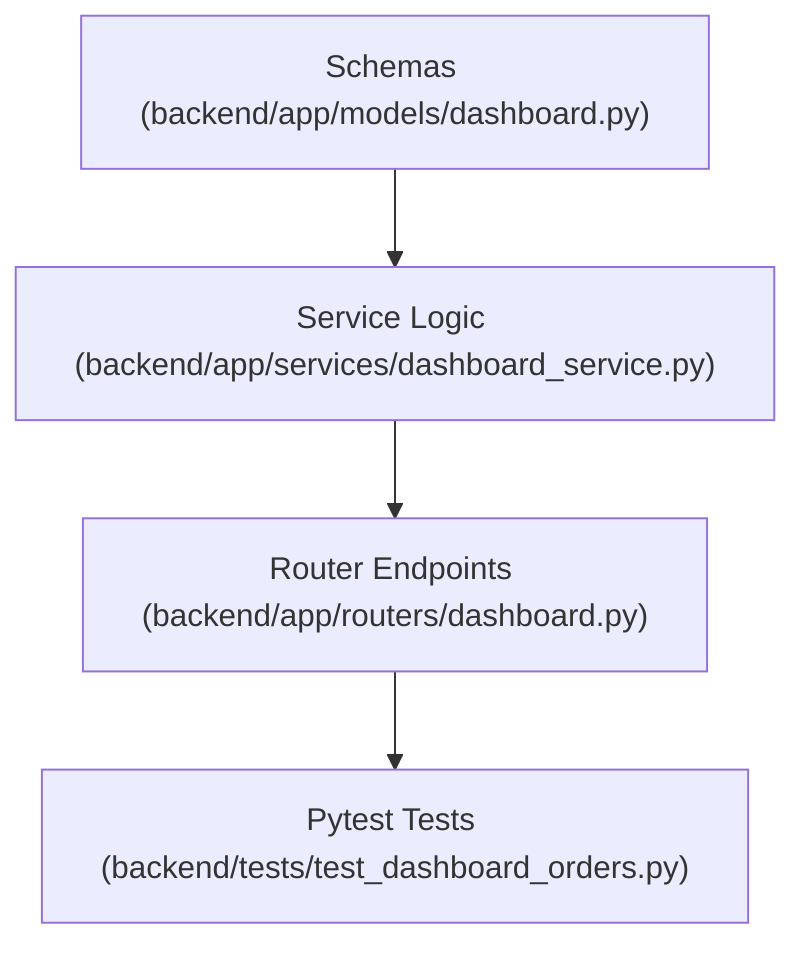

# Plan: Merchant Incoming Orders and Status Update Endpoints

> **Spec Reference**: `specs/005-merchant-incoming-orders-endpoint/spec.md`
> **Branch**: `feat/merchant-dashboard`
> **Spec**: 005 of 006 in phase
> **Date**: 2026-09-06
> **Status**: Draft
>
> **CRITICAL CONTENT RULE**: DO NOT write implementation code or logic blocks in this document.
> Everything must be written in **pure text** (natural language, tables, bullet points). Only mock code
> shapes (e.g. JSON schemas or minimal type/interface signatures) are allowed, but **mock logic is
> strictly prohibited** (no function bodies, control flow, loops, or algorithms). Custom enums
> MUST be explained in pure text.

---

## 1. Technical Approach

Implement `GET /api/v1/dashboard/orders` and `PATCH /api/v1/dashboard/orders/{order_id}/status` in the dashboard router.
For `GET /orders`:
- Accepts optional `status` query parameter.
- Service queries `user_orders` where `seller_id == current_user.id`, optionally filtering by `delivery_types == status`.
- Joins with `products` table (`id, name, brand, image_url`) and `users` table on `buyer_id` (`id, display_name`).
- Maps records into a list of `MerchantOrderItemResponse` models.
For `PATCH /orders/{order_id}/status`:
- Verifies order existence and seller ownership (`order.seller_id == current_user.id`).
- Enforces strict transition validation: only `status == "confirmed"` is permitted, and only when the current order status is `"pending"`.
- If valid, updates `delivery_types` to `confirmed` in `user_orders`.
- Re-queries or formats the updated record and returns `MerchantOrderItemResponse`.
Pytest test suite will verify listing, status filtering, successful status advancement to `confirmed`, and all validation failure cases.

## 2. Dependencies on Prior Specs

| Prior Spec | What It Provides | What This Spec Uses |
|------------|-----------------|---------------------|
| `specs/001-merchant-list-offers-endpoint/` | Dashboard router, models, and service layer | Extends router and service |

## 3. Files to Create

| File Path | Purpose |
|-----------|---------|
| `backend/tests/test_dashboard_orders.py` | Pytest tests for merchant incoming orders and status updates |

## 4. Files to Modify

| File Path | Changes |
|-----------|---------|
| `backend/app/models/dashboard.py` | Add `MerchantOrderItemResponse` and `MerchantOrderStatusUpdateRequest` schemas |
| `backend/app/services/dashboard_service.py` | Add `get_merchant_orders` and `update_merchant_order_status` business logic |
| `backend/app/routers/dashboard.py` | Add `GET /orders` and `PATCH /orders/{order_id}/status` endpoints |

## 5. Dependencies & Order

## 6. Detailed Implementation Notes

> **REMINDER**: DO NOT write implementation code or logic blocks here! Everything must
> be written in pure text. Mock code shapes/signatures only; mock logic is strictly
> prohibited. Custom enums must be explained in pure text.

### 6.1 — Backend: Models (`backend/app/models/dashboard.py`)

- Define `MerchantOrderItemResponse`:
  - `id`: integer
  - `product_id`: UUID
  - `product_name`: string
  - `product_brand`: string
  - `product_image_url`: string or null
  - `bought_price`: float
  - `quantity`: integer
  - `total_price`: float
  - `status`: string (values: pending, confirmed, shipped, delivered, cancelled, returned)
  - `address`: string
  - `buyer_name`: string or null
  - `created_at`: datetime or ISO string or null
- Define `MerchantOrderStatusUpdateRequest`:
  - `status`: string (required, must be confirmed)

### 6.2 — Backend: Service (`backend/app/services/dashboard_service.py`)

- Define `get_merchant_orders`:
  - Inputs: `seller_id` (UUID), `status_filter` (optional string), `supabase_client`.
  - Queries `user_orders` table filtering by `seller_id == seller_id`.
  - If `status_filter` is provided, adds condition `delivery_types == status_filter`.
  - Joins `products(id, name, brand, image_url)` and `users!user_orders_buyer_id_fkey(id, display_name)`.
  - Sorts by `created_at` descending.
  - Maps database rows to `MerchantOrderItemResponse` models, computing `total_price = row.bought_price * row.quantity`.
  - Returns list of `MerchantOrderItemResponse`.
- Define `update_merchant_order_status`:
  - Inputs: `order_id` (integer), `seller_id` (UUID), `new_status` (string), `supabase_client`.
  - Step 1: Query `user_orders` by `id == order_id` with joined product and buyer fields.
  - Step 2: If record is missing, raise `HTTPException(status_code=404)` with code `ORDER_NOT_FOUND`.
  - Step 3: If `record.seller_id != seller_id`, raise `HTTPException(status_code=403)` with code `FORBIDDEN`.
  - Step 4: Validate transition. If `new_status != "confirmed"` or `record.delivery_types != "pending"`, raise `HTTPException(status_code=400)` with code `INVALID_STATUS_TRANSITION`.
  - Step 5: Update `delivery_types` to `confirmed` in `user_orders` where `id == order_id`.
  - Step 6: Return updated order formatted as `MerchantOrderItemResponse`.

### 6.3 — Backend: Router (`backend/app/routers/dashboard.py`)

- Add `GET /orders`:
  - Query parameter: `status: str | None = None`.
  - Enforce `current_user.user_role == "merchant"`.
  - Call `get_merchant_orders`.
  - Return `list[MerchantOrderItemResponse]`.
  - Document responses: 200, 401, 403, 500.
- Add `PATCH /orders/{order_id}/status`:
  - Path parameter: `order_id: int`.
  - Body: `MerchantOrderStatusUpdateRequest`.
  - Enforce `current_user.user_role == "merchant"`.
  - Call `update_merchant_order_status`.
  - Return `MerchantOrderItemResponse`.
  - Document responses: 200, 400, 401, 403, 404, 422, 500.

### 6.4 — Backend: Tests (`backend/tests/test_dashboard_orders.py`)

- Test cases:
  1. Success list orders: Returns array with orders containing product and buyer details.
  2. Filter by status: `?status=pending` returns only pending orders.
  3. Empty orders: Merchant with no orders returns `[]`.
  4. Success status update: Transitions pending order to confirmed; returns updated model with status `confirmed`.
  5. Invalid status transition (target not confirmed): Requesting `status = "shipped"` returns 400 with `INVALID_STATUS_TRANSITION`.
  6. Invalid status transition (order not pending): Updating an already confirmed order returns 400 with `INVALID_STATUS_TRANSITION`.
  7. Order not found: Updating non-existent order returns 404.
  8. Forbidden order access: Attempting to update another merchant's order returns 403.
  9. Non-merchant and unauthenticated access checks: 403 and 401.

## 7. Testing Strategy

### Backend Tests (Pytest)
- Run `uv run pytest backend/tests/test_dashboard_orders.py -v`.
- Test all status checks and ownership validations.

### Manual Verification
- Place an order through checkout endpoint or database seed.
- Verify order appears in `GET /api/v1/dashboard/orders`.
- Execute `PATCH /api/v1/dashboard/orders/{order_id}/status` with `{"status": "confirmed"}` in `/docs`.
- Verify status reflects `confirmed`.

## 8. Constitution Compliance Checklist

- [ ] All order logic and transition guards in FastAPI (§4.1)
- [ ] Merchant can only transition `pending` -> `confirmed` ("ready for pickup") (§15)
- [ ] Logistics downstream statuses preserved (§16)
- [ ] Endpoint prefixed with `/api/v1/` (§4.3)
- [ ] Standard error envelope for 400, 403, 404 (§4.4)
- [ ] Pytest coverage for all endpoints (§14)

## 9. Risks & Mitigations

| Risk | Mitigation |
|------|-----------|
| Seller attempts to mark order as delivered prematurely | Backend endpoint strictly restricts allowed status to `confirmed` |
| Buyer joins or null buyer_id | Safely handle optional `buyer` relationship and provide fallback string if null |
