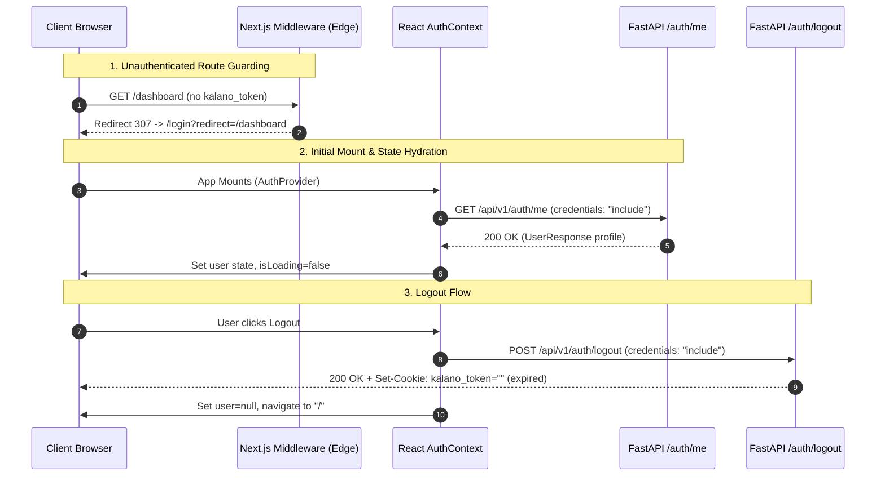
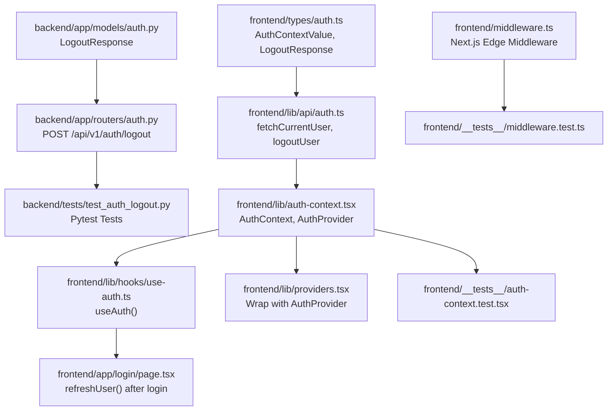

# Plan: Auth Context & Middleware

> **Spec Reference**: `specs/006-auth-context-and-middleware/spec.md`  
> **Branch**: `feat/authentication`  
> **Spec**: 006 of 006 in phase  
> **Date**: 2026-09-03  
> **Status**: Draft  

---

## 1. Technical Approach

This plan establishes the client-side session lifecycle and edge routing defenses for Kalano. It connects the backend JWT cookie mechanism implemented in Specs 001–003 with the frontend user experience built in Specs 004–005.



### Architectural Principles & Design Decisions

1. **Thin Client State Hydration**:
   - Because `kalano_token` is an `httpOnly` cookie, client-side code cannot read token contents or parse claims.
   - The client hydrates user profile data by invoking `GET /api/v1/auth/me` on initial mount via `AuthProvider`.
   - All network requests include `credentials: "include"` to forward the cookie to FastAPI.

2. **Edge Route Protection (Next.js Middleware)**:
   - `frontend/middleware.ts` runs at the Edge before request routing reaches page renderers.
   - It intercepts protected routes (`/cart`, `/checkout`, `/orders`, `/dashboard`, `/logistics`) and tests only for the presence of the `kalano_token` cookie.
   - **Crucial Separation**: Middleware does **not** decode or verify JWT cryptographic signatures. Cryptographic validation is strictly the backend's responsibility via `/api/v1/auth/me`. This avoids bundling Node crypto or duplicate JWT secrets in the frontend edge runtime.

3. **Stateless Cookie Revocation (Logout)**:
   - The backend `POST /api/v1/auth/logout` endpoint responds with a `Set-Cookie` header for `kalano_token` configured with an expiration date in the past (`Expires=Thu, 01 Jan 1970 00:00:00 GMT`), matching path (`/`), and `httponly=True`.
   - The client coordinates this by clearing its in-memory user state and pushing to `/`.

4. **Context Hierarchy**:
   - `<AuthProvider>` sits inside `<QueryClientProvider>` in `frontend/lib/providers.tsx`. This ensures that context consumers can use React Query if needed, and all pages wrapped in `RootLayout` have access to `useAuth()`.

---

## 2. Dependencies on Prior Specs

| Prior Spec | What It Provides | What This Spec Uses |
|---|---|---|
| `specs/001-user-registration-endpoint/` | `UserResponse`, `ErrorResponse`, `ErrorDetail` in `backend/app/models/auth.py` | Models and error response schemas |
| `specs/002-user-login-endpoint/` | `POST /api/v1/auth/login`, `kalano_token` httpOnly cookie issuance | Cookie name convention and authentication lifecycle |
| `specs/003-auth-dependency-and-current-user/` | `GET /api/v1/auth/me` endpoint in `backend/app/routers/auth.py` | Endpoint called by `fetchCurrentUser()` on mount |
| `specs/004-frontend-signup-page/` | Base TypeScript types in `frontend/types/auth.ts` | `UserResponse`, `ApiError` types |
| `specs/005-frontend-login-page/` | `frontend/lib/api/auth.ts`, `frontend/app/login/page.tsx` | Base API client and login page to trigger `refreshUser()` |

---

## 3. Files to Create

| File Path | Purpose |
|---|---|
| `frontend/lib/auth-context.tsx` | Implements `AuthContext` and `AuthProvider` React component |
| `frontend/lib/hooks/use-auth.ts` | Implements `useAuth()` convenience hook with provider assertion |
| `frontend/middleware.ts` | Next.js Edge middleware for cookie presence checks on protected routes |
| `backend/tests/test_auth_logout.py` | Pytest test suite for `POST /api/v1/auth/logout` endpoint |
| `frontend/__tests__/auth-context.test.tsx` | Vitest test suite for `AuthProvider` and `useAuth` hook |
| `frontend/__tests__/middleware.test.ts` | Vitest test suite for Next.js route protection middleware |

---

## 4. Files to Modify

| File Path | Changes |
|---|---|
| `backend/app/models/auth.py` | Add `LogoutResponse` Pydantic model with field descriptions |
| `backend/app/routers/auth.py` | Add `POST /auth/logout` endpoint deleting `kalano_token` cookie |
| `frontend/types/auth.ts` | Add `AuthContextValue` interface and `LogoutResponse` type |
| `frontend/lib/api/auth.ts` | Add `fetchCurrentUser()` and `logoutUser()` functions with `credentials: "include"` |
| `frontend/lib/providers.tsx` | Wrap children with `AuthProvider` inside `QueryClientProvider` |
| `frontend/app/login/page.tsx` | Call `await refreshUser()` from `useAuth()` upon successful login before redirecting |

---

## 5. Dependencies & Order



---

## 6. Detailed Implementation Notes

### 6.1 — Backend: Models (`backend/app/models/auth.py`)

Add the `LogoutResponse` model to `backend/app/models/auth.py`:

```python
from pydantic import BaseModel, Field

class LogoutResponse(BaseModel):
    message: str = Field(
        default="Logged out successfully",
        description="Confirmation message that the user was logged out",
        examples=["Logged out successfully"],
    )
```

### 6.2 — Backend: Router (`backend/app/routers/auth.py`)

Add the `POST /auth/logout` endpoint in `backend/app/routers/auth.py`:

```python
from fastapi import APIRouter, Response, status
from app.models.auth import LogoutResponse

@router.post(
    "/auth/logout",
    response_model=LogoutResponse,
    summary="Log out the current user",
    description="Clears the httpOnly authentication cookie, effectively logging the user out.",
    status_code=status.HTTP_200_OK,
    tags=["Auth"],
)
async def logout(response: Response) -> LogoutResponse:
    response.delete_cookie(
        key="kalano_token",
        httponly=True,
        samesite="lax",
        path="/",
    )
    return LogoutResponse(message="Logged out successfully")
```

*(Note: If the router has `prefix="/api/v1/auth"`, route path is `/logout`; if `prefix="/api/v1"`, route path is `/auth/logout`. In either case, the full URL is `/api/v1/auth/logout`.)*

### 6.3 — Backend: Tests (`backend/tests/test_auth_logout.py`)

Create `backend/tests/test_auth_logout.py`:
- `test_logout_clears_cookie`: Calls `POST /api/v1/auth/logout` with an existing `kalano_token` cookie. Asserts HTTP 200 response, JSON message `{"message": "Logged out successfully"}`, and presence of a `set-cookie` header with `kalano_token` set to expire in the past.
- `test_logout_when_not_logged_in`: Calls `POST /api/v1/auth/logout` without any cookies. Asserts HTTP 200 response and cookie deletion header (idempotent behavior).

### 6.4 — Frontend: Types (`frontend/types/auth.ts`)

Add the `AuthContextValue` and `LogoutResponse` definitions to `frontend/types/auth.ts`:

```typescript
import type { UserResponse } from "./auth";

export interface LogoutResponse {
  message: string;
}

export interface AuthContextValue {
  user: UserResponse | null;
  isLoading: boolean;
  isAuthenticated: boolean;
  logout: () => Promise<void>;
  refreshUser: () => Promise<void>;
}
```

### 6.5 — Frontend: API Client (`frontend/lib/api/auth.ts`)

Add `fetchCurrentUser` and `logoutUser` functions:

```typescript
import type { UserResponse, LogoutResponse } from "@/types/auth";

const API_BASE_URL = process.env.NEXT_PUBLIC_API_URL || "http://localhost:8000";

export async function fetchCurrentUser(): Promise<UserResponse> {
  const res = await fetch(`${API_BASE_URL}/api/v1/auth/me`, {
    method: "GET",
    credentials: "include",
  });
  if (!res.ok) {
    throw new Error("Not authenticated");
  }
  return res.json();
}

export async function logoutUser(): Promise<LogoutResponse> {
  const res = await fetch(`${API_BASE_URL}/api/v1/auth/logout`, {
    method: "POST",
    credentials: "include",
  });
  if (!res.ok) {
    // Attempt fallback or return empty confirmation
    return { message: "Logged out" };
  }
  return res.json();
}
```

### 6.6 — Frontend: AuthContext & Provider (`frontend/lib/auth-context.tsx`)

Create `frontend/lib/auth-context.tsx`:

```typescript
"use client";

import { createContext, useCallback, useEffect, useState, type ReactNode } from "react";
import { useRouter } from "next/navigation";
import type { UserResponse, AuthContextValue } from "@/types/auth";
import { fetchCurrentUser, logoutUser } from "@/lib/api/auth";

export const AuthContext = createContext<AuthContextValue | undefined>(undefined);

export function AuthProvider({ children }: { children: ReactNode }) {
  const [user, setUser] = useState<UserResponse | null>(null);
  const [isLoading, setIsLoading] = useState<boolean>(true);
  const router = useRouter();

  const refreshUser = useCallback(async () => {
    try {
      setIsLoading(true);
      const userData = await fetchCurrentUser();
      setUser(userData);
    } catch {
      setUser(null);
    } finally {
      setIsLoading(false);
    }
  }, []);

  useEffect(() => {
    refreshUser();
  }, [refreshUser]);

  const logout = useCallback(async () => {
    try {
      await logoutUser();
    } catch {
      // Ignore network errors on logout to allow local state cleanup
    } finally {
      setUser(null);
      router.push("/");
    }
  }, [router]);

  return (
    <AuthContext.Provider
      value={{
        user,
        isLoading,
        isAuthenticated: Boolean(user),
        logout,
        refreshUser,
      }}
    >
      {children}
    </AuthContext.Provider>
  );
}
```

### 6.7 — Frontend: Custom Hook (`frontend/lib/hooks/use-auth.ts`)

Create `frontend/lib/hooks/use-auth.ts`:

```typescript
import { useContext } from "react";
import { AuthContext } from "@/lib/auth-context";
import type { AuthContextValue } from "@/types/auth";

export function useAuth(): AuthContextValue {
  const context = useContext(AuthContext);
  if (!context) {
    throw new Error("useAuth must be used within an AuthProvider");
  }
  return context;
}
```

### 6.8 — Frontend: Providers (`frontend/lib/providers.tsx`)

Update `frontend/lib/providers.tsx` to wrap children with `AuthProvider`:

```typescript
"use client";

import { QueryClientProvider } from "@tanstack/react-query";
import { useState, type ReactNode } from "react";
import { makeQueryClient } from "./query-client";
import { AuthProvider } from "./auth-context";

export function Providers({ children }: { children: ReactNode }) {
  const [queryClient] = useState(() => makeQueryClient());

  return (
    <QueryClientProvider client={queryClient}>
      <AuthProvider>{children}</AuthProvider>
    </QueryClientProvider>
  );
}
```

### 6.9 — Frontend: Middleware (`frontend/middleware.ts`)

Create `frontend/middleware.ts` at the root of `frontend/`:

```typescript
import { NextResponse } from "next/server";
import type { NextRequest } from "next/server";

const PROTECTED_ROUTES = [
  "/cart",
  "/checkout",
  "/orders",
  "/dashboard",
  "/logistics",
];

export function middleware(request: NextRequest) {
  const { pathname, search } = request.nextUrl;
  const isProtected = PROTECTED_ROUTES.some(
    (route) => pathname === route || pathname.startsWith(`${route}/`)
  );

  if (isProtected) {
    const token = request.cookies.get("kalano_token");
    if (!token || !token.value) {
      const loginUrl = new URL("/login", request.url);
      const destination = `${pathname}${search}`;
      loginUrl.searchParams.set("redirect", destination);
      return NextResponse.redirect(loginUrl);
    }
  }

  return NextResponse.next();
}

export const config = {
  matcher: [
    "/cart/:path*",
    "/checkout/:path*",
    "/orders/:path*",
    "/dashboard/:path*",
    "/logistics/:path*",
  ],
};
```

### 6.10 — Frontend: Login Page Update (`frontend/app/login/page.tsx`)

Update the login page's submit handler:
1. Import `useAuth` from `@/lib/hooks/use-auth`.
2. Import `useSearchParams` from `next/navigation`.
3. In `handleSubmit`, after successful `loginUser(data)`:
   ```typescript
   await refreshUser();
   const redirectParam = searchParams.get("redirect");
   // Sanitize redirect: ensure starts with single '/' and not '//'
   const target = redirectParam && redirectParam.startsWith("/") && !redirectParam.startsWith("//")
     ? redirectParam
     : "/";
   router.push(target);
   ```

---

## 7. Testing Strategy

### Backend Tests (Pytest)

- **`test_logout_clears_cookie`**:
  - Send `POST /api/v1/auth/logout` with cookies `{"kalano_token": "valid.mock.jwt"}`.
  - Assert status is `200`.
  - Assert response JSON is `{"message": "Logged out successfully"}`.
  - Inspect response headers for `set-cookie` containing `kalano_token=""`, `Max-Age=0` or `Expires=... 1970`, `Path=/`, and `HttpOnly`.
- **`test_logout_when_not_logged_in`**:
  - Send `POST /api/v1/auth/logout` without cookies.
  - Assert status is `200`.
  - Assert response JSON is `{"message": "Logged out successfully"}`.
  - Assert `set-cookie` header is still sent.

### Frontend Tests (Vitest)

- **`frontend/__tests__/auth-context.test.tsx`**:
  - `useAuth throws error when invoked outside AuthProvider`: Verify React renderHook throws `"useAuth must be used within an AuthProvider"`.
  - `AuthProvider hydrates user on mount when fetchCurrentUser succeeds`: Mock `fetchCurrentUser` returning valid user profile. Render consumer hook, verify `user` matches mock, `isAuthenticated === true`, `isLoading === false`.
  - `AuthProvider clears user when fetchCurrentUser rejects with 401`: Mock `fetchCurrentUser` throwing error. Render consumer hook, verify `user === null`, `isAuthenticated === false`, `isLoading === false`.
  - `logout calls logoutUser API, clears user state, and pushes to '/'`: Invoke `logout()`, verify `logoutUser` was called, `user` became `null`, `router.push` called with `"/"`.
  - `refreshUser updates user state`: Call `refreshUser()`, verify state updates accordingly.
- **`frontend/__tests__/middleware.test.ts`**:
  - `redirects unauthenticated request on /cart to /login?redirect=/cart`: Instantiate `NextRequest` for `https://example.com/cart` without cookie. Assert redirect response to `https://example.com/login?redirect=%2Fcart`.
  - `redirects unauthenticated request on nested path /orders/123`: Instantiate `NextRequest` for `https://example.com/orders/123`. Assert redirect to `https://example.com/login?redirect=%2Forders%2F123`.
  - `allows request through when kalano_token is present`: Instantiate `NextRequest` with cookie `kalano_token=xyz`. Assert response is `NextResponse.next()`.
  - `allows public routes through without cookie`: Instantiate `NextRequest` for `/products`. Assert response is `NextResponse.next()`.

### Manual Verification

1. Start backend under a strict timeout constraint (run as a background task with a max 60s timeout, or terminate immediately after verification via `manage_task kill`): `uv run uvicorn app.main:app --port 8000`.
2. Start frontend under a strict timeout constraint (run as a background task with a max 60s timeout, or terminate immediately after verification via `manage_task kill`): `pnpm dev`.
3. Navigate to `http://localhost:3000/dashboard` in an incognito window without logging in.
   - Verify browser is automatically redirected to `http://localhost:3000/login?redirect=%2Fdashboard`.
4. Fill in credentials and log in.
   - Verify browser redirects automatically back to `http://localhost:3000/dashboard`.
   - Inspect devtools Application cookies: `kalano_token` cookie is present.
5. Refresh the page at `/dashboard`.
   - Verify user remains logged in without being kicked to `/login`.
6. Trigger logout.
   - Verify browser navigates to `/`.
   - Verify `kalano_token` cookie is removed.
7. Try navigating directly to `/dashboard` again.
   - Verify immediate redirect back to `/login?redirect=%2Fdashboard`.
8. Immediately terminate both backend and frontend server processes using `manage_task kill` so the agent returns to working state without waiting indefinitely.

---

## 8. Constitution Compliance Checklist

- [x] All business logic in FastAPI, not Next.js (§4.1)
- [x] Using custom argon2/JWT cookie auth, not Supabase Auth (§4.2)
- [x] JWT stored in httpOnly cookie `kalano_token` (§4.2)
- [x] Next.js middleware guards protected routes by checking cookie presence (§4.2)
- [x] Protected routes include `/cart`, `/checkout`, `/orders`, `/dashboard`, `/logistics` (§4.2, §8)
- [x] All backend endpoints prefixed with `/api/v1/` (§4.3)
- [x] Pydantic models with field descriptions and examples (§4.3)
- [x] Standard error envelope used for API errors (§4.4)
- [x] Naming conventions followed: kebab-case frontend files, snake_case Python (§7)
- [x] Tests written for endpoints and client state (§14)
- [x] Conventional Commits used for all changes (§13)

---

## 9. Risks & Mitigations

| Risk | Mitigation |
|---|---|
| Middleware runs on edge, unable to verify JWT signature | By design: middleware checks cookie presence only; backend API calls and `AuthContext` check cryptographic validity (§4.2) |
| Flash of unauthenticated content during client-side hydration | `isLoading` state defaults to `true`, allowing components to show a loader/skeleton until `fetchCurrentUser()` resolves |
| Open redirect vulnerability via malicious `redirect` query parameter | Login page validates `redirect` parameter: must start with `/` and not `//`, else defaults to `/` |
| Cookie deletion path mismatch (e.g. cookie set on `/api` but deleted on `/`) | Explicitly set `path="/"` on both cookie creation (`login`) and cookie deletion (`logout`) |
| Network error during logout prevents user from exiting session | `logout()` wraps API call in try/finally, ensuring client state is cleared and navigation to `/` occurs even if backend fails |
