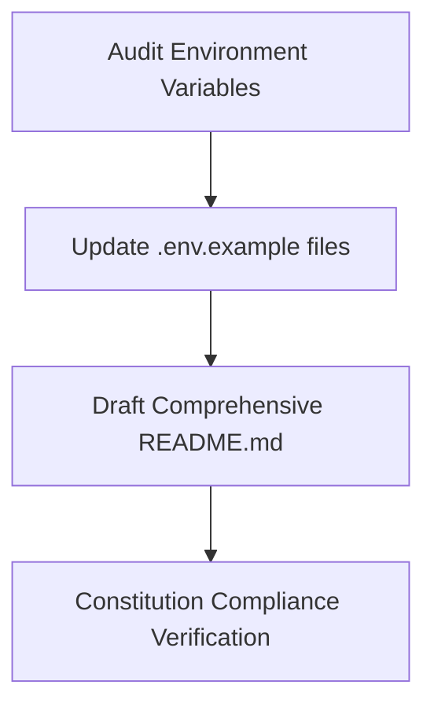

# Plan: README & Documentation

> **Spec Reference**: `specs/006-readme-and-documentation/spec.md`
> **Branch**: `feat/polish-and-integration`
> **Spec**: 006 of 006 in phase
> **Date**: 2026-09-07
> **Status**: Draft
>
> **CRITICAL CONTENT RULE**: DO NOT write implementation code or logic blocks in this document.
> Everything must be written in **pure text** (natural language, tables, bullet points). Only mock code
> shapes (e.g. JSON schemas or minimal type/interface signatures) are allowed, but **mock logic is
> strictly prohibited** (no function bodies, control flow, loops, or algorithms). Custom enums
> MUST be explained in pure text.

---

## 1. Technical Approach

This plan outlines the systematic documentation and environment variable audit across the monorepo.

1. **Root `README.md` Modernization**:
   - Rewrite `README.md` to be an end-to-end operational guide.
   - Detail the multi-vendor architecture and highlight the simulated nature of financial/logistics workflows.
   - Document prerequisites (Node 20+, pnpm, Python 3.11+, uv).
   - Document complete commands for local development, linting, testing, and accessing Swagger OpenAPI docs at `/docs`.
2. **Environment Template Synchronization**:
   - Audit `backend/.env.example` to ensure all runtime settings used in `backend/app/` are represented with helpful commentary.
   - Audit `frontend/.env.example` to ensure the API origin configuration is clearly described.
3. **Constitution Compliance Check**:
   - Walk through the 17 sections of `.specify/memory/constitution.md` to verify full alignment across both codebases.

## 2. Dependencies on Prior Specs

| Prior Spec | What It Provides | What This Spec Uses |
|------------|-----------------|---------------------|
| `specs/001-shared-layout-and-navigation/` | Shared layout and navigation features | Documents frontend navigation, routing, and layout |
| `specs/002-loading-and-error-states/` | ErrorState, Toasts, Skeletons | Documents UI feedback conventions |
| `specs/003-accessibility-pass/` | A11y and keyboard features | Documents accessibility and keyboard standards |
| `specs/004-responsive-design-pass/` | Responsive breakpoints | Documents supported breakpoints and layout behavior |
| `specs/005-end-to-end-smoke-test/` | Automated E2E smoke test suite | Documents how to run integration and E2E smoke tests |

## 3. Files to Create

| File Path | Purpose |
|-----------|---------|
| None | — |

## 4. Files to Modify

| File Path | Changes |
|-----------|---------|
| `README.md` | Complete rewrite to provide production-grade setup, architecture, and testing guide |
| `backend/.env.example` | Update with exhaustive parameter documentation and clear comments |
| `frontend/.env.example` | Update with clear API URL instructions |

## 5. Dependencies & Order

## 6. Detailed Implementation Notes

### 6.1 — Root `README.md` Content Sections

- **Header**: Project title, educational badge/notice, brief description.
- **Features by Role**:
  - Buyer: Catalog discovery, seller price comparison, server-backed cart, simulated checkout, order history.
  - Merchant: Product catalog contribution, multi-seller offer listings, inventory management, incoming order fulfillment.
  - Logistics: Order pipeline dashboard, status progression (`pending` -> `confirmed` -> `shipped` -> `delivered`).
- **Tech Stack Overview**:
  - Frontend: Next.js (App Router), TypeScript, TailwindCSS, shadcn/ui, TanStack Query, Vitest.
  - Backend: FastAPI, Pydantic, Supabase Python client, argon2-cffi, Pytest, uv.
- **Getting Started**:
  - Prerequisites list.
  - Clone and setup steps.
  - Backend setup commands: `cd backend && uv sync && cp .env.example .env && uv run uvicorn app.main:app --reload`.
  - Frontend setup commands: `cd frontend && pnpm install && cp .env.example .env.local && pnpm dev`.
- **Testing Guide**:
  - Backend tests: `uv run pytest`.
  - E2E smoke test: `uv run pytest backend/tests/test_e2e_smoke.py`.
  - Frontend tests: `pnpm test`.
  - Linting: `pnpm lint` and `uv run ruff check .`.
- **API Documentation**: Pointers to interactive Swagger UI at `http://localhost:8000/docs`.

### 6.2 — Backend `.env.example`

- Ensure the template covers:
  - `SUPABASE_URL`: e.g. `https://your-project.supabase.co`
  - `SUPABASE_KEY`: e.g. `your-service-or-anon-key`
  - `JWT_SECRET_KEY`: e.g. `your-super-secret-jwt-key-change-in-production`
  - `JWT_ALGORITHM`: `HS256`
  - `ACCESS_TOKEN_EXPIRE_MINUTES`: `1440`
  - `CORS_ORIGINS`: `http://localhost:3000`

### 6.3 — Frontend `.env.example`

- Ensure the template covers:
  - `NEXT_PUBLIC_API_URL`: `http://localhost:8000`

## 7. Testing Strategy

### Verification
- Validate markdown rendering and links.
- Test that executing commands listed in `README.md` succeeds on clean environments without syntax errors.
- Confirm `.env.example` parameters match variables used in code.

## 8. Constitution Compliance Checklist

- [x] Educational disclaimer prominently presented (§1)
- [x] Strict backend separation documented (§4.1)
- [x] Custom argon2 auth documented (§4.2)
- [x] All endpoints prefixed with `/api/v1/` (§4.3)
- [x] Both `.env.example` files maintained (§4.5)

## 9. Risks & Mitigations

| Risk | Mitigation |
|------|-----------|
| Outdated commands or path references in README | Cross-check each command against current `package.json` scripts and `pyproject.toml` configurations. |
