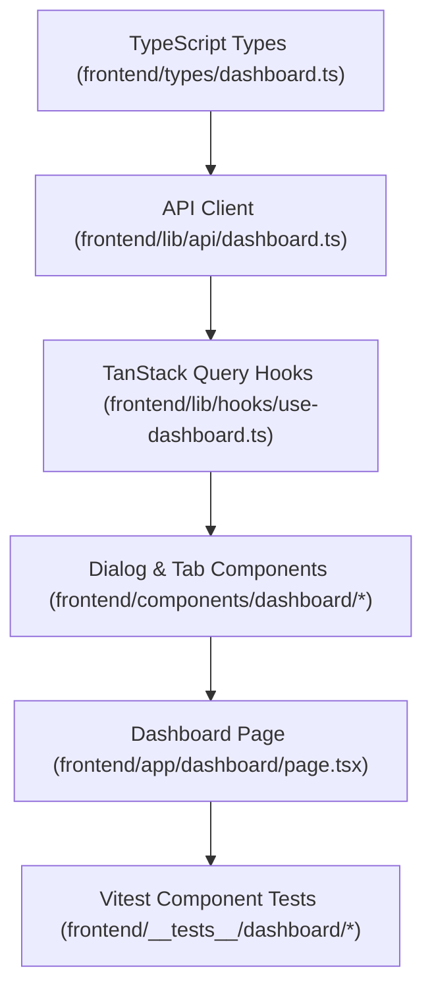

# Plan: Seller Dashboard Frontend

> **Spec Reference**: `specs/006-seller-dashboard-frontend/spec.md`
> **Branch**: `feat/merchant-dashboard`
> **Spec**: 006 of 006 in phase
> **Date**: 2026-09-06
> **Status**: Draft
>
> **CRITICAL CONTENT RULE**: DO NOT write implementation code or logic blocks in this document.
> Everything must be written in **pure text** (natural language, tables, bullet points). Only mock code
> shapes (e.g. JSON schemas or minimal type/interface signatures) are allowed, but **mock logic is
> strictly prohibited** (no function bodies, control flow, loops, or algorithms). Custom enums
> MUST be explained in pure text.

---

## 1. Technical Approach

Implement the merchant dashboard page at `frontend/app/dashboard/page.tsx` using Next.js App Router, TailwindCSS, shadcn/ui components, and TanStack Query.
1. Define shared TypeScript interfaces in `frontend/types/dashboard.ts`.
2. Implement typed API client helper functions in `frontend/lib/api/dashboard.ts` using `fetch` with credentials enabled for the `kalano_token` cookie.
3. Build TanStack Query hooks in `frontend/lib/hooks/use-dashboard.ts` to manage server state and cache invalidation.
4. Construct modular UI components under `frontend/components/dashboard/`:
   - `dashboard-shell.tsx`: Page header, metrics summary, and tab container.
   - `my-offers-tab.tsx`: Offer list, empty state, and trigger buttons for edit and delete dialogs.
   - `edit-offer-dialog.tsx`: Modal form for updating price, stock, and delivery days.
   - `delete-offer-dialog.tsx`: Confirmation modal before removing an offer.
   - `add-offer-tab.tsx`: Searchable catalog input, product selector, and the multipart new product creation form.
   - `incoming-orders-tab.tsx`: Orders table, status filter tabs, and the "Ready for Pickup" button.
5. Protect page access with `useAuth` hook: render access denied message if role != `merchant`.
6. Write Vitest component tests verifying offer rendering, order status transition clicks, and catalog search interactions.

## 2. Dependencies on Prior Specs

| Prior Spec | What It Provides | What This Spec Uses |
|------------|-----------------|---------------------|
| `specs/001-merchant-list-offers-endpoint/` | `GET /api/v1/dashboard/offers` | Fetches merchant offers for My Offers tab |
| `specs/002-merchant-add-offer-endpoint/` | `POST /api/v1/dashboard/offers` | Submits offer for existing product |
| `specs/003-merchant-create-product-offer-endpoint/` | `POST /api/v1/dashboard/products` | Submits multipart form for new product + offer |
| `specs/004-merchant-update-delete-offers-endpoints/` | `PATCH` & `DELETE /api/v1/dashboard/offers/{id}` | Edits and removes seller offers |
| `specs/005-merchant-incoming-orders-endpoint/` | `GET` & `PATCH /api/v1/dashboard/orders` | Lists incoming orders and marks ready for pickup |

## 3. Files to Create

| File Path | Purpose |
|-----------|---------|
| `frontend/types/dashboard.ts` | TypeScript type definitions for dashboard offers, orders, and payloads |
| `frontend/lib/api/dashboard.ts` | API fetch helper functions for dashboard endpoints |
| `frontend/lib/hooks/use-dashboard.ts` | TanStack Query hooks for offers, orders, and mutations |
| `frontend/components/dashboard/dashboard-shell.tsx` | Main container and header component with overview metrics |
| `frontend/components/dashboard/my-offers-tab.tsx` | Offers list view with action triggers |
| `frontend/components/dashboard/edit-offer-dialog.tsx` | Dialog form for editing offer terms |
| `frontend/components/dashboard/delete-offer-dialog.tsx` | Confirmation dialog for offer deletion |
| `frontend/components/dashboard/add-offer-tab.tsx` | Catalog search and new product multipart creation form |
| `frontend/components/dashboard/incoming-orders-tab.tsx` | Incoming orders list with status badge and pickup trigger |
| `frontend/app/dashboard/page.tsx` | Next.js protected route page for merchant dashboard |
| `frontend/__tests__/dashboard/dashboard-offers.test.tsx` | Vitest tests for offers tab and actions |
| `frontend/__tests__/dashboard/dashboard-orders.test.tsx` | Vitest tests for orders tab and ready for pickup action |

## 4. Files to Modify

| File Path | Changes |
|-----------|---------|
| None (clean additions to existing frontend structure) | — |

## 5. Dependencies & Order

## 6. Detailed Implementation Notes

> **REMINDER**: DO NOT write implementation code or logic blocks here! Everything must
> be written in pure text. Mock code shapes/signatures only; mock logic is strictly
> prohibited. Custom enums must be explained in pure text.

### 6.1 — Frontend: Types (`frontend/types/dashboard.ts`)

- Define `MerchantOffer`:
  - `id`: string
  - `product_id`: string
  - `product_name`: string
  - `product_brand`: string
  - `product_description`: string
  - `product_image_url`: string or null
  - `price`: number
  - `stock`: number
  - `estimated_delivery_days`: number or null
  - `created_at`: string or null
- Define `CreateOfferPayload`:
  - `product_id`: string
  - `price`: number
  - `stock`: number
  - `estimated_delivery_days` (optional): number or null
- Define `UpdateOfferPayload`:
  - `price` (optional): number
  - `stock` (optional): number
  - `estimated_delivery_days` (optional): number or null
- Define `MerchantOrder`:
  - `id`: number
  - `product_id`: string
  - `product_name`: string
  - `product_brand`: string
  - `product_image_url`: string or null
  - `bought_price`: number
  - `quantity`: number
  - `total_price`: number
  - `status`: string (values: pending, confirmed, shipped, delivered, cancelled, returned)
  - `address`: string
  - `buyer_name`: string or null
  - `created_at`: string

### 6.2 — Frontend: API Client (`frontend/lib/api/dashboard.ts`)

- `fetchMerchantOffers`: Calls `GET /api/v1/dashboard/offers`. Returns array of `MerchantOffer`.
- `createMerchantOffer`: Calls `POST /api/v1/dashboard/offers` with JSON payload. Returns `MerchantOffer`.
- `createProductAndOffer`: Calls `POST /api/v1/dashboard/products` with `FormData` object (no explicit Content-Type header so browser sets boundary). Returns product and offer response.
- `updateMerchantOffer`: Calls `PATCH /api/v1/dashboard/offers/{offerId}` with JSON payload. Returns updated `MerchantOffer`.
- `deleteMerchantOffer`: Calls `DELETE /api/v1/dashboard/offers/{offerId}`. Returns deletion confirmation.
- `fetchMerchantOrders`: Calls `GET /api/v1/dashboard/orders` with optional status filter. Returns array of `MerchantOrder`.
- `updateMerchantOrderStatus`: Calls `PATCH /api/v1/dashboard/orders/{orderId}/status` with `{"status": status}`. Returns updated `MerchantOrder`.

### 6.3 — Frontend: TanStack Query Hooks (`frontend/lib/hooks/use-dashboard.ts`)

- `useMerchantOffers`: `useQuery` querying `['merchant-offers']`.
- `useCreateOffer`: `useMutation` that on success invalidates `['merchant-offers']`.
- `useCreateProductAndOffer`: `useMutation` that on success invalidates `['merchant-offers']` and catalog queries.
- `useUpdateOffer`: `useMutation` that on success invalidates `['merchant-offers']`.
- `useDeleteOffer`: `useMutation` that on success invalidates `['merchant-offers']`.
- `useMerchantOrders`: `useQuery` keyed by `['merchant-orders', status]`.
- `useUpdateOrderStatus`: `useMutation` that on success invalidates `['merchant-orders']`.

### 6.4 — Frontend: Components (`frontend/components/dashboard/`)

- `dashboard-shell.tsx`:
  - Header: Displays "Merchant Dashboard" title, user display name, and high-level count metrics (total offers, pending shipments).
  - Renders tab trigger buttons: "My Offers", "Add Offer", "Incoming Orders".
- `my-offers-tab.tsx`:
  - Table or grid view of offers.
  - Shows thumbnail, title, brand, price in USD format, stock count with warning colors if low, delivery transit days.
  - Action buttons per row: "Edit" opens `EditOfferDialog`, "Delete" opens `DeleteOfferDialog`.
  - Empty state: Friendly graphic and "Add Your First Offer" button switching to Add tab.
- `edit-offer-dialog.tsx`:
  - Modal with form inputs: Price (number with decimals), Stock (integer), Estimated Delivery Days (integer).
  - Submit button shows loading spinner while mutating.
- `delete-offer-dialog.tsx`:
  - Modal with confirmation warning: "Are you sure you want to remove this offer? Customers will no longer be able to purchase it."
  - Delete button triggers mutation and closes modal on success.
- `add-offer-tab.tsx`:
  - Search bar to search catalog by keyword (`useProducts`).
  - Search results card list with "Add Offer" button on each product.
  - "Can't find it? Create new product" section with form fields: Name, Brand, Description, Price, Stock, Estimated Days, Image File picker.
- `incoming-orders-tab.tsx`:
  - Filter pills: All, Pending, Confirmed, Shipped, Delivered.
  - Orders list: displays Order ID, product details, quantity, total price, buyer address, order date, and status badge.
  - "Ready for Pickup" button for pending orders. Invokes status update mutation.

### 6.5 — Frontend: Page (`frontend/app/dashboard/page.tsx`)

- Client component using `useAuth`.
- If auth is loading, renders skeleton loader.
- If user is not authenticated, redirects to login.
- If user role is not `merchant`, renders access denied message ("This area is reserved for merchants").
- If role is `merchant`, renders `DashboardShell`.

### 6.6 — Frontend: Tests (`frontend/__tests__/dashboard/`)

- Test `dashboard-offers.test.tsx`:
  - Renders offers list correctly with product titles, prices, and stock.
  - Clicking Edit opens edit dialog.
  - Submitting edit triggers API call and updates query cache.
  - Renders empty state when offers array is empty.
- Test `dashboard-orders.test.tsx`:
  - Renders incoming orders with buyer name, address, and status badge.
  - Renders "Ready for Pickup" button only for pending orders.
  - Clicking "Ready for Pickup" triggers status update API call.

## 7. Testing Strategy

### Frontend Tests (Vitest)
- Execute `pnpm test frontend/__tests__/dashboard` to verify component rendering and user interaction flows.
- Mock API client functions using Vitest `vi.fn()` to isolate UI testing.

### Manual Verification
- Log in as a merchant account.
- Navigate to `http://localhost:3000/dashboard`.
- Verify all three tabs load correctly.
- Test editing an offer's price and stock; observe updated values in the table.
- Test searching catalog and adding an offer.
- Test creating a brand new product with image.
- Test viewing incoming orders and clicking "Ready for Pickup".
- Log in as a buyer and attempt visiting `/dashboard`; verify Access Restricted view.

## 8. Constitution Compliance Checklist

- [ ] Thin client architecture: no backend logic or Supabase JS in Next.js (§4.1)
- [ ] Route protected by middleware and AuthContext role check (§4.2, §8)
- [ ] TanStack Query used for server state management (§3)
- [ ] Desktop-first layout down to tablet (§12)
- [ ] Accessibility: semantic tags, aria-labels on action buttons, form labels (§12)
- [ ] Vitest tests for components (§14)

## 9. Risks & Mitigations

| Risk | Mitigation |
|------|-----------|
| Multipart FormData submission without proper boundary header | Avoid manually setting Content-Type header in fetch so the browser automatically computes boundary |
| Fast tab switching while queries are loading | TanStack Query caches results and handles query cancellation automatically |
| Non-merchant user navigates directly to /dashboard | Middleware checks JWT and client component verifies `user_role == 'merchant'` |
