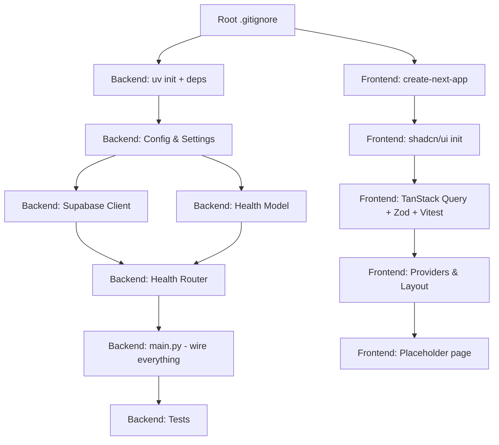

# Plan: Monorepo Scaffolding

> **Spec Reference**: `specs/2026-09-02-monorepo-scaffolding/spec.md`
> **Date**: 2026-09-02
> **Status**: Draft

---

## 1. Technical Approach

This step scaffolds the project from scratch. The frontend and backend are
entirely independent at this stage, so they can be set up in parallel. The
approach is:

1. **Frontend**: Use `create-next-app` to bootstrap, then layer on shadcn/ui,
   TanStack Query, Zod, and Vitest. Configure linting/formatting.
2. **Backend**: Use `uv init` to bootstrap, install all dependencies, create the
   folder structure manually, configure Ruff, and implement the health endpoint.
3. **Root**: Set up `.gitignore` for the monorepo.

Key architectural decision: The backend uses **pydantic-settings** for
configuration management. This gives us type-safe settings loaded from `.env`
files with validation on startup — if required env vars are missing, the app
fails fast with a clear error.

The Supabase client uses a **singleton pattern** — initialized once at module
level and reused across requests. This avoids creating a new client per request.

---

## 2. Files to Create

| File Path | Purpose |
|-----------|---------|
| `backend/app/__init__.py` | Package marker |
| `backend/app/main.py` | FastAPI app instance, CORS, router registration |
| `backend/app/routers/__init__.py` | Package marker |
| `backend/app/routers/health.py` | `GET /api/v1/health` endpoint |
| `backend/app/models/__init__.py` | Package marker |
| `backend/app/models/health.py` | `HealthResponse` Pydantic model |
| `backend/app/services/__init__.py` | Package marker |
| `backend/app/dependencies/__init__.py` | Package marker |
| `backend/app/dependencies/config.py` | `Settings` class via pydantic-settings |
| `backend/app/dependencies/database.py` | `get_supabase_client()` singleton |
| `backend/app/utils/__init__.py` | Package marker |
| `backend/tests/__init__.py` | Package marker |
| `backend/tests/conftest.py` | Shared pytest fixtures (TestClient) |
| `backend/tests/test_health.py` | Tests for health endpoint |
| `backend/.env.example` | Environment variable template |
| `backend/pyproject.toml` | Python project config (deps, ruff, pytest) |
| `frontend/.env.example` | Environment variable template |
| `frontend/lib/query-client.ts` | TanStack Query client setup |
| `frontend/lib/providers.tsx` | Client-side providers wrapper (QueryClientProvider) |
| `.gitignore` | Root-level gitignore |

## 3. Files to Modify

| File Path | Changes |
|-----------|---------|
| `frontend/app/layout.tsx` | Wrap children with `Providers` component (TanStack Query) |
| `frontend/app/page.tsx` | Replace default content with Kalano placeholder |

> Note: Most frontend files are generated by `create-next-app` and `shadcn init`.
> We modify the generated files rather than creating from scratch.

---

## 4. Dependencies & Order



---

## 5. Detailed Implementation Notes

### 5.1 — Backend: Settings (`backend/app/dependencies/config.py`)

Use `pydantic-settings` `BaseSettings` class with `model_config` pointing to
`.env` file:

```python
from pydantic_settings import BaseSettings, SettingsConfigDict

class Settings(BaseSettings):
    model_config = SettingsConfigDict(env_file=".env", env_file_encoding="utf-8")

    supabase_url: str
    supabase_key: str
    jwt_secret_key: str
    jwt_algorithm: str = "HS256"
    jwt_expiration_minutes: int = 60
    frontend_url: str = "http://localhost:3000"

settings = Settings()
```

Module-level instantiation means the app fails fast on startup if required vars
are missing.

### 5.2 — Backend: Supabase Client (`backend/app/dependencies/database.py`)

```python
from supabase import create_client, Client
from app.dependencies.config import settings

_supabase_client: Client | None = None

def get_supabase_client() -> Client:
    global _supabase_client
    if _supabase_client is None:
        _supabase_client = create_client(
            settings.supabase_url,
            settings.supabase_key,
        )
    return _supabase_client
```

### 5.3 — Backend: Health Model (`backend/app/models/health.py`)

```python
from pydantic import BaseModel, Field

class HealthResponse(BaseModel):
    status: str = Field(description="Service health status: 'healthy' or 'degraded'")
    database: str = Field(description="Database connection status: 'connected' or 'disconnected'")
    error: str | None = Field(default=None, description="Error message if database is disconnected")
```

### 5.4 — Backend: Health Router (`backend/app/routers/health.py`)

```python
from fastapi import APIRouter
from app.models.health import HealthResponse
from app.dependencies.database import get_supabase_client

router = APIRouter(prefix="/api/v1", tags=["System"])

@router.get(
    "/health",
    response_model=HealthResponse,
    summary="Health Check",
    description="Check the health of the Kalano API and its database connection. "
    "Returns 'healthy' if the database is reachable, 'degraded' otherwise. "
    "Always returns HTTP 200 — use the 'status' field to differentiate.",
)
async def health_check() -> HealthResponse:
    try:
        client = get_supabase_client()
        client.table("users").select("id", count="exact").limit(0).execute()
        return HealthResponse(status="healthy", database="connected")
    except Exception as e:
        return HealthResponse(
            status="degraded",
            database="disconnected",
            error=str(e),
        )
```

### 5.5 — Backend: Main App (`backend/app/main.py`)

```python
from fastapi import FastAPI
from fastapi.middleware.cors import CORSMiddleware
from app.dependencies.config import settings
from app.routers import health

app = FastAPI(
    title="Kalano API",
    description="Multi-vendor e-commerce platform API",
    version="0.1.0",
)

app.add_middleware(
    CORSMiddleware,
    allow_origins=[settings.frontend_url],
    allow_credentials=True,
    allow_methods=["*"],
    allow_headers=["*"],
)

app.include_router(health.router)
```

### 5.6 — Backend: Test Fixtures (`backend/tests/conftest.py`)

```python
import pytest
from fastapi.testclient import TestClient
from app.main import app

@pytest.fixture
def client():
    return TestClient(app)
```

### 5.7 — Backend: Health Tests (`backend/tests/test_health.py`)

Test cases:
1. **`test_health_returns_200`** — Verify the endpoint returns HTTP 200.
2. **`test_health_response_has_status_field`** — Verify the response contains
   `status` and `database` fields.
3. **`test_health_with_valid_db`** — With a real or mocked Supabase, verify
   `"healthy"` status (mock the Supabase call to succeed).
4. **`test_health_with_unreachable_db`** — Mock the Supabase call to raise an
   exception, verify `"degraded"` status with an error message.

### 5.8 — Frontend: TanStack Query Setup (`frontend/lib/query-client.ts`)

```typescript
import { QueryClient } from "@tanstack/react-query";

export function makeQueryClient() {
  return new QueryClient({
    defaultOptions: {
      queries: {
        staleTime: 60 * 1000, // 1 minute
      },
    },
  });
}
```

### 5.9 — Frontend: Providers (`frontend/lib/providers.tsx`)

```tsx
"use client";

import { QueryClientProvider } from "@tanstack/react-query";
import { useState } from "react";
import { makeQueryClient } from "./query-client";

export function Providers({ children }: { children: React.ReactNode }) {
  const [queryClient] = useState(() => makeQueryClient());

  return (
    <QueryClientProvider client={queryClient}>
      {children}
    </QueryClientProvider>
  );
}
```

### 5.10 — Frontend: Root Layout (`frontend/app/layout.tsx`)

Modify the generated layout to wrap children with `<Providers>`.

### 5.11 — Frontend: Home Page (`frontend/app/page.tsx`)

Replace default Next.js content with a simple centered placeholder:
- "Kalano" heading
- "Your multi-vendor marketplace" tagline
- Styled with TailwindCSS utility classes

---

## 6. Testing Strategy

### Backend Tests (Pytest)

- `test_health_returns_200` — Basic HTTP status check.
- `test_health_response_structure` — Validate response schema.
- `test_health_db_connected` — Mock `get_supabase_client` to return a mock
  client whose `.table().select().limit().execute()` succeeds. Assert
  `status == "healthy"`.
- `test_health_db_disconnected` — Mock `get_supabase_client` to raise an
  `Exception`. Assert `status == "degraded"` and `error` is populated.

### Frontend Tests (Vitest)

- No frontend tests in this step — there is no business logic to test yet.
  Vitest is configured and verified to run (`pnpm test` exits cleanly).

### Manual Verification

1. Start backend: `cd backend && uv run uvicorn app.main:app --reload`
2. Visit `http://localhost:8000/docs` — should see Swagger UI.
3. Hit `GET /api/v1/health` — should return JSON.
4. Start frontend: `cd frontend && pnpm dev`
5. Visit `http://localhost:3000` — should see placeholder page.
6. Run `cd backend && uv run pytest` — all tests pass.
7. Run `cd backend && uv run ruff check . && uv run ruff format --check .` — clean.
8. Run `cd frontend && pnpm lint` — clean.

---

## 7. Constitution Compliance Checklist

- [x] All business logic in FastAPI, not Next.js (§4.1)
- [x] No Supabase Auth — custom auth planned for Phase 2 (§4.2)
- [x] No Supabase JS client in frontend (§4.1, §17)
- [x] All endpoints prefixed with `/api/v1/` (§4.3)
- [x] Pydantic models with field descriptions (§4.3)
- [x] OpenAPI docs with summary and description on endpoints (§4.3)
- [x] `.env.example` files maintained (§4.5)
- [x] Naming conventions followed — snake_case for Python, kebab-case for
  frontend (§7)
- [x] Tests written for the health endpoint (§14)
- [x] Conventional Commits will be used (§13)

---

## 8. Risks & Mitigations

| Risk | Mitigation |
|------|-----------|
| `create-next-app` or `shadcn init` CLI prompts block automation | Use `--yes` flags and non-interactive modes. |
| `uv` not installed on the system | Document prerequisite in README; check with `uv --version` first. |
| Supabase credentials not available during development | Health endpoint gracefully degrades; tests mock Supabase calls. |
| shadcn/ui version incompatibility with Next.js 15 | Use latest shadcn CLI which supports Next.js 15 natively. |
| pnpm not installed | Document prerequisite; scaffold step checks with `pnpm --version`. |
