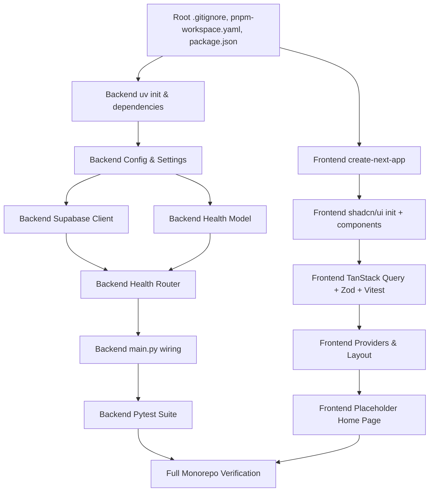

# Plan: Monorepo Scaffolding & Initial Setup

> **Spec Reference**: `specs/2026-09-03-monorepo-scaffolding/spec.md`  
> **Branch**: `feat/monorepo-scaffolding`  
> **Date**: 2026-09-03  
> **Status**: Ready for Implementation  

---

## 1. Technical Approach

This plan establishes the foundational structure for the Kalano multi-vendor e-commerce platform according to the Project Constitution (§3, §4, §6, §7).

1. **Root Orchestration**: A root `package.json` and `pnpm-workspace.yaml` unify script execution (`pnpm dev`, `pnpm dev:backend`, `pnpm lint`, `pnpm test`) across the monorepo while keeping the runtime dependencies of the frontend and backend cleanly decoupled.
2. **Frontend Architecture**:
   - Initialized using Next.js App Router, TypeScript (strict mode), and Tailwind CSS in `frontend/`.
   - UI layer powered by **shadcn/ui** (slate/neutral style, CSS variables) with pre-installed core primitives (`button`, `input`, `card`) and `lucide-react`.
   - Server state caching and hydration prepared via **TanStack Query** (`@tanstack/react-query`) wrapped in a client provider component (`frontend/lib/providers.tsx`).
   - Testing setup configured with **Vitest**, `jsdom`, and React Testing Library.
   - Code standards enforced with ESLint and Prettier.
3. **Backend Architecture**:
   - Managed with **uv** in `backend/` targeting **Python 3.12**.
   - FastAPI application instance equipped with CORS middleware targeting `FRONTEND_URL`.
   - Settings validation via `pydantic-settings` reading from environment variables with graceful defaults.
   - Supabase Python client wrapped in a reusable dependency (`get_supabase_client`) with singleton caching.
   - Health check probe (`GET /api/v1/health`) tagged with `System` in OpenAPI docs and backed by an exact Pydantic model (`HealthResponse`).
   - Linting and formatting managed via **Ruff** in `pyproject.toml`.
   - Pytest suite using `fastapi.testclient.TestClient` with unit tests for healthy and degraded states.

---

## 2. Files to Create

| File Path | Purpose |
|-----------|---------|
| `.gitignore` | Monorepo-wide git exclusion rules (environments, caches, outputs) |
| `pnpm-workspace.yaml` | Declares frontend workspace package |
| `package.json` | Root helper scripts delegating to frontend and backend |
| `frontend/.env.example` | Environment template for frontend client |
| `frontend/lib/query-client.ts` | Factory for TanStack Query client instance |
| `frontend/lib/providers.tsx` | React client wrapper providing QueryClientProvider |
| `frontend/vitest.config.ts` | Configuration for Vitest test runner with jsdom and path aliases |
| `frontend/.prettierrc` | Formatting rules for Prettier |
| `backend/pyproject.toml` | Backend project specification, dependencies, and Ruff config |
| `backend/.python-version` | Pins Python 3.12 for uv |
| `backend/.env.example` | Environment template for FastAPI and Supabase |
| `backend/app/__init__.py` | Package marker for app module |
| `backend/app/main.py` | FastAPI application initialization and middleware registration |
| `backend/app/dependencies/__init__.py` | Package marker for dependencies module |
| `backend/app/dependencies/config.py` | Pydantic Settings class for environment configuration |
| `backend/app/dependencies/database.py` | Supabase client singleton provider function |
| `backend/app/models/__init__.py` | Package marker for models module |
| `backend/app/models/health.py` | Pydantic model for health check response |
| `backend/app/routers/__init__.py` | Package marker for routers module |
| `backend/app/routers/health.py` | Health check endpoint router (`GET /api/v1/health`) |
| `backend/app/services/__init__.py` | Package marker for services module |
| `backend/app/utils/__init__.py` | Package marker for utilities module |
| `backend/tests/__init__.py` | Package marker for tests module |
| `backend/tests/conftest.py` | Pytest fixtures providing TestClient |
| `backend/tests/test_health.py` | Health endpoint tests (success, failure, schema) |

---

## 3. Files to Modify

| File Path | Changes |
|-----------|---------|
| `frontend/app/layout.tsx` | Wrap application children with `<Providers>` |
| `frontend/app/page.tsx` | Render clean Kalano placeholder using shadcn Card, Button, Input |
| `frontend/package.json` | Add test scripts, prettier scripts, and dependencies |

---

## 4. Dependencies & Order



---

## 5. Detailed Implementation Notes

### 5.1 — Root Workspace Configuration

#### `pnpm-workspace.yaml`
```yaml
packages:
  - "frontend"
```

#### `package.json`
```json
{
  "name": "kalano-monorepo",
  "version": "0.1.0",
  "private": true,
  "scripts": {
    "dev": "pnpm --filter frontend dev",
    "dev:backend": "cd backend && uv run uvicorn app.main:app --reload --port 8000",
    "build": "pnpm --filter frontend build",
    "lint": "pnpm --filter frontend lint && cd backend && uv run ruff check .",
    "format": "pnpm --filter frontend format && cd backend && uv run ruff format .",
    "test": "pnpm --filter frontend test && cd backend && uv run pytest"
  }
}
```

#### `.gitignore`
```gitignore
# Environment files
.env
.env*.local
.env.development
.env.test
.env.production
!.env.example

# Node / Frontend
node_modules/
.next/
out/
dist/
.pnpm-store/

# Python / Backend
__pycache__/
*.py[cod]
*$py.class
.venv/
env/
venv/
.pytest_cache/
.ruff_cache/

# System / IDE
.DS_Store
Thumbs.db
.vscode/
.idea/
*.log
```

---

### 5.2 — Backend: Settings & Configuration (`backend/app/dependencies/config.py`)

```python
from pydantic_settings import BaseSettings, SettingsConfigDict


class Settings(BaseSettings):
    model_config = SettingsConfigDict(
        env_file=".env",
        env_file_encoding="utf-8",
        extra="ignore",
    )

    supabase_url: str = "https://placeholder-project.supabase.co"
    supabase_key: str = "placeholder-anon-key"
    jwt_secret_key: str = "placeholder-secret-key-32-chars-minimum"
    jwt_algorithm: str = "HS256"
    jwt_expiration_minutes: int = 60
    frontend_url: str = "http://localhost:3000"


settings = Settings()
```

---

### 5.3 — Backend: Supabase Client (`backend/app/dependencies/database.py`)

```python
from supabase import Client, create_client
from app.dependencies.config import settings

_supabase_client: Client | None = None


def get_supabase_client() -> Client:
    global _supabase_client
    if _supabase_client is None:
        _supabase_client = create_client(
            settings.supabase_url,
            settings.supabase_key,
        )
    return _supabase_client
```

---

### 5.4 — Backend: Health Model (`backend/app/models/health.py`)

```python
from pydantic import BaseModel, Field


class HealthResponse(BaseModel):
    status: str = Field(
        description="Service health status: 'healthy' or 'degraded'",
        examples=["healthy"],
    )
    database: str = Field(
        description="Database connectivity status: 'connected' or 'disconnected'",
        examples=["connected"],
    )
    error: str | None = Field(
        default=None,
        description="Error details if database is unreachable",
        examples=[None],
    )
```

---

### 5.5 — Backend: Health Router (`backend/app/routers/health.py`)

```python
from fastapi import APIRouter
from app.dependencies.database import get_supabase_client
from app.models.health import HealthResponse

router = APIRouter(prefix="/api/v1", tags=["System"])


@router.get(
    "/health",
    response_model=HealthResponse,
    summary="System Health and Connectivity Check",
    description="Probes the FastAPI application and verifies connection to Supabase database. "
    "Returns status='healthy' if database is accessible, or 'degraded' if an error occurs.",
)
async def health_check() -> HealthResponse:
    try:
        client = get_supabase_client()
        client.table("users").select("id", count="exact").limit(0).execute()
        return HealthResponse(status="healthy", database="connected", error=None)
    except Exception as e:
        return HealthResponse(
            status="degraded",
            database="disconnected",
            error=str(e),
        )
```

---

### 5.6 — Backend: Main App (`backend/app/main.py`)

```python
from fastapi import FastAPI
from fastapi.middleware.cors import CORSMiddleware
from app.dependencies.config import settings
from app.routers import health

app = FastAPI(
    title="Kalano API",
    description="Multi-vendor e-commerce platform API for Kalano",
    version="0.1.0",
)

app.add_middleware(
    CORSMiddleware,
    allow_origins=[settings.frontend_url],
    allow_credentials=True,
    allow_methods=["*"],
    allow_headers=["*"],
)

app.include_router(health.router)
```

---

### 5.7 — Backend: Ruff Configuration in `pyproject.toml`

```toml
[project]
name = "kalano-backend"
version = "0.1.0"
description = "FastAPI backend for Kalano e-commerce platform"
readme = "README.md"
requires-python = ">=3.12"
dependencies = [
    "argon2-cffi>=23.1.0",
    "fastapi>=0.115.0",
    "pydantic>=2.10.0",
    "pydantic-settings>=2.7.0",
    "python-jose[cryptography]>=3.3.0",
    "supabase>=2.10.0",
    "uvicorn[standard]>=0.32.0",
]

[dependency-groups]
dev = [
    "httpx>=0.28.0",
    "pytest>=8.3.0",
    "pytest-asyncio>=0.24.0",
    "ruff>=0.8.0",
]

[tool.ruff]
line-length = 100
target-version = "py312"

[tool.ruff.lint]
select = ["E", "F", "I", "N", "W"]
ignore = []

[tool.pytest.ini_options]
asyncio_mode = "auto"
testpaths = ["tests"]
```

---

### 5.8 — Backend Tests (`backend/tests/test_health.py`)

- `test_health_returns_200`: checks status code 200.
- `test_health_response_schema`: validates `status` and `database` keys exist.
- `test_health_mocked_connected`: mocks Supabase client query to return success, asserts `status == "healthy"` and `database == "connected"`.
- `test_health_mocked_disconnected`: mocks Supabase client to raise `Exception("Network unreachable")`, asserts `status == "degraded"` and `database == "disconnected"`.

---

### 5.9 — Frontend: TanStack Query Client (`frontend/lib/query-client.ts`) & Providers (`frontend/lib/providers.tsx`)

```typescript
// frontend/lib/query-client.ts
import { QueryClient } from "@tanstack/react-query";

export function makeQueryClient(): QueryClient {
  return new QueryClient({
    defaultOptions: {
      queries: {
        staleTime: 60 * 1000,
        refetchOnWindowFocus: false,
      },
    },
  });
}
```

```tsx
// frontend/lib/providers.tsx
"use client";

import { QueryClientProvider } from "@tanstack/react-query";
import { useState, type ReactNode } from "react";
import { makeQueryClient } from "./query-client";

export function Providers({ children }: { children: ReactNode }) {
  const [queryClient] = useState(() => makeQueryClient());

  return (
    <QueryClientProvider client={queryClient}>
      {children}
    </QueryClientProvider>
  );
}
```

---

### 5.10 — Frontend: Vitest Setup (`frontend/vitest.config.ts`)

```typescript
import { defineConfig } from "vitest/config";
import react from "@vitejs/plugin-react";
import path from "path";

export default defineConfig({
  plugins: [react()],
  test: {
    environment: "jsdom",
    globals: true,
  },
  resolve: {
    alias: {
      "@": path.resolve(__dirname, "./"),
    },
  },
});
```

---

## 6. Testing Strategy

### Backend Tests (Pytest)
- Execute `uv run pytest -v` inside `backend/`.
- Tests will run completely offline (Supabase client mocked during test cases to guarantee determinism in CI and local machines).

### Frontend Tests (Vitest)
- Execute `pnpm test` inside `frontend/` (via `vitest run`).
- Adds sample component smoke test `frontend/__tests__/home.test.tsx` verifying placeholder renders without crashing.

### Manual Verification Steps
1. Boot backend: `cd backend && uv run uvicorn app.main:app --port 8000`
2. Access `http://localhost:8000/docs` to inspect OpenAPI documentation.
3. Query `http://localhost:8000/api/v1/health` to verify response format.
4. Boot frontend: `cd frontend && pnpm dev`
5. Access `http://localhost:3000` to inspect UI placeholder with shadcn components.
6. Verify no console errors or CORS blocks.

---

## 7. Constitution Compliance Checklist

- [x] Next.js restricted to thin client; zero backend logic in frontend (§4.1)
- [x] Supabase JS client not imported in frontend (§4.1, §17)
- [x] No Supabase Auth used; argon2-cffi and python-jose prepared for Phase 2 (§4.2)
- [x] Endpoints prefixed with `/api/v1/` (§4.3)
- [x] Pydantic models with field descriptions and OpenAPI tags (§4.3)
- [x] Standard error envelope structures respected (§4.4)
- [x] Environment files gitignored with `.env.example` templates committed (§4.5)
- [x] Monorepo directory structure adheres to §6
- [x] Naming conventions followed (`kebab-case` frontend, `snake_case` backend) (§7)
- [x] Automated tests included for all endpoints and components (§14)
- [x] Conventional Commits planned (§13)

---

## 8. Risks & Mitigations

| Risk | Mitigation |
|------|-----------|
| Interactive CLI prompts from `create-next-app` or `shadcn init` block execution | Run CLI tools with automated flags (`--yes`, non-interactive arguments) |
| Missing local Python installation in system PATH | `uv` manages Python 3.12 automatically via `uv python pin 3.12` and standalone toolchain |
| Supabase credentials missing during local dev | Health check returns HTTP 200 `degraded` gracefully rather than throwing 500 error; tests mock Supabase calls |
| Vitest conflicts with Next.js App Router | Provide explicit path resolution in `vitest.config.ts` and use `@vitejs/plugin-react` |
