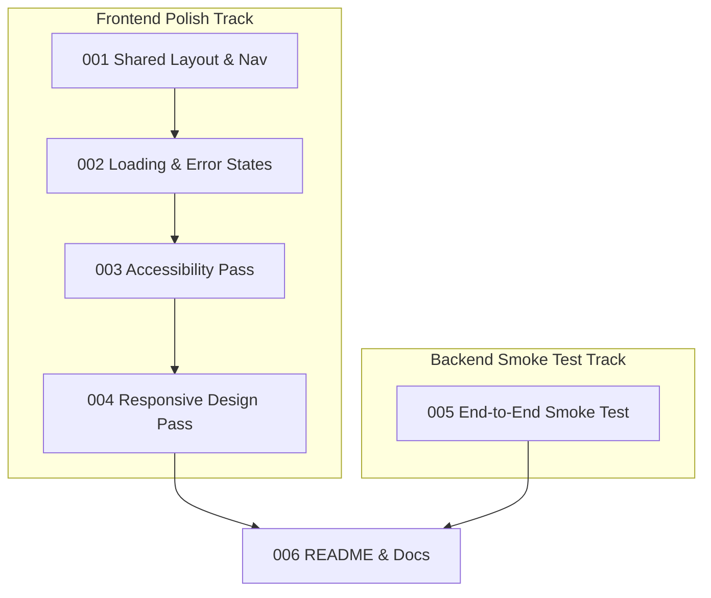

# Phase Index: Polish & Integration

> **Roadmap Reference**: Phase 8 — Polish & Integration
> **Branch**: `feat/polish-and-integration`
> **Date**: 2026-09-07
> **Total Specs**: 6

---

## Execution Order

| # | Spec Folder | Step | Status |
|---|-------------|------|--------|
| 001 | [`specs/001-shared-layout-and-navigation/`](file:///D:/Code/A%20new%20era/kalano/specs/001-shared-layout-and-navigation/) | Step 8.1 — Shared layout & navigation | ✅ Complete |
| 002 | [`specs/002-loading-and-error-states/`](file:///D:/Code/A%20new%20era/kalano/specs/002-loading-and-error-states/) | Step 8.2 — Loading & error states | ✅ Complete |
| 003 | [`specs/003-accessibility-pass/`](file:///D:/Code/A%20new%20era/kalano/specs/003-accessibility-pass/) | Step 8.3 — Accessibility pass | ✅ Complete |
| 004 | [`specs/004-responsive-design-pass/`](file:///D:/Code/A%20new%20era/kalano/specs/004-responsive-design-pass/) | Step 8.4 — Responsive design pass | ⬜ Pending |
| 005 | [`specs/005-end-to-end-smoke-test/`](file:///D:/Code/A%20new%20era/kalano/specs/005-end-to-end-smoke-test/) | Step 8.5 — End-to-end smoke test | ⬜ Pending |
| 006 | [`specs/006-readme-and-documentation/`](file:///D:/Code/A%20new%20era/kalano/specs/006-readme-and-documentation/) | Step 8.6 — README & documentation | ⬜ Pending |

---

## Dependencies

- **Spec 001 (`shared-layout-and-navigation`)**: Foundational layout spec. Provides global `Navbar`, `Footer`, `NavSearch`, `CartBadge`, and `UserNav` components embedded into root `app/layout.tsx`.
- **Spec 002 (`loading-and-error-states`)**: Depends on Spec 001. Adds unified loading skeletons, error fallbacks, and Sonner toast notifications across routes inside the global layout frame.
- **Spec 003 (`accessibility-pass`)**: Depends on Spec 001 and Spec 002. Audits all forms, interactive icon triggers, landmarks, and table elements for WCAG 2.1 AA / Constitution Section 12 compliance.
- **Spec 004 (`responsive-design-pass`)**: Depends on Specs 001, 002, and 003. Adds `MobileNav` sheet drawer to navbar and refactors grids and tables for tablet breakpoints down to 640px.
- **Spec 005 (`end-to-end-smoke-test`)**: Independent backend integration spec. Implements full multi-role order lifecycle testing (`backend/tests/test_e2e_smoke.py`) verifying merchant listing, buyer checkout, inventory decrement, pickup confirmation, and logistics delivery. Can run in parallel with frontend polish.
- **Spec 006 (`readme-and-documentation`)**: Depends on Specs 001–005. Updates root `README.md`, environment templates, and verifies full constitutional compliance across the entire project.

---

## Parallelization Strategy

- Specs 001 through 004 form the frontend refinement pipeline executed sequentially or with subagents on parallel batches.
- Spec 005 can be executed concurrently with any of the frontend specs since it operates exclusively on the backend test suite.
- Spec 006 is the final documentation wrap-up once all implementation tasks are verified.

---

## Notes

- **Toast System**: Uses `shadcn/ui` Sonner (already configured in root layout).
- **Search System**: Persistent search bar in navbar submits query to `/products?q={query}`.
- **E2E Testing**: Backend integration smoke test utilizes FastAPI `TestClient` to execute the full multi-role flow reliably and deterministically.
- **Constitution Compliance**: Strictly zero backend logic in Next.js, no frontend Supabase imports, all endpoints on `/api/v1/`, standard error envelopes enforced, argon2 hashing preserved.
