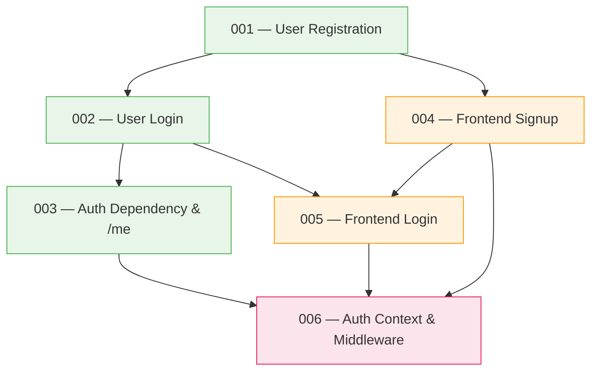

# Phase Index: Authentication

> **Roadmap Reference**: Phase 2 — Authentication
> **Branch**: `feat/authentication`
> **Date**: 2026-09-03
> **Total Specs**: 6

---

## Execution Order

| # | Spec Folder | Step | Status |
|---|-------------|------|--------|
| 001 | `specs/001-user-registration-endpoint/` | Step 2.1 — User registration endpoint | ✅ Complete |
| 002 | `specs/002-user-login-endpoint/` | Step 2.2 — User login endpoint | ✅ Complete |
| 003 | `specs/003-auth-dependency-and-current-user/` | Step 2.3 — Auth dependency & current user | ⬜ Pending |
| 004 | `specs/004-frontend-signup-page/` | Step 2.4 — Frontend auth pages (Sign Up) | ⬜ Pending |
| 005 | `specs/005-frontend-login-page/` | Step 2.5 — Frontend auth pages (Log In) | ⬜ Pending |
| 006 | `specs/006-auth-context-and-middleware/` | Step 2.6 — Auth context & middleware | ⬜ Pending |

## Dependencies

### Dependency Rules

- **Spec 001** → No dependencies (first in phase)
- **Spec 002** → Depends on Spec 001 (reuses `UserResponse`, `ErrorResponse` models; extends auth router)
- **Spec 003** → Depends on Specs 001 & 002 (uses JWT utility from 002, auth models from 001)
- **Spec 004** → Depends on Spec 001 (needs registration API; can be built in parallel if types are pre-defined)
- **Spec 005** → Depends on Specs 002 & 004 (needs login API; reuses types and patterns from 004)
- **Spec 006** → Depends on Specs 003, 004 & 005 (needs `/auth/me` endpoint, signup/login pages, API client functions)

### Parallelization Opportunities

- **Specs 001 → 002 → 003**: Must be sequential (each builds on the previous)
- **Specs 004 & 005**: Can be partially parallelized with backend specs if TypeScript types are defined upfront, but 005 depends on 004 for shared patterns
- **Spec 006**: Must come last (integrates everything)

## Key Design Decisions

| Decision | Choice | Rationale |
|----------|--------|-----------|
| JWT delivery | Backend sets httpOnly cookie via `Set-Cookie` header | More secure, aligns with constitution §4.2 |
| Token extraction | Cookie first, then `Authorization: Bearer` header fallback | Supports both browser and non-browser clients |
| Cookie name | `kalano_token` | Descriptive, unique to the app |
| Role selector UI | Two side-by-side panels (Merchant/Buyer) with benefits listed | User-requested design; more engaging than a dropdown |
| Post-registration flow | Success toast → redirect to `/login` | User-confirmed preference |
| Auth page layout | Centered card on minimal background | Clean, standard auth pattern |
| Signup/Login cross-links | Yes, bidirectional links between pages | Better UX navigation |

## Notes

- The database schema (`users` table) is **predefined and already exists** in Supabase — no migrations needed.
- For all database insertions (e.g. `users`), `id` and `created_at` are handled automatically by Supabase defaults (`gen_random_uuid()`, `now()`) — the backend application must never generate or provide them in insert payloads.
- Sonner toast library will be installed during Spec 004 for success/error feedback.
- Next.js middleware only checks cookie **presence**, not JWT validity — the backend handles token validation.
- Protected routes: `/cart`, `/checkout`, `/orders`, `/dashboard`, `/logistics` (per constitution §4.2 and §8).
- All error responses use the standard envelope: `{ "error": { "code": "...", "message": "..." } }`.
- **Server Execution & Timeout Constraint**: Whenever an agent starts a server (FastAPI/Uvicorn or Next.js) for manual verification, schema inspection, or smoke testing, the server MUST be started under an explicit timeout constraint (e.g. background task with a strict maximum duration of 15–30 seconds, or terminated immediately upon completing the verification step via `manage_task kill`). Servers must NEVER be launched as long-running blocking commands that leave the agent waiting indefinitely.
